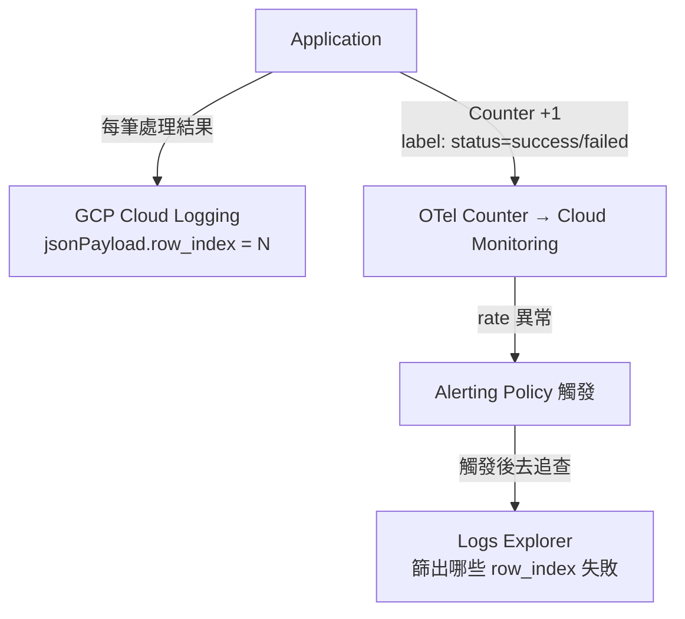

# Log 與 Metric 的職責劃分：以 GCP 結構化日誌為例

> Metric 給你 signal，Log 給你 context—— 兩者互補，不要互相取代。

## 問題背景

假設 GCP 日誌中有大量結構化紀錄：

```json
{"message": "ASM update successful", "row_index": 1}
{"message": "ASM update successful", "row_index": 2}
{"message": "ASM update failed",     "row_index": 3}
```

`row_index` 每筆不同。面對這樣的 log，應該用 **OTel Metrics API** 埋點，還是用 **Log-based Alert** 直接分析？

## Step 1：先釐清「你想問的問題是什麼」

| 想知道的問題 | 適合的工具 |
|---|---|
| 某筆 row_index 有沒有成功？ | Logs Explorer（查個別事件） |
| 過去 1 小時成功了幾筆？ | Log-based Metric → Cloud Monitoring |
| 成功率掉了，要即時告警 | Log-based Alert 或 Alerting Policy |
| 每分鐘 throughput 趨勢 | OTel Counter Metric |
| 哪些 row_index 在某段時間成功 / 失敗 | Logs Explorer 篩選 |

選型的核心原則：**能用 metric 表達的問題就用 metric；需要還原個別事件細節的才用 log**。

## Step 2：兩種方案的本質差異

### Log-based Alert（GCP 原生，零侵入）

直接在 log filter 上設告警條件，不需要改程式碼：

```
# Logs Explorer filter
jsonPayload.message="ASM update successful"
```

**優點：** 無需改程式碼，現有 log 直接用。
**缺點：** 只能做計數（count over time window），無法做 histogram、percentile；也無法把動態欄位當維度 aggregate。

### OTel Metrics API（埋點，彈性最高）

在程式碼裡埋 counter，每筆成功就遞增，可附帶固定維度（attribute）：

```python
asm_counter.add(1, {"status": "success"})
asm_counter.add(1, {"status": "failed"})
```

**優點：** 可切維度、計算 error ratio、與 Prometheus / Grafana / Cloud Monitoring 完整整合。
**缺點：** 需要改程式碼並重新部署。

## Step 3：Cardinality 陷阱 ——`row_index` 不能當 Metric Label

這個 case 最常見的錯誤設計是：

```python
# 錯誤示範：把流水號放進 label
asm_counter.add(1, {"status": "success", "row_index": row_index})
```

**Metric 的 label（dimension）必須是有限集合。** `row_index` 每筆都不同，放進 label 會造成 cardinality 爆炸 ——Prometheus 的 time series 數量 = label 所有可能值的笛卡兒積，無限增長會讓 TSDB 崩潰或費用暴增。

**判斷 label 是否合適的標準：**

| label 值的可能數量 | 評估 |
|---|---|
| 個位數（status: success/failed） | 安全 |
| 十位數（region、service name） | 可接受 |
| 百位數以上 | 需謹慎 |
| 無上限（row_index、user_id、request_id） | 禁止放進 metric label |

## Step 4：正確的分層設計

正確做法是**兩層分工**，metric 負責趨勢與告警，log 負責個別事件追查：



**Metric 層（趨勢與告警）：** 統計單位時間成功 / 失敗筆數，label 只放有限的維度（`status`、`region` 等）。告警在成功率下降或速率異常時觸發。

**Log 層（個別追查）：** 告警觸發後，去 Logs Explorer 用時間範圍加 filter 找出是哪幾筆 `row_index` 出問題。

```
# 告警觸發後，去 Logs Explorer 追查細節
jsonPayload.message="ASM update failed"
timestamp >= "2026-07-13T10:00:00Z"
timestamp <= "2026-07-13T10:30:00Z"
```

## Step 5：實務選型速查

| 情境 | 建議方案 |
|---|---|
| 現有 log 已夠用、快速設告警 | Log-based Alert（零侵入） |
| 需要 error ratio、rate 趨勢圖 | OTel Counter + Alerting Policy |
| 需要還原哪幾筆資料出問題 | Logs Explorer 篩選 |
| 需要 latency percentile（p99） | OTel Histogram（log 完全做不到） |
| `row_index` 等流水號要分析 | 留在 log，不要放進 metric label |

## 核心原則（RED Method）

SRE 觀測的 RED Method：

- **Rate**：每秒處理幾筆 → Metric
- **Error**：失敗比例是多少 → Metric
- **Duration**：處理一筆花多久 → Metric（Histogram）

個別事件的**細節（哪一筆、錯誤訊息內容）** → Log

兩者互補：metric 讓你知道「有問題了」，log 讓你知道「問題在哪裡」。

## 相關筆記

- [Prometheus 與 Grafana 的功能與協作方式](#/sre/02-observability/prometheus-and-grafana-overview.mdx)
- [OpenTelemetry 的功能與應用](#/sre/06-opentelemetry/what-is-opentelemetry.mdx)
- [OpenTelemetry 的 Metrics API 與其他 API 總覽（以 FastAPI 為例）](#/sre/06-opentelemetry/otel-metrics-api-fastapi.mdx)
- [GCP Cloud Observability 套件總覽](#/sre/05-gcp/gcp-cloud-observability-overview.mdx)
