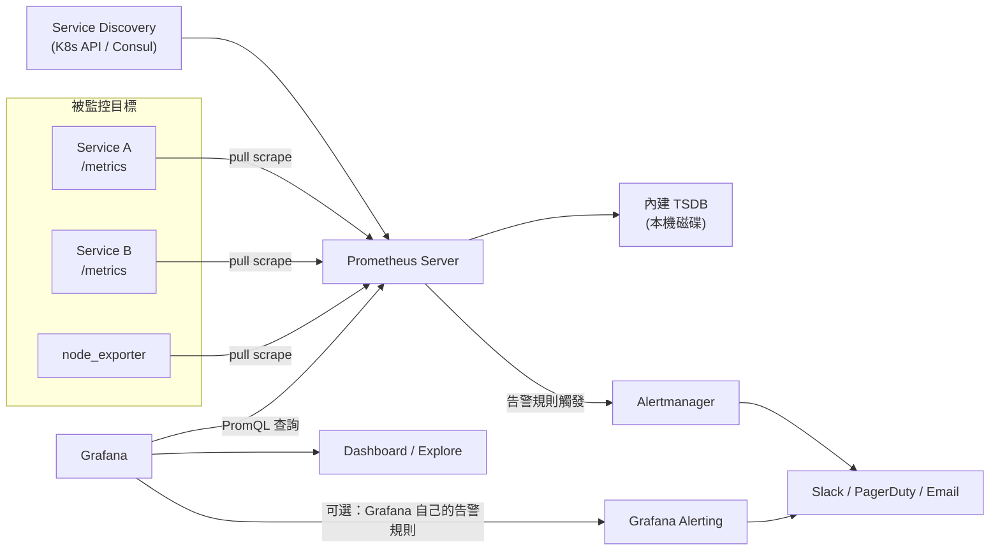

# Prometheus 與 Grafana 的功能與協作方式

> 一句話版本：Prometheus 負責「收集、儲存、查詢時間序列指標並觸發告警」，Grafana 負責「把任何資料來源的數據畫成可讀的儀表板」——兩者是監控告警堆疊（monitoring stack）裡分工明確的兩個獨立元件，不是同一套系統的兩個模組。

## Step 1：先分清楚兩者的定位

新手最常見的誤解是把 Prometheus 和 Grafana 當成「一套產品」。實際上：

| | Prometheus | Grafana |
|---|---|---|
| 角色 | 指標的資料庫 + 收集器 + 告警引擎 | 視覺化層，不儲存資料 |
| 資料來源 | 自己 scrape 目標系統 | 透過 data source 外掛接到 Prometheus、Loki、Tempo、CloudWatch、SQL 等任何來源 |
| 查詢語言 | PromQL（自己定義） | 呼叫底層資料源的查詢語言（對 Prometheus 就是轉發 PromQL） |
| 沒有對方能否運作 | 可以，PromQL 也能單獨查、Alertmanager 也能單獨告警 | 可以，但沒資料源就是空殼 |

也就是說，Grafana 不是 Prometheus 的「前端」，它是一個資料源無關（data-source agnostic）的視覺化平台，只是業界最常見的組合是 Prometheus（存資料）+ Grafana（畫圖）。

## Step 2:Prometheus 的核心功能

### 2.1 Pull 模型的資料收集

Prometheus 採用**主動拉取（pull）**而非被監控端主動推送（push）的架構：每個被監控的服務要暴露一個 `/metrics` HTTP endpoint（純文字格式），Prometheus Server 依設定的間隔（scrape interval，常見 15s）主動去抓。

這個設計的好處：

- Prometheus 自己知道目標是否「活著」——抓不到就是明確訊號（`up == 0`），不需要額外的心跳機制。
- 目標系統不需要知道 Prometheus 的存在，也不用維護一條對外連線，降低耦合。
- 但也因此**不適合超短生命週期的 batch job**（還沒被抓到就結束了），這種場景要靠 Pushgateway 中轉。

對於本來不會主動暴露 Prometheus 格式指標的系統（MySQL、Redis、作業系統本身…），透過 **Exporter**（如 `node_exporter`、`mysqld_exporter`）把原生指標轉譯成 Prometheus 格式後再被抓取。

### 2.2 Service Discovery（服務發現）

在 Kubernetes 這種 Pod 會不斷生滅、IP 會變動的環境，不可能手動維護抓取目標清單。Prometheus 透過 Service Discovery（K8s API、Consul、DNS…）動態發現要抓誰，搭配 `relabel_config` 決定要不要抓、怎麼加標籤。

### 2.3 內建時間序列資料庫（TSDB）

抓回來的資料以 `metric_name{label1="a", label2="b"} value @ timestamp` 的形式存進本機的 TSDB，針對指標資料的特性（同一序列連續寫入、高基數標籤查詢）做了專門優化。但這個 TSDB 是**單機的、本地磁碟儲存**，不是天生的分散式系統——這也是它最大的架構限制，後面會提到。

### 2.4 PromQL——查詢與運算

PromQL 是 Prometheus 的查詢語言，專門為時間序列設計。幾個典型用法：

```promql
# 過去 5 分鐘 HTTP 5xx 的每秒錯誤率
sum(rate(http_requests_total{status=~"5.."}[5m]))
  /
sum(rate(http_requests_total[5m]))

# P99 請求延遲(histogram_quantile 搭配 histogram 型指標)
histogram_quantile(0.99, sum(rate(http_request_duration_seconds_bucket[5m])) by (le))

# 記憶體使用超過 request 的 Pod
container_memory_working_set_bytes / container_spec_memory_request_bytes > 1
```

`rate()` 是關鍵函式：Prometheus 的 counter 型指標只會單向遞增（重啟會歸零），必須用 `rate()` 或 `increase()` 換算成「單位時間變化量」才有意義，不能直接畫原始值。

### 2.5 告警：Prometheus 自己出題，Alertmanager 負責送

告警規則（`alert rule`）寫在 Prometheus 裡，本質是一條 PromQL 條件式加上持續時間（`for`）：

```yaml
- alert: HighErrorRate
  expr: sum(rate(http_requests_total{status=~"5.."}[5m])) / sum(rate(http_requests_total[5m])) > 0.05
  for: 10m
  labels:
    severity: page
  annotations:
    summary: "5xx 錯誤率超過 5% 已持續 10 分鐘"
```

Prometheus 只負責「判斷條件是否成立、成立多久」，真正的**去重、分組、路由、靜音、通知管道**（Slack/PagerDuty/Email）是交給獨立元件 **Alertmanager** 處理——這個分層設計讓告警邏輯（何時觸發）和通知邏輯（誰收、怎麼收）解耦。

## Step 3:Grafana 的核心功能

### 3.1 Dashboard 視覺化

Grafana 的核心賣點是把任意資料源的查詢結果組成可互動的儀表板：折線圖、熱力圖（對 histogram 型指標特別適合）、Gauge、Table、Alert list…面板之間可以共享時間範圍與變數（template variable），例如一個 `$cluster` 下拉選單同時篩選所有面板。

### 3.2 資料源無關（Multi-data-source）

一張 Dashboard 上的不同面板可以分別接不同的資料源——例如同時顯示 Prometheus 的 QPS 曲線、Loki 的錯誤日誌、Tempo 的分布式追蹤——這正是可觀測性三支柱（metrics/logs/traces）在同一個畫面關聯分析（correlation）的常見做法，可以參考 [OpenTelemetry 的功能與應用](#/sre/02-observability/what-is-opentelemetry.mdx) 了解這三者如何統一收集。

### 3.3 Explore：即時查詢介面

除了固定的 Dashboard,Grafana 也提供 Explore 模式，讓工程師直接寫 PromQL/LogQL 做 ad-hoc 查詢，常用在事故排查（incident debugging）時快速下鑽，不需要先做好一個 Dashboard。

### 3.4 Grafana 自己的告警引擎（Unified Alerting）

現代版本的 Grafana 內建了自己的告警系統，可以直接對任何資料源（不限 Prometheus）設定告警規則、走 Grafana 自己的 Notification Policy 路由。這代表告警可以有兩條路徑：

1. Prometheus 規則 → Alertmanager → 通知
2. Grafana 規則 → Grafana Alerting → 通知

兩者可以並存，但團隊通常會選一條作為「唯一真相來源」，避免同一個異常觸發兩份告警造成 on-call 混亂。

### 3.5 Provisioning-as-Code

Dashboard、Data source、Alert rule 都可以用 YAML/JSON 定義，透過 Provisioning 或 Grafana Operator 在 CI/CD 中版控與部署，避免「Dashboard 只存在於某個人手動點出來的網頁狀態」這種不可重現的維運債。

## Step 4：兩者如何協作——完整資料流



## Step 5：常見的規模化痛點與延伸方案

原生 Prometheus 是單機架構，規模大了之後會遇到兩個典型問題，值得知道對應解法（不展開細節）：

- **長期儲存與跨叢集查詢**：本機 TSDB 沒有內建的高可用與長期保存能力，常見解法是 Thanos 或 Cortex/Mimir，把多個 Prometheus 實例的資料匯聚到物件儲存（如 S3/GCS），提供全域查詢視圖。
- **雲端 Managed 版本**：例如 GCP 的 Managed Service for Prometheus，把 scrape 與儲存交給雲端服務代管，只留 PromQL 相容介面給使用者，可參考 [OpenTelemetry 在 GKE + GCP 上的實踐案例](#/sre/02-observability/otel-gcp-gke-case-study.mdx)。

## 相關筆記

- [OpenTelemetry 的功能與應用](#/sre/02-observability/what-is-opentelemetry.mdx)
- [OpenTelemetry 在 GKE + GCP 上的實踐案例](#/sre/02-observability/otel-gcp-gke-case-study.mdx)
- [GKE Pod 記憶體管理：Request 與 Limit 的實際運作](#/sre/03-operations/gke-pod-memory-without-limit.mdx)
