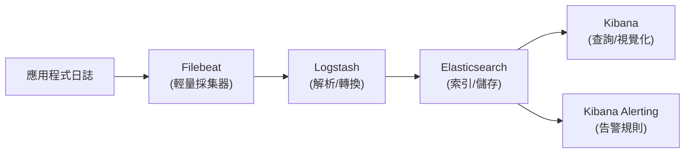

# ELK Stack（Elasticsearch、Logstash、Kibana）的核心作用與架構

> 一句話版本：ELK 是「收集 → 結構化 → 索引 → 搜尋與視覺化」的日誌處理三件套 —— Logstash 負責 ETL,Elasticsearch 負責儲存與全文檢索，Kibana 負責查詢介面、儀表板與告警。

## Step 1: 三個字母各自的角色

| 元件 | 角色 |
|------|------|
| **E**lasticsearch | 分散式搜尋與分析引擎，儲存資料並提供全文檢索 |
| **L**ogstash | 資料處理管線 (pipeline), 負責收集、轉換、輸出日誌 |
| **K**ibana | 視覺化介面，做查詢、儀表板、告警 |

後來 Elastic 公司加入輕量級資料採集器 **Beats**(如 Filebeat、Metricbeat), 整套工具因此常被稱為 **Elastic Stack**(ELK 是舊稱但仍普遍使用)。

## Step 2: 為什麼需要 ELK

在微服務或多機器環境下，日誌散落在幾十、幾百台機器上，單純用 `grep` 是行不通的。ELK 解決的核心問題:

1. **集中化**: 把分散的日誌統一收集到一個地方
2. **結構化**: 把非結構化的文字日誌 (`2026-07-30 10:23:01 ERROR ...`) 解析成結構化欄位 (`timestamp`、`level`、`message`、`trace_id`…)
3. **可搜尋**: 秒級全文檢索海量日誌 (底層是倒排索引 inverted index, 這也是搜尋引擎的核心資料結構)
4. **可視化**: 用儀表板看趨勢、排錯、做告警

## Step 3: 資料流架構



實務上常見兩種變形:

- **輕量版**:Filebeat 直接寫入 Elasticsearch, 省略 Logstash (Elasticsearch 的 ingest pipeline 也能做簡單轉換)
- **EFK**: 用 Fluentd/Fluent Bit 取代 Logstash (Kubernetes 生態系很常見，資源占用更小)

## Step 4: 各元件詳解

### 4.1 Elasticsearch: 儲存與檢索的核心

- 以 **index**(類似資料庫的 table) 組織文件 (document, 類似一列 row), 每筆是一個 JSON 物件
- 底層用 **inverted index**: 把「詞 → 出現在哪些文件」反向映射，讓全文搜尋是 $O (\log n)$ 級別而非全表掃描
- 資料會切成多個 **shard** 分散到不同節點，每個 shard 可以有 **replica** 提供容錯與讀取擴展
- 搭配 **ILM(Index Lifecycle Management)** 自動把舊索引從 hot (SSD, 常查) 降級到 warm/cold (HDD 或物件儲存), 最後刪除 —— 這是控制儲存成本的關鍵機制

### 4.2 Logstash:ETL pipeline

設定檔分三段，這是它的核心心智模型:

```
input {
  beats { port => 5044 }
}
filter {
  grok {
    match => { "message" => "%{TIMESTAMP_ISO8601:timestamp} %{LOGLEVEL:level} %{GREEDYDATA:msg}" }
  }
}
output {
  elasticsearch { hosts => ["es-node:9200"] }
}
```

- `input`: 從哪裡收資料 (Beats、Kafka、syslog…)
- `filter`: 用 `grok`(正則模式庫)、`mutate`、`date` 等 plugin 把非結構化文字轉成結構化欄位
- `output`: 送到哪裡 (通常是 Elasticsearch, 也可以同時送多個目的地)

Logstash 的缺點是 JVM-based, 資源消耗較大，這也是為什麼很多團隊改用更輕量的 Fluent Bit, 或直接用 Filebeat 的 ingest pipeline。

### 4.3 Kibana: 查詢、視覺化與告警

- **Discover**: 用 KQL (Kibana Query Language) 或 Lucene 語法即時搜尋原始日誌
- **Dashboard**: 把多個視覺化元件 (長條圖、時序圖、地圖) 組成儀表板
- **Alerting**: 對查詢結果設閾值觸發告警，概念上對應 GCP 的 Alert Policy

## Step 5:Kibana Alerting vs GCP Alert Policy

Kibana 內建 **Alerting**(早期叫 Watcher, 屬 X-Pack 功能，現已內建於基礎版), 可以像 GCP Alert Policy 一樣設定條件式告警:

| 概念 | GCP Alerting Policy | Kibana Alerting |
|---|---|---|
| 觸發條件 | 對 metric /log-based metric 設閾值 | 對 Elasticsearch query (日誌內容) 設閾值，例如「5 分鐘內 error 筆數 > 100」 |
| 通知管道 | Email、Slack、PagerDuty、Webhook、Pub/Sub | Email、Slack、PagerDuty、Webhook、ServiceNow |
| 執行方式 | GCP 托管排程檢查 | Kibana 內建排程器 (rule 定期跑 query) |
| 靜音 / 抑制 | Snooze | Mute alert / Snooze |

差異在於：GCP Alert Policy 主要針對**數值型 metric**;Kibana Alerting 是對**日誌查詢結果**設條件 —— 例如「特定錯誤字串出現次數異常增加」這種 metric 難以直接表達的情境，是 ELK alerting 的強項。實務上兩者常並存:metric 告警負責快速偵測異常，log 告警負責更細緻的「哪一種錯誤在增加」。

## Step 6: 與其他方案的關係

ELK 屬於**日誌(log)**這條可觀測性支柱，和 [[prometheus-and-grafana-overview]] 處理的**指標(metric)**是互補而非取代關係 —— 這點在 [[log-vs-metric-signal-design]] 裡有詳細討論:metric 用於高基數、低延遲的告警觸發，log 用於事後的根因追查與細節還原。

| | ELK | Prometheus + Grafana | GCP Cloud Logging |
|---|---|---|---|
| 資料型態 | 非結構化 / 半結構化日誌 | 時序數值指標 | 日誌 (GCP 原生) |
| 強項 | 全文檢索、細節排錯 | 高效率告警、SLO 監控 | 免維運、與 GCP 服務原生整合 |
| 維運成本 | 高 (自建叢集、調 shard/ILM) | 中 | 低 (托管服務) |

如果團隊已經在 GCP,[[gcp-logs-trace-metrics-error-reporting]] 中的 Cloud Logging 提供了類似 ELK 的日誌檢索能力但免自建維運；ELK 的優勢在於**跨雲/地端可攜性**與更成熟的全文檢索生態 (例如需要對日誌內容做複雜的模糊搜尋、聚合分析時)。

## 相關筆記

- [Prometheus 與 Grafana 的功能與協作方式](#/sre/02-observability/prometheus-and-grafana-overview.mdx)
- [Log 與 Metric 的職責劃分：以 GCP 結構化日誌為例](#/sre/02-observability/log-vs-metric-signal-design.mdx)
- [GCP Logs Explorer、Trace Explorer、Metrics Explorer 與 Error Reporting 的關係](#/sre/05-gcp/gcp-logs-trace-metrics-error-reporting.mdx)
- [PagerDuty：On-Call 事件管理平台的核心概念與運作機制](#/sre/04-incident/what-is-pagerduty.mdx)
