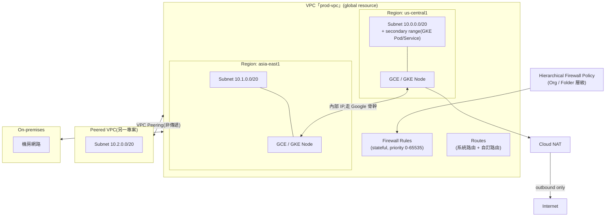

# GCP VPC Network 的架構與核心概念

> GCP 的 VPC 是一個 global、跨區域的邏輯網路，把子網路（subnet）、路由、防火牆規則收斂成單一資源，讓你決定服務彼此如何連通、對外如何曝露。

## Step 1：VPC 是 global resource，subnet 才是 regional

這是最容易搞錯的一點：GCP 的 VPC 本身**不綁定任何區域**，它是一個橫跨全球的邏輯容器，只定義「哪些子網路屬於同一個路由與防火牆管轄範圍」。真正落地到實體位置的是 **subnet（子網路）**，每個 subnet 綁定一個 region，內部再橫跨該 region 下所有的 zone。

這個設計的直接好處：同一個 VPC 內、不同 region 的 VM 預設就能用內部 IP 互通（走 Google 骨幹網路），不需要額外的跨區連通元件，也不必公開到網際網路。

## Step 2：Auto mode vs Custom mode

建立 VPC 時要選：

| 模式 | 行為 | 適用場景 |
|---|---|---|
| **Auto mode** | 每個 GCP region 自動建一個 `/20` subnet，之後新增 region 也自動加 | 測試、demo，不建議正式環境 |
| **Custom mode** | 完全自己決定每個 subnet 的 region、CIDR、是否建立 | 正式環境標準做法，可控 IP 規劃、避免浪費位址空間 |

正式環境幾乎都用 custom mode，理由是 IP 位址規劃必須跟未來的 VPC Peering、Shared VPC、跨雲/跨機房連線一起考慮——一旦不同 VPC 的 CIDR 重疊，之後想 peering 或串接就會卡死（peering 不支援 overlapping CIDR，且事後改 subnet 範圍是有限制的擴縮，不能整段搬移）。

## Step 3：Subnet 的 IP 位址規劃

每個 subnet 有：

- **Primary IP range**：VM 的主要內部 IP 來源
- **Secondary IP ranges**（可選、可多個）：最常見用途是 GKE 的 alias IP —— Pod IP 和 Service IP 各佔一個 secondary range，讓 Pod 直接用 VPC 原生路由（VPC-native cluster），不需要額外的 overlay network

subnet 的 primary range 可以**在不重啟工作負載的情況下擴大**（例如 `/24` 擴成 `/20`），但不能縮小或跟其他 subnet 重疊，所以規劃時通常會預留足夠大的區塊。

## Step 4：Routes——封包怎麼被送到目的地

每個 VPC 都有一份路由表，決定封包的 next hop：

- **系統自動產生的路由**：每個 subnet 建立時自動產生一條本地路由，加上一條預設路由 `0.0.0.0/0` 指向 Internet Gateway
- **自訂靜態路由**：可以指到 instance、內部 IP、Cloud VPN tunnel、Interconnect attachment、或內部負載平衡器
- **優先權（priority）**：0–65535，數字越小優先權越高，多條路由匹配同一目的地時用優先權決勝負，優先權相同才看前綴長度（more specific 優先）

VPC Peering、Shared VPC 建立後，會透過動態交換路由的方式讓對方看到你的 subnet 路由，但這裡有個關鍵限制：**Peering 不具傳遞性（non-transitive）**——A peer B、B peer C，A 並不會自動看到 C，這是實務上最常踩到的坑。

## Step 5：Firewall Rules——狀態化防火牆

GCP 的防火牆規則是**狀態化（stateful）**的（允許進來的連線，回應封包自動放行，不用另開規則），核心概念：

| 屬性 | 說明 |
|---|---|
| **Implied rules** | 每個 VPC 隱含兩條規則：allow all egress（優先權 65535，最低）、deny all ingress（優先權 65535） |
| **Direction** | INGRESS / EGRESS，各自獨立評估 |
| **Priority** | 0–65535，數字越小越先套用，第一條匹配到的規則生效 |
| **Target** | 用 network tag 或 service account 指定規則套用到哪些 VM，比早期純用 IP 更容易維護 |
| **Source/Destination** | CIDR、tag、service account，甚至可以指定 Google-managed range |

比 per-VPC 防火牆規則更上層的是 **Hierarchical Firewall Policies**：可以掛在 Organization 或 Folder 上，強制套用到底下所有專案，用來實作「全公司禁止對外 SSH」這類跨團隊的硬性規範，且它的優先權會跟 VPC 層的防火牆規則一起排序，不是各自為政。

## Step 6：VPC 之間怎麼互連

這是最容易選錯的部分，幾種常見手段各解決不同問題：

| 方式 | 適用情境 | 是否 transitive | 關鍵限制 |
|---|---|---|---|
| **VPC Peering** | 兩個獨立 VPC（不同專案/組織）需要用內部 IP 互通 | 否 | 不支援 overlapping CIDR，不能傳遞 |
| **Shared VPC** | 同一組織下多個專案共用同一套網路（集中管理防火牆/路由，各專案跑各自的資源） | N/A（本質是同一個 VPC） | Host project 集中管控，Service project 只能用不能改網路設定 |
| **Private Service Connect (PSC)** | 消費 Google 或第三方的 managed service（如 Cloud SQL、SaaS）而不想處理 peering 的 CIDR 衝突問題 | 否，但天生避開 overlap 問題 | 只曝露單一 endpoint，不是整個網路互通 |
| **Cloud VPN / Interconnect** | 連接 on-premises 機房或其他雲 | 需搭配 Cloud Router 的 BGP 才能動態學路由 | Interconnect 需要實體線路布建，VPN 走公網加密隧道 |
| **Network Connectivity Center** | 把多個 VPC、VPN、Interconnect 統一成 hub-and-spoke 拓樸 | 是（透過 hub） | 較新的服務，用來解掉 peering 不能傳遞的根本問題 |

## Step 7：對外連線

- **Cloud NAT**：讓沒有外部 IP 的 VM 能對外發起連線（outbound-only），不像早期用單一 VM 當 NAT gateway 那樣有單點瓶頸，且不需要在防火牆開對內規則
- **Private Google Access**：讓沒有外部 IP 的 VM 仍能存取 Google API/服務（如 Cloud Storage、BigQuery），不必經過公網
- **Private Service Connect for Google APIs**：比 Private Google Access 更進一步，把 Google API 映射成 VPC 內部的一個 IP，方便走內部防火牆規則統一管控

## 架構總覽

## 小結給 SRE 視角

VPC 本身的設定失誤（IP 規劃太小、peering CIDR 衝突、忘記 hierarchical policy 會覆蓋 VPC 層規則）通常在容量爬升或跨團隊合併網路時才會爆炸性地變成大問題，所以規劃階段就要把「未來會不會需要 peering / Shared VPC / 跨雲連線」納入 CIDR 設計，而不是等到要接的時候才發現位址空間重疊。

## 相關筆記

- [GKE Pod 記憶體管理：Request 與 Limit 的實際運作](#/sre/03-operations/gke-pod-memory-without-limit.mdx)
- [GCP Logs Explorer、Trace Explorer、Metrics Explorer 與 Error Reporting 的關係](#/sre/02-observability/gcp-logs-trace-metrics-error-reporting.mdx)
