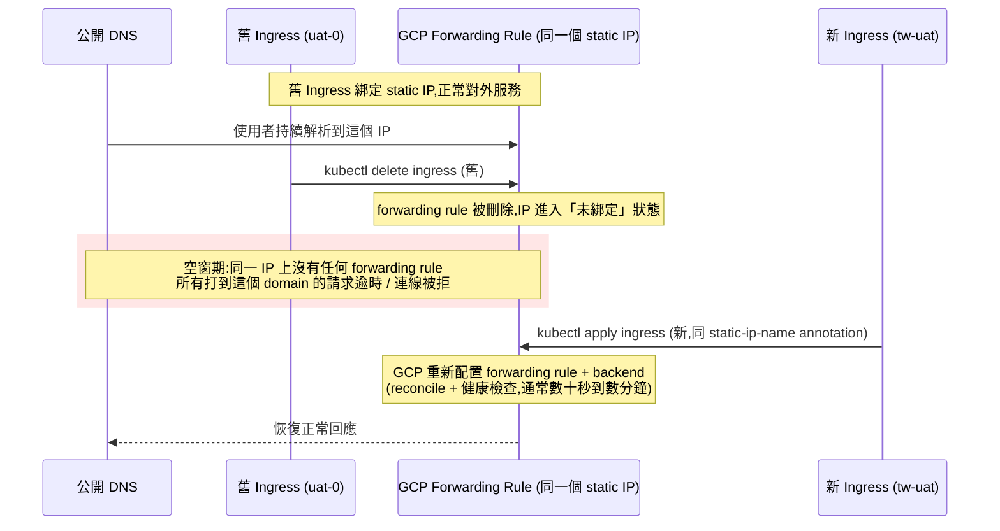

# GKE 跨叢集遷移時 Ingress 外部 IP 切換的風險與正確做法

> 「先刪舊 Ingress 釋放 IP、讓新 Ingress 搶回同一個 IP」這個做法在對外正式 domain 上並不安全：Ephemeral IP 可能拿不回來,即使是 Static IP 也存在一段兩個 Ingress 都不存在 forwarding rule 的空窗期。安全做法是 DNS-based cutover 或 GKE Multi-cluster Ingress/Gateway。

## 情境

有一個對外公開的網站部署在 GKE 上,綁定正式 domain,現在要把整個 workload 從一個 cluster 遷移到另一個 cluster（例如從 `uat-0` 遷移到 `tw-uat`）。常見的直覺做法是：

1. 先把 Pod 部署到新 cluster。
2. 刪除舊 cluster 上的 Ingress,釋放外部 IP。
3. 讓新 cluster 的 Ingress 抓到同一個 IP,完成切換。

步驟 1 沒問題（提前部署、預熱是對的),但步驟 2、3 的假設——「刪掉舊的就能讓新的接手同一個 IP」——本身有兩個層次的風險。

## Step 1：Ingress 的外部 IP 是怎麼來的

GKE 上建立 `Ingress` 資源,背後會建立一組 GCP External HTTP(S) Load Balancer 元件（forwarding rule、target proxy、URL map、backend service）。外部 IP 只是掛在 forwarding rule 上的資源,生命週期分兩種：

- **Ephemeral IP**（預設行為）：沒有指定 `kubernetes.io/ingress.global-static-ip-name` annotation 時,GCP 自動配一個 IP。Ingress 被刪除的瞬間,這個 IP 直接歸還給 GCP 的公用 IP 池——**沒有任何機制保證你能再搶回同一個 IP**,新 Ingress 建立時很可能拿到完全不同的位址。
- **Static IP**：事先用 `gcloud compute addresses create` 保留,Ingress 用 annotation 指向這個保留位址。IP 生命週期與 Ingress 脫鉤,刪除 Ingress 不會釋放它。

如果舊 Ingress 用的是 ephemeral IP,「刪舊等新的搶到同一個 IP」這個前提根本不成立,而正式 domain 的 DNS A record 是固定指向那個 IP 的,一旦 IP 換掉,domain 立刻不可達。

## Step 2：即使是 Static IP,切換仍有空窗期

就算已經把 IP 轉成 static,流程仍然存在一段風險視窗,因為 GCP **不允許兩個獨立的 Ingress 資源同時綁定同一個 forwarding rule**：



這段空窗期是**必然發生**,差別只在長短——內部 UAT 環境或許可以接受,但對外正式 domain 就是使用者能感知的 downtime。

## Step 3：更安全的做法

### 方案 A：DNS-based cutover（最常見、最好控制)

不嘗試搶同一個 IP,讓新舊 cluster **各自擁有獨立的 static IP**：

1. 新 cluster 建立 Ingress,綁定一個全新的 static IP。
2. 直接用這個新 IP 驗證（例如帶 `Host` header 呼叫,或掛一個暫時的測試子網域),確認新 cluster 完全健康。
3. 遷移前提前降低正式 domain 的 DNS TTL（例如從預設幾小時降到 60–300 秒),換取快速切換與回滾的彈性。
4. 把 domain 的 A record 從舊 IP 改成新 IP。
5. 監控舊 Ingress 對應的 GCLB 流量指標（request count、active connections),確認流量已經歸零,再刪除舊 cluster 資源。

新舊 LB 全程同時存在、同時可用,只是把「哪個 IP 被解析」交給 DNS,而不是強迫兩個 Ingress 搶同一個資源,空窗期趨近於零。

### 方案 B：GKE Multi-cluster Ingress / Multi-cluster Gateway(漸進式流量切分)

若需要真正 zero-downtime、且希望流量能按比例（例如 5% → 50% → 100%)漸進遷移,GCP 官方建議用 Multi-cluster Ingress（MCI）或基於 Gateway API 的 Multi-cluster Gateway：單一 Ingress/Gateway 資源同時掛新舊兩個 cluster 的 Service 作為 backend,透過 traffic splitting 逐步把權重從舊 cluster 移到新 cluster,全程只有一個對外 IP,完全不涉及刪除/重建 Ingress。這是跨叢集遷移中最穩健的做法,建置成本比 DNS cutover 高,適合需要反覆執行遷移或對 downtime 零容忍的場景。

## Step 4：`ManagedCertificate` 讓憑證核發跟 DNS 切換綁在一起

GKE 的 `ManagedCertificate`（`networking.gke.io/v1` 的 Custom Resource）可以讓 GCP 自動申請、續期、掛載 Google-managed SSL 憑證到 Ingress 上,不用自己管 Let's Encrypt 或手動上傳憑證：

```yaml
apiVersion: networking.gke.io/v1
kind: ManagedCertificate
metadata:
  name: my-cert
spec:
  domains:
    - example.com
```

```yaml
# Ingress 上掛上去
metadata:
  annotations:
    networking.gke.io/managed-certificates: my-cert
```

關鍵限制：**GCP 要能驗證 `spec.domains` 裡的 domain 已經指向這個 Ingress 的 IP,憑證才會從 `Provisioning` 轉成 `Active`**（用 `kubectl describe managedcertificate my-cert` 查 `status.domainStatus`),通常要 15 分鐘到數小時。

這對方案 A（DNS-based cutover）是個雞生蛋問題：新 Ingress 建立當下,正式 domain 的 DNS 還沒切過去,`ManagedCertificate` 驗證不到、會一直卡在 `Provisioning`。也就是說：

- 沒辦法在切 DNS 之前,用正式 domain 完整驗證新 cluster 的 HTTPS——只能先用 IP 直連或暫時的測試子網域（該子網域先指向新 IP,讓它自己的憑證核發、驗證完成）測試功能。
- 切 DNS 之後,正式 domain 的憑證還要再等一段核發時間才會 `Active`,這段時間內走 HTTPS 的正式流量可能還是打到舊 cluster,或短暫出現憑證錯誤,需納入切換窗口的風險評估。
- 方案 B（Multi-cluster Ingress/Gateway）因為對外 IP 全程不變、domain 一直指向同一個資源,憑證不需要重新核發,這也是 MCI 比較穩的原因之一。

一句話：`ManagedCertificate` 的 Ready 時間點會落後於 Ingress/Pod 的 Ready 時間點,規劃 cutover 窗口時要把這段核發延遲算進去,不要以為新 Ingress 一 Up 就能立刻上 HTTPS 服務正式流量。

## Checklist

- 確認舊 Ingress 目前用的是 static 還是 ephemeral IP（`gcloud compute addresses list` 對照)
- 若是 ephemeral,先轉成 static,避免刪除時徹底丟失 IP
- 遷移前把 domain 的 DNS TTL 調低
- 新 cluster 用獨立的新 IP 先驗證,不要一開始就想著沿用舊 IP
- DNS 切換後,監控舊 cluster 流量歸零再退役,而不是先刪 Ingress 再祈禱新的接手
- 若需要多次或長期的跨叢集遷移能力,評估導入 Multi-cluster Ingress/Gateway
- 若用 `ManagedCertificate`,提前確認新 Ingress 的憑證何時會從 `Provisioning` 轉成 `Active`,不要假設 DNS 一切過去就立刻有 HTTPS

## 相關筆記

- [GCP VPC Network 的架構與核心概念](#/sre/05-gcp/gcp-vpc-network.mdx)
- [GCP Cloud Run 的原理與應用](#/sre/05-gcp/gcp-cloud-run-overview.mdx)
