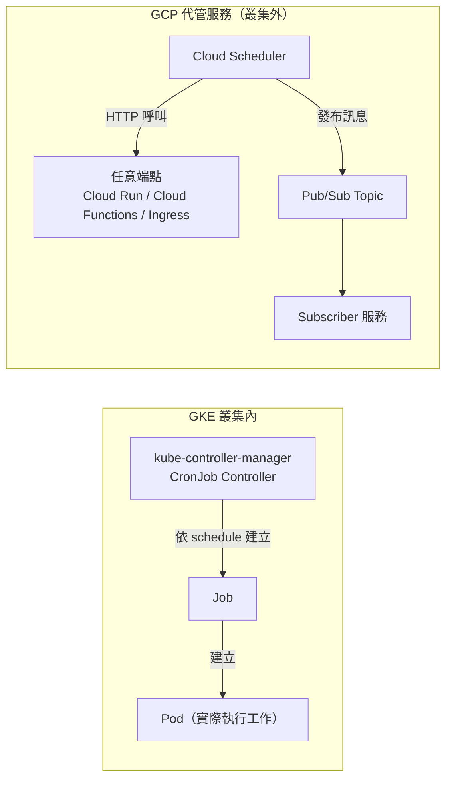
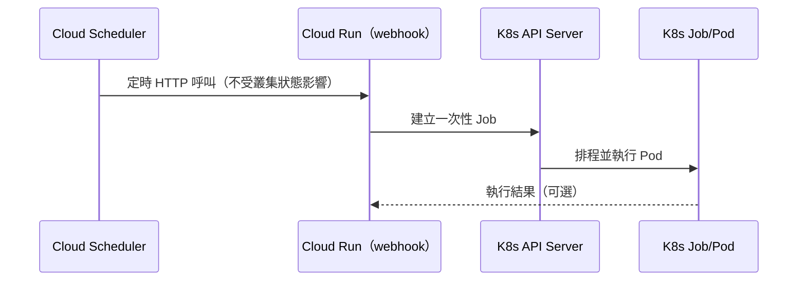
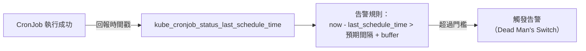

# Kubernetes CronJob 與 GCP Cloud Scheduler 的差異與選型

> 一句話：CronJob 是「在叢集內建立會執行工作的 Pod」的排程器；Cloud Scheduler 是「在叢集外定時發送觸發訊號」的獨立管理服務，兩者的本質差異在於「執行工作」與「排程觸發」是否耦合在同一個 Kubernetes 叢集裡。

## Step 1：兩者分別是什麼

### Kubernetes CronJob

CronJob 是 Kubernetes 的一種 API 資源，由 `kube-controller-manager` 內建的
CronJob controller 依 cron 表達式週期性地建立 Job，Job 再建立 Pod 去真正執行
工作。整個生命週期都發生在同一個叢集裡：

- 排程邏輯（controller）跑在叢集的 control plane。
- 實際工作（container）跑在叢集的 worker node 上，需要有可用的 node 資源。
- 你必須把要執行的程式包成 container image，跟其他 workload 一樣受叢集的
  排程、資源配額、網路政策約束。

### GCP Cloud Scheduler

Cloud Scheduler 是 GCP 的全代管排程服務，本質上是一個「雲端版 cron」，但它
**自己不執行任何工作**，只是在排定時間到了之後，對外送出一個觸發訊號：

- 觸發目標可以是 HTTP/HTTPS endpoint（Cloud Run、Cloud Functions、App
  Engine、甚至一個公開的 GKE Ingress 端點）、Pub/Sub topic，或 App Engine
  排程工作。
- 真正的運算完全發生在被觸發的服務裡，Cloud Scheduler 只負責「準時打一次
  請求」並依回應碼決定要不要重試。
- 服務本身脫離任何特定叢集或 VM 的生命週期，有獨立的 SLA。

## Step 2：架構對比

CronJob 的排程與執行「頭尾都在叢集裡」；Cloud Scheduler 只負責「頭」（觸發
時機），「尾」（實際執行）交給任何有 endpoint 的服務，可以是叢集內、叢集
外，甚至完全無關的 GCP 服務。

## Step 3：核心差異逐項拆解

| 面向 | Kubernetes CronJob | GCP Cloud Scheduler |
|---|---|---|
| 執行環境 | 叢集內建立 Pod 執行 | 不執行工作，只送出觸發訊號 |
| 相依性 | 依賴叢集/API server 健康狀態 | 獨立代管服務，有自己的 SLA |
| 觸發目標 | 只能是叢集內的 Job（container image） | HTTP endpoint、Pub/Sub、App Engine，範圍不限於 K8s |
| 資源模型 | 執行時需要 node capacity，可能 Pending | 自身不耗運算資源，執行方自行擴縮 |
| 重試/並發語意 | `concurrencyPolicy`（`Allow`/`Forbid`/`Replace`）、`backoffLimit`、`startingDeadlineSeconds` | 依 HTTP 回應碼決定重試，可設 retry count、min/max backoff |
| 時區支援 | 新版本才原生支援 `timeZone` 欄位，舊版本固定用 controller 所在時區 | 建立時可直接指定 timezone |
| 監控整合 | 需自行整合 `kubectl` / Prometheus / GKE 的 Cloud Logging | 原生整合 Cloud Logging、Cloud Monitoring、IAM |

### 可用性與相依性是最關鍵的差異

CronJob 的排程完全依賴叢集本身：如果叢集正在升級、node 被 cordon、或
API server 短暫不可用，排程可能漏跑或延遲。這是因為 CronJob controller
本身也只是 control plane 裡的一個 controller loop，跟叢集的其他狀態共享
同一個「故障域」（fault domain）。

Cloud Scheduler 則刻意設計成與任何運算資源解耦——即使你的 GKE 叢集正在
做 maintenance window、擴縮容或重建，Cloud Scheduler 仍會準時發送觸發，
這對「排程本身的可靠性」比「執行環境的健康度」更重要的場景很關鍵。

### 目標型態決定了適用範圍

CronJob 天生只能觸發「叢集內的 Job」，如果你的工作需要存取叢集內部資源
（例如叢集內的資料庫連線、service mesh、特定的 sidecar），CronJob 更直接。

Cloud Scheduler 因為只是打一個 HTTP 請求或發一則 Pub/Sub 訊息，觸發對象
可以是任何服務，天然適合「跨服務整合」或「排程邏輯要獨立於任何單一
compute 環境」的場景。

## Step 4：兩者合用的典型架構

實務上很常見的做法是把兩者的優點結合：用 Cloud Scheduler 提供高可用的
觸發時機保證，再由它去呼叫一個 webhook（例如 Cloud Run 服務），由該
webhook 呼叫 Kubernetes API 建立一次性的 Job，藉此把「觸發時機」與
「執行環境」解耦：

這種架構的好處是：即使叢集正在重建或維護，觸發時機不會漏；同時工作仍然
能利用叢集內的資源與網路存取叢集內部服務。

## Step 5：選型建議

- 工作需要存取叢集內部資源、或已經是叢集內既有 workload 的延伸 → 用
  **CronJob**，維運上不需要額外服務。
- 只是定時打一個 API、發一則訊息去觸發下游、或希望排程邏輯完全獨立於任何
  compute 環境（避免叢集重建/升級造成漏跑）→ 用 **Cloud Scheduler**。
- 需要「高可用觸發 + 叢集內執行」兩者兼具 → 用 Cloud Scheduler 觸發一個
  webhook，再由 webhook 建立 K8s Job，把觸發時機與執行環境解耦。

## Step 6：哪一種穩定度比較高？

單就「觸發時機的可靠性」而言，**Cloud Scheduler 的穩定度上限高於一般
CronJob**，原因回到 Step 3 討論過的相依性差異：

- Cloud Scheduler 是獨立代管服務，有自己的 SLA，且天生跨區域備援，不與
  任何使用者管理的運算資源共享故障域。
- CronJob 的穩定度受限於「這個叢集」本身：control plane 的可用性、
  CronJob controller 的 sync loop、node 是否有可用資源，任何一環出問題
  都可能讓排程漏跑或延遲。

但這個比較有個重要前提：**Cloud Scheduler 保證的只是「觸發訊號準時送
出」，不保證下游執行成功**。如果 Cloud Scheduler 打的 webhook 本身不穩、
或該 webhook 又是去建立一個 K8s Job，那穩定度瓶頸其實還是回到叢集這一
層。換句話說，兩者比的是「排程觸發」這一段的穩定度，不是整條「排程 →
執行 → 完成」鏈路的穩定度——鏈路的穩定度永遠等於最弱一環。

CronJob 並非天生不穩定，只是預設設定沒有針對高可用場景調校。透過
Step 7 的作法，CronJob 的穩定度可以逼近 Cloud Scheduler，代價是需要
自己投入 observability 與架構設計。

## Step 7：如何確保 CronJob 穩定執行

### 叢集層面

- 用 **regional cluster**（多 zone 的 control plane）而非 zonal
  cluster，避免單一 zone 故障讓 API server 整個不可用。
- 開 **cluster autoscaler** 或用 GKE Autopilot，確保排定時間到了有足夠
  node capacity 可以建立 Pod，避免 Job 卡在 `Pending`。
- 排程時間本身有解析度限制：CronJob controller 是固定週期的 sync loop，
  不是精準的即時觸發器，不要對秒級精準時間有期待；真的需要秒級精度應該
  用其他機制（例如應用層自己的 timer）。

### CronJob spec 的關鍵欄位

| 欄位 | 作用 | 建議 |
|---|---|---|
| `concurrencyPolicy` | 上一輪還沒執行完、下一輪排程到了怎麼辦 | 大多數批次工作建議 `Forbid`，避免重疊執行造成資源競爭或重複處理 |
| `startingDeadlineSeconds` | 錯過排程後，多久內還算「來得及補跑」 | 設定明確的合理值（而非留空），避免叢集短暫不可用恢復後，大量錯過的排程一次補跑造成 thundering herd |
| `backoffLimit` | Job 失敗後的重試次數 | 依工作的冪等性與執行時長評估，避免無限重試 |
| `activeDeadlineSeconds` | Job 執行的總時長上限 | 一定要設，避免程式 hang 住導致 Pod 卡死佔用資源 |
| `successfulJobsHistoryLimit` / `failedJobsHistoryLimit` | 保留多少歷史 Job 物件 | 保留足夠筆數方便除錯，但不要設太高造成 etcd 壓力 |

### 監控：CronJob 最大的風險是「沉默失敗」

CronJob 最危險的故障模式不是「執行失敗」（這會留下錯誤 log，容易被
發現），而是**完全沒有被觸發**——CronJob controller 卡住、或叢集在
維護窗口期間整個排程被跳過，這種情況不會產生任何錯誤事件，必須主動
偵測：

- 用 `kube-state-metrics` 匯出的
  `kube_cronjob_status_last_schedule_time`、`kube_job_status_failed`
  設定告警規則，核心邏輯是「距離上次成功排程/執行的時間超過預期間隔太
  多」就告警，而不是只看「有沒有錯誤」。
- 這種模式在 SRE 領域稱為 **dead man's switch**：正常運作時持續發出
  訊號，一旦訊號停止才是異常，剛好對應「排程完全沒被觸發」這種找不到
  錯誤 log 的故障。也可以用外部服務（如 Healthchecks.io、Cronitor）
  或自建的 heartbeat 端點實作同樣的模式。

### 冪等性設計

`concurrencyPolicy: Forbid` 加上合理的 `backoffLimit`、`startingDeadlineSeconds`
只能降低重複執行的機率，無法完全消除（例如 crash 後重試、補跑）。因此
工作本體務必設計成**冪等（idempotent）**：對外部有副作用的操作（發信、
扣款、寫入）用去重 key 或 upsert 語意，確保就算意外重複執行，結果也一致。

### 若穩定度要求非常高

考慮把「觸發」與「執行」徹底解耦：用 Cloud Scheduler 觸發一個 webhook
去建立 K8s Job（見 Step 4 的架構），或乾脆把工作移出叢集，改用
**Cloud Run Jobs**（GCP 專門給批次/排程工作設計的代管執行環境），
省去自行維運 CronJob 高可用性的成本。

## 相關筆記

- [GKE Pod 記憶體管理：Request 與 Limit 的實際運作](#/sre/03-operations/gke-pod-memory-without-limit.mdx)
- [GCP Logs Explorer、Trace Explorer、Metrics Explorer 與 Error Reporting 的關係](#/sre/02-observability/gcp-logs-trace-metrics-error-reporting.mdx)
- [Prometheus 與 Grafana 的功能與協作方式](#/sre/02-observability/prometheus-and-grafana-overview.mdx)
