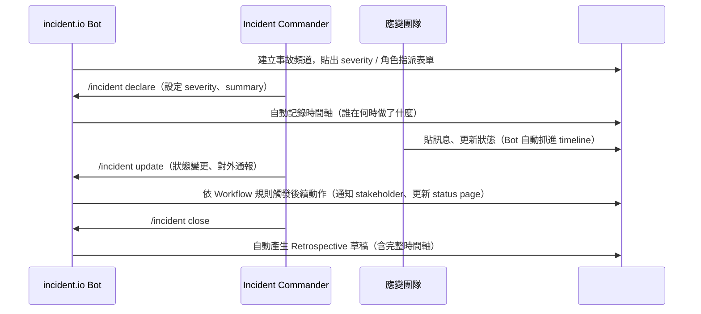
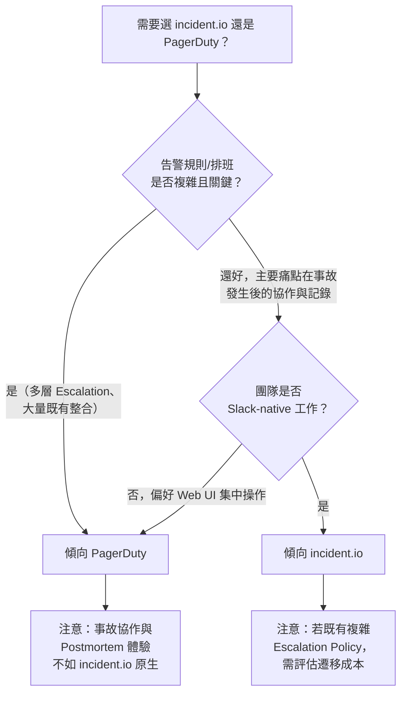

# incident.io 與 PagerDuty 的深度比較：事故管理工具選型指南

> 一句話：PagerDuty 是從「告警通知引擎」長出事故管理功能的老牌平台，incident.io 是從「Slack 原生的事故協作流程」出發、近年才補上告警引擎的新銳工具；兩者現在功能高度重疊，差異在於「引擎的成熟度」與「工作流程的原生體驗」哪個對團隊更重要。

## Step 1：定位與發展脈絡

兩家公司的起點完全相反，這決定了各自的強項在哪裡：

- **PagerDuty**（2009 年成立）：從取代實體 pager 的「on-call 通知工具」起家，核心優勢是**告警路由與升級引擎**（Escalation Policy、On-call Schedule）。近幾年才往上疊加 Incident Response、Postmortem、Status Page 等模組，變成完整的 Digital Operations 平台。
- **incident.io**（2021 年成立）：一開始就鎖定「事故本身要怎麼被協作處理」，用 Slack/Teams bot 當作主要操作介面，核心優勢是**結構化的事故工作流程**（角色指派、時間軸自動記錄、事後回顧模板）。告警引擎（Alerts、on-call 排班）是後來才補上的新功能。

理解這個脈絡，就能預期：涉及複雜升級規則、多層排班、告警降噪的場景，PagerDuty 的引擎更成熟；涉及事故發生當下「一群人要怎麼協作、溝通、留下記錄」的場景，incident.io 的體驗更順手。

## Step 2：核心概念對照表

兩者的資料模型名稱不同但可以互相對應：

| 概念 | PagerDuty | incident.io |
|---|---|---|
| 告警來源掛勾點 | Service | Alert Source |
| 告警前處理/降噪 | Event Orchestration | Alert routing + grouping |
| 通知升級規則 | Escalation Policy | Escalation Path |
| 值班排班 | On-call Schedule（多層 Rotation） | Schedule（近年才推出，功能較新） |
| 事故本體 | Incident | Incident |
| 嚴重度 | Priority（P1–P5） | Severity（可自訂等級） |
| 事故中的角色 | 較弱，多半靠 Postmortem app 補 | **原生支援**：Incident Commander、Comms Lead 等角色一開始就是核心概念 |
| 自動化流程 | Automation Actions / Process Automation | **Workflows**（類似 Zapier，可在 Slack 內觸發任意動作） |
| 事後回顧 | Postmortem app（後期加入） | **原生 Retrospective**，模板化、可自動帶入時間軸 |
| 對外狀態頁 | Status Page | Status Page |
| AI 輔助 | PagerDuty Advance（生成式功能，較新） | AI 事故摘要、自動產生時間軸敘述（主打賣點之一） |

## Step 3：告警與 On-call 引擎——PagerDuty 仍是老大哥

如果團隊的痛點是「告警太多太雜、需要精細的路由與降噪規則、on-call 排班複雜（多時區、多層 backup）」，PagerDuty 的 Event Orchestration 與 Escalation Policy 經過十幾年打磨，功能深度明顯領先：

- Event Orchestration 支援 Route / Suppress / Auto-resolve / Enrich 多段規則，還有 Intelligent Alert Grouping（用 ML 把同根因的告警自動合併）。
- On-call Schedule 支援多層 Rotation Layer 疊加、Override、且能用 Terraform 做 Schedule as Code。

incident.io 的 Alerts 與 Schedules 是近兩年才推出的功能，規則引擎的表達力與可靠度紀錄都還在追趕階段——如果團隊本來就重度依賴 PagerDuty 或 Opsgenie 的複雜 Escalation Policy，直接换成 incident.io 的告警引擎可能需要簡化既有規則。

## Step 4：事故協作工作流程——incident.io 的主場

事故一旦被建立之後，接下來「一群人在 Slack 裡怎麼協作」是 incident.io 設計最用心的地方：

關鍵差異：

- **事故頻道即操作介面**：incident.io 幾乎所有操作都能在 Slack/Teams 的 slash command 或按鈕完成，不需要切到網頁後台；PagerDuty 雖然也有 Slack 整合，但完整操作仍偏向 Web UI/App。
- **角色（Roles）是一等公民**：宣告事故時直接指派 Incident Commander、Communications Lead 等角色，且角色本身可以有 handoff 記錄；PagerDuty 原生模型裡沒有這個概念，要靠團隊自己在 Postmortem 裡手動補。
- **Workflows 自動化**：incident.io 的 Workflow 引擎可以設定「當 severity = Critical 且經過 15 分鐘未解決，自動 @ 通知某個 stakeholder 群組並更新 status page」這類條件式自動化，介面類似 Zapier；PagerDuty 也有類似的 Process Automation，但通常需要額外整合 Rundeck 或撰寫 script，門檻較高。

## Step 5：事後回顧（Postmortem）與 AI 功能

- **incident.io**：Retrospective 是核心賣點之一，事故關閉後自動把 Slack 時間軸整理成草稿報告，並用 AI 生成事件摘要、時間軸敘述、甚至建議 action item，減少人工整理的工作量。
- **PagerDuty**：Postmortem app 是後期補上的模組，功能可用但整合深度不如 incident.io 原生；PagerDuty Advance 是近年推出的生成式 AI 功能線，方向類似但市場口碑與成熟度還在累積。

如果團隊的痛點是「每次事故後都要花很多時間手動生成報告、資料常常缺漏」，incident.io 在這塊的體驗優勢明顯。

## Step 6：整合生態與遷移成本

- **PagerDuty**：整合數量與廣度是業界最大之一（600+ 官方整合），對於已經有龐大既有工具鏈（各種監控系統、CMDB、ITSM）的大型企業，相容性風險較低。
- **incident.io**：主流工具（Slack、Teams、Jira、Datadog、Opsgenie）都已支援，並提供從 PagerDuty / Opsgenie 遷移的匯入工具，但整合廣度仍不及 PagerDuty。

## Step 7：定價模式

兩者都採「依人數分層」，但計費對象不同，評估時要注意換算基準：

- **PagerDuty**：依 User（所有需要登入系統的人）分層計費（Free / Professional / Business / Digital Operations），功能會隨方案切割（例如 Event Orchestration 進階規則只在較高方案開放）。
- **incident.io**：主要依 Responder（實際會被拉進事故處理的人）計費，方案切割相對單純，官方主打「定價透明、不用逐項加購」。

實務上要拿到真實報價才能比較總成本，因為兩者的「席位定義」與「功能鎖定門檻」不同，簡單看牌價容易誤判。

## Step 8：選型建議

- **選 PagerDuty**：大型企業、既有複雜 Escalation Policy 與大量第三方整合、需要成熟穩定的告警降噪引擎（Intelligent Alert Grouping）。
- **選 incident.io**：團隊已用 Slack/Teams 當核心溝通工具、重視事故協作流程本身（角色分工、自動時間軸、AI 生成 Postmortem）、告警規則需求相對單純。
- **兩者並存**：不少團隊實務上用 PagerDuty 做告警與 on-call 排班引擎，再串接 incident.io 做事故協作與 Retrospective——兩者都提供彼此的整合，這是常見的漸進式導入路徑，不必一次全部替換。

## 相關筆記

- [PagerDuty：On-Call 事件管理平台的核心概念與運作機制](#/sre/04-incident/what-is-pagerduty.mdx)
- [SLA、SLO 與 SLI 的核心概念與設計實踐](#/sre/01-reliability/sla-slo-sli.mdx)
