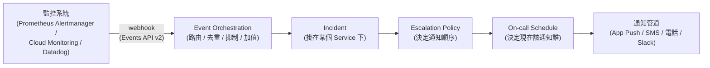
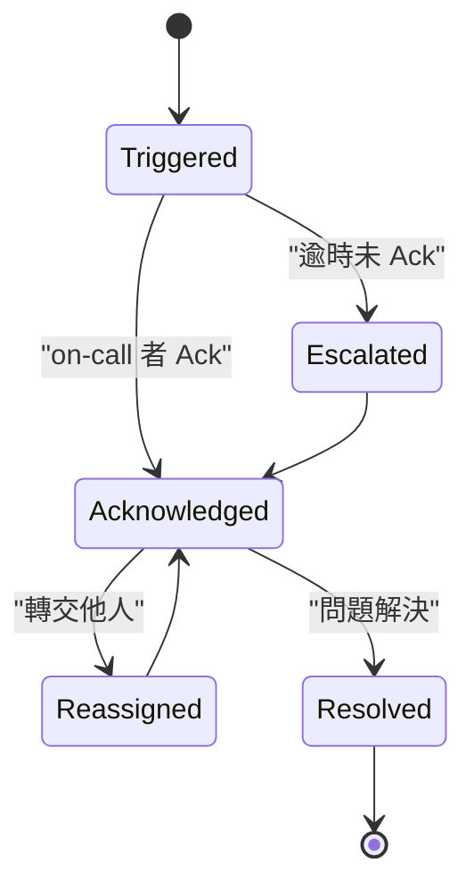
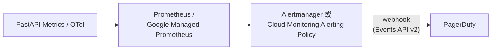

# PagerDuty：On-Call 事件管理平台的核心概念與運作機制

> 一句話：PagerDuty 把「監控系統偵測到異常」跟「正確的人在正確時間收到通知並處理」之間的整條鏈路標準化，並留下事後可追溯的紀錄。

## Step 1：定位——從「傳呼工具」演化成「數位維運平台」

PagerDuty 早期的核心賣點只是「把告警轉成電話/簡訊叫醒對的人」，取代真正的實體 pager。但光是「通知」不足以解決維運痛點——真正麻煩的是「一堆監控系統各自吐告警、雜訊淹沒訊號、事故處理流程沒有留下紀錄」。因此現在的 PagerDuty 涵蓋四塊：

1. On-call 排班與升級通知（最初的核心功能）
2. Event Orchestration（告警前處理，降噪）
3. Incident Response（事故處理協作介面）
4. Analytics / Postmortem（事後留存與度量）

## Step 2：核心資料模型的關係

`Service` 是掛勾監控來源與 Escalation Policy 的中介點，一個 Service 通常對應到一個 GKE Deployment 或一組 FastAPI endpoint 群。

## Step 3：Event Orchestration——真正降噪的地方

這是解決「告警轟炸」問題的關鍵功能。Event 進來後，在建立 Incident **之前**先跑一組規則引擎：

- **Route**：依 event 內容（如 severity、service_name）分流到不同 Escalation Policy
- **Suppress**：符合條件的 event 不建立 Incident（例如已知的 maintenance window）
- **Auto-resolve**：收到「恢復正常」的 event 時自動關閉對應 Incident
- **Enrich**：呼叫外部 webhook 補充上下文（例如自動查 runbook 連結塞進 Incident）
- **Intelligent Alert Grouping**：用機器學習把「同一個根因造成的多個告警」自動合併成一個 Incident，避免值班者收到大量通知才發現其實是同一個資料庫掛掉

這一層跟 SLO burn-rate alerting 是互補關係：burn-rate 規則負責讓告警本身精準，Event Orchestration 負責讓「精準的告警」不會因為重複觸發而變成疲勞轟炸。

## Step 4：Escalation Policy 的細節機制

Escalation Policy 不是單純「A 沒回應找 B」，實際可以設定：

- **多層 level**，每層可設定逾時秒數（幾分鐘沒 ack 就跳下一層）
- 每層可以是 **parallel notify**（同時通知多人，先 ack 算數）
- **repeat 次數**：整個 policy 跑完一輪還沒人 ack，可以重複跑 N 次
- 可綁定不同的 On-call Schedule，而不是寫死某個人

## Step 5：On-call Schedule 的排班機制

- **Rotation Layer**：可疊加多層輪值（例如 Layer 1 是每週輪替的 primary，Layer 2 是每月輪替的 secondary/backup）
- **Override**：某人請假，可以臨時蓋掉排班表的某個時段，不影響原本輪值週期
- **Schedule as Code**：透過 Terraform provider 管理 Schedule / Escalation Policy，跟 infra-as-code 文化一致，避免排班表用試算表手動維護

## Step 6：Incident 生命週期與操作

| 狀態/操作 | 說明 |
|---|---|
| Triggered | 剛建立，尚未有人處理 |
| Acknowledged | 值班者按下 ack，暫停升級 |
| Resolved | 問題解決 |
| Escalate | 手動或逾時自動往下一層轉 |
| Reassign | 轉交給特定的人（不透過 Escalation Policy） |
| Snooze | 暫時延後提醒（例如正在修但還沒好） |
| Merge | 把重複的 Incident 合併成一個，避免同根因產生多筆記錄 |

**Priority 與 Urgency 是兩個容易混淆但不同的概念：**

| 面向 | Urgency（急迫度） | Priority（優先度） |
|---|---|---|
| 決定內容 | 決定「怎麼通知」——high urgency 才會觸發電話/SMS，low urgency 可能只發 email | 決定「重要程度」分類（P1 最嚴重～P5 最輕），用於報表與排序 |
| 誰設定 | 通常由 Service 或 Escalation Policy 事先設定，或 event 內容動態指定 | 通常事故建立後由人工指派，或規則自動判斷 |
| 範例 | 資料庫全掛 → high urgency，立刻打電話 | 使用者體驗但非阻斷的 bug → P3，不需要半夜叫醒人 |

## Step 7：事後留存與度量

- **Postmortem app**：協助整理 Incident timeline、影響範圍、root cause、action item，格式化輸出報告
- **Analytics**：追蹤 MTTA（Mean Time To Acknowledge）、MTTR（Mean Time To Resolve）、告警量趨勢，用來檢視「on-call 負擔是否太重」或「Escalation Policy 設計是否合理」

## Step 8：跟 GKE + FastAPI 監控棧的整合路徑

- **Prometheus Alertmanager**：內建 PagerDuty receiver，`alertmanager.yml` 設定 `pagerduty_configs` 即可
- **GCP Cloud Monitoring**：Notification Channel 直接支援 PagerDuty 整合，Alerting Policy 觸發時打進 PagerDuty 的 Events API

這樣就把「SLI 精準計算 → SLO burn-rate 判斷該不該告警 → PagerDuty 決定通知誰、怎麼通知、事故留存」整條鏈路串起來。

## 相關筆記

- [incident.io 與 PagerDuty 的深度比較：事故管理工具選型指南](#/sre/04-incident/incident-io-vs-pagerduty.mdx)
- [SLA、SLO 與 SLI 的核心概念與設計實踐](#/sre/01-reliability/sla-slo-sli.mdx)
- [在 GKE FastAPI 服務上以 OpenTelemetry 落地 SLI/SLO 量測](#/sre/01-reliability/sli-slo-with-otel-fastapi-gke.mdx)
- [GCP Alerting Policy → Pub/Sub → 自訂 Webhook 完整串接](#/sre/99-staging/gcp-alerting-pubsub-webhook.mdx)
