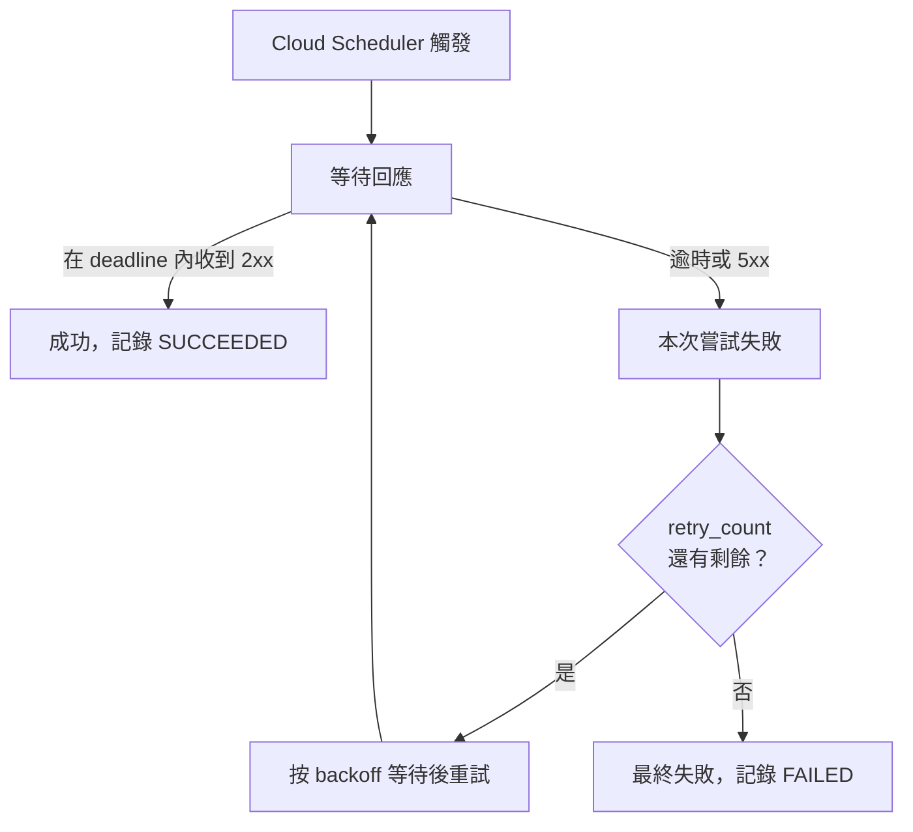
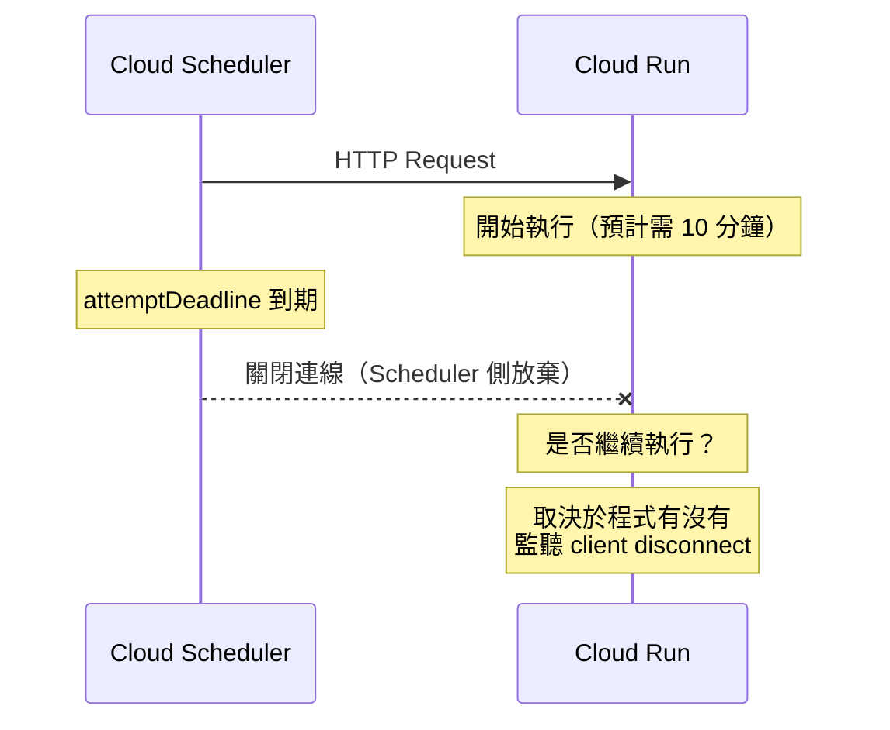
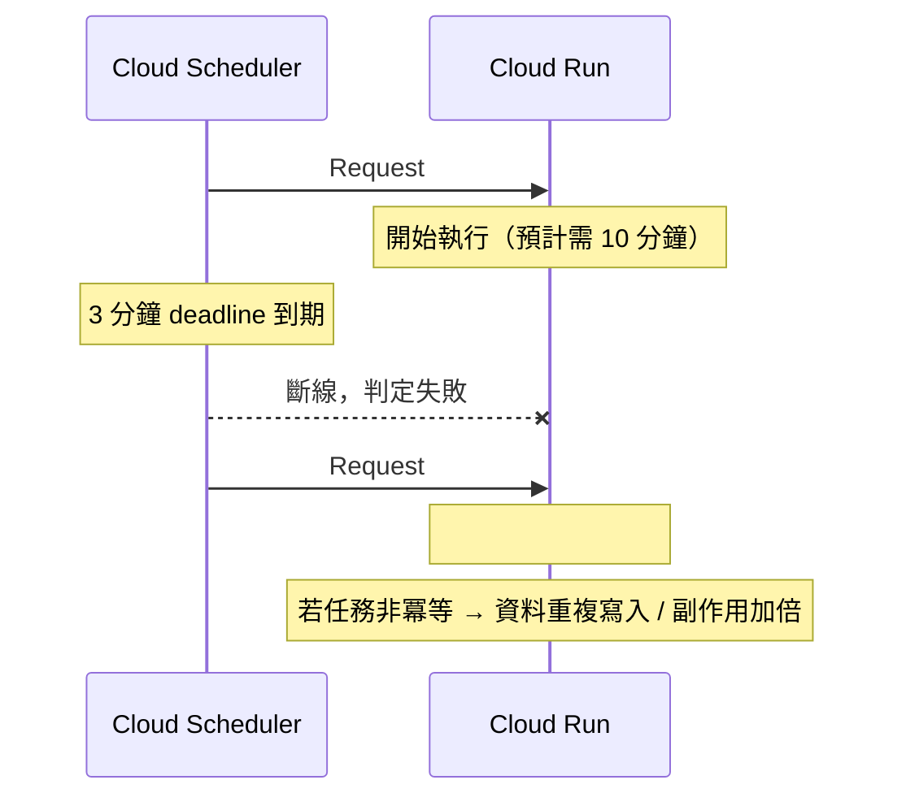

# GCP Cloud Scheduler 的 Timeout 限制與配置

> Cloud Scheduler 以 `attemptDeadline` 控制等待目標回應的時間上限，最大 30 分鐘；與 Cloud Run 搭配時需特別注意兩端 timeout 的大小關係，避免重複執行。

## attemptDeadline 預設值與上限

Cloud Scheduler 每次觸發任務時，會等待目標回應最多 `attemptDeadline` 指定的時間。

| 目標類型 | 預設值 | 最大值 |
|---------|-------|-------|
| HTTP / HTTPS | 3 分鐘（180s） | **30 分鐘（1800s）** |
| App Engine HTTP | 3 分鐘 | 30 分鐘 |
| Pub/Sub | N/A | — |

Pub/Sub 目標只負責把訊息投遞到 topic，沒有 timeout 概念；處理時間由 subscriber 端的 ack deadline 控制。

## 超時後的行為

若在 `attemptDeadline` 內目標未回應（或回傳 5xx）：



Retry policy 的可配置欄位：

| 欄位 | 說明 | 上限 |
|------|------|------|
| `retryCount` | 最多重試幾次 | 5 次 |
| `minBackoffDuration` | 最小退避間隔 | — |
| `maxBackoffDuration` | 最大退避間隔 | — |
| `maxDoublings` | 退避指數翻倍次數上限 | — |

## Timeout 只是「Scheduler 放棄等待」，不是「目標被強制中止」

這是最容易誤解的地方：`attemptDeadline` 到期時，**Cloud Scheduler 只是關掉自己這端的 TCP 連線**，它無法強制終止目標服務的執行。



目標服務收到 client 斷線訊號後的行為：

| 語言 / 框架 | 預設行為 | 說明 |
|------------|---------|------|
| Python FastAPI / Flask | **繼續執行** | 預設不監聽 client disconnect，handler 跑到底 |
| Go `net/http` | **可以中斷** | `r.Context()` 在 client 斷開時自動 cancel；需主動檢查 `ctx.Done()` |
| Node.js Express | 繼續執行（除非監聽 `req.on('close')`） | 同 Python 預設行為 |

Cloud Run 本身不會因為 Scheduler 斷線就殺掉 container；它會讓 request 繼續執行，直到 **Cloud Run 自己的 request timeout** 到期。

## 與 Cloud Run 的搭配陷阱

Cloud Scheduler → Cloud Run 是最常見的組合，但兩端都有獨立的 timeout 設定，**必須保持一致**：

$$\text{attemptDeadline} \leq \text{Cloud Run request timeout}$$

- Cloud Run request timeout 上限為 **3600 秒（1 小時）**
- 若 `attemptDeadline` 小於 Cloud Run 實際執行時間，Scheduler 會判定失敗並觸發 retry，**但 Cloud Run job 其實仍在執行中**

最危險的情境——`attemptDeadline` 過短 + retry 開啟：



建議做法：

1. 先確認任務的最壞執行時間，再同時調高兩端的 timeout
2. 確保任務本身具備 **idempotency**（即使重複執行也不會產生副作用）
3. 若使用 Python，可在 handler 內加入 background task 並立即回 202，讓 Scheduler 認為成功，由 Cloud Run 自己管理執行時間

## gcloud / Terraform 配置範例

```bash
# gcloud：建立任務時設定 attemptDeadline 為 20 分鐘
gcloud scheduler jobs create http my-job \
  --schedule="0 * * * *" \
  --uri="https://my-service.example.com/run" \
  --http-method=POST \
  --attempt-deadline=1200s \
  --max-retry-attempts=3 \
  --min-backoff=5s \
  --max-backoff=300s

# gcloud：更新現有任務的 deadline
gcloud scheduler jobs update http my-job \
  --attempt-deadline=1200s
```

```hcl
# Terraform
resource "google_cloud_scheduler_job" "my_job" {
  name     = "my-job"
  schedule = "0 * * * *"
  time_zone = "Asia/Taipei"

  http_target {
    uri         = "https://my-service.example.com/run"
    http_method = "POST"
  }

  attempt_deadline = "1200s"

  retry_config {
    retry_count          = 3
    min_backoff_duration = "5s"
    max_backoff_duration = "300s"
    max_doublings        = 3
  }
}
```

## 小結

| 要點 | 值 |
|------|---|
| 最大 `attemptDeadline` | 30 分鐘（1800s） |
| 預設 `attemptDeadline` | 3 分鐘（180s） |
| 超時後行為 | 觸發 retry policy |
| 最大 retry 次數 | 5 次 |
| Cloud Run timeout 上限 | 1 小時（3600s） |
| 搭配 Cloud Run 的黃金規則 | Scheduler deadline ≤ Cloud Run timeout |

## 相關筆記

- [Kubernetes CronJob 與 GCP Cloud Scheduler 的差異與選型](#/sre/05-gcp/k8s-cronjob-vs-cloud-scheduler.mdx)
- [GCP Cloud Run 的原理與應用](#/sre/05-gcp/gcp-cloud-run-overview.mdx)
