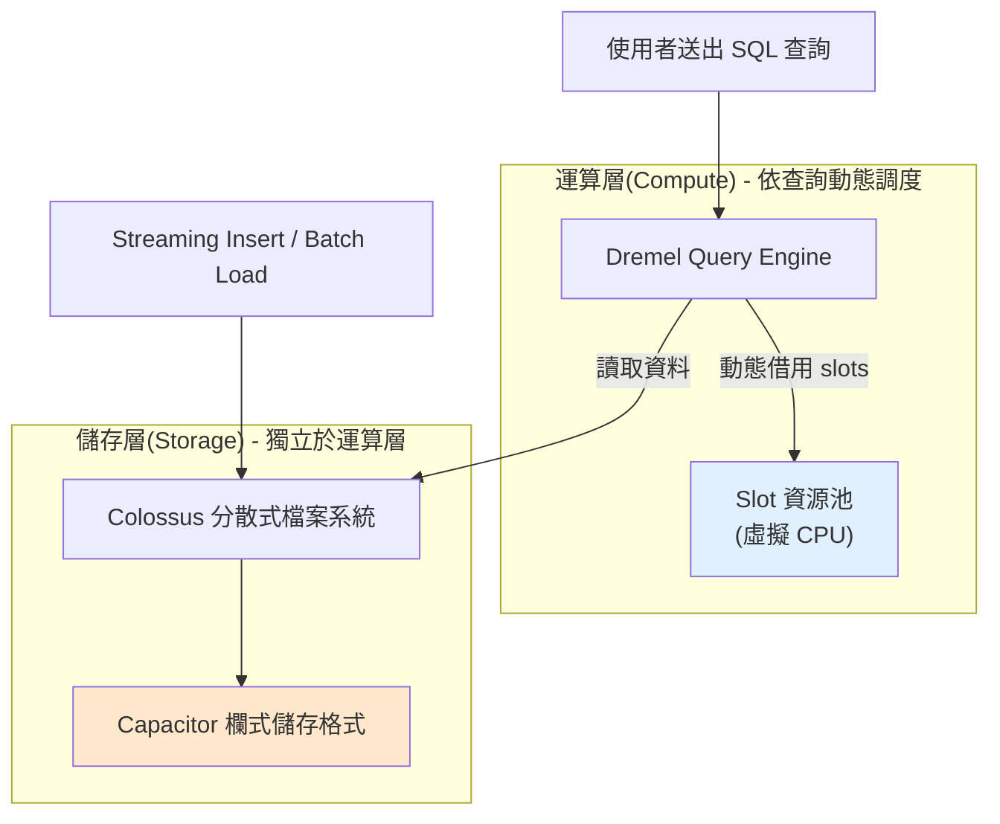

# GCP BigQuery 核心功能與計費模式

> 一句話版本：BigQuery 是 GCP 的無伺服器（serverless）分析型資料倉儲，儲存與運算完全分離，計費分成「查詢處理量」與「儲存量」兩條主軸，並可依用量規模在隨用隨付與容量定額（Editions）方案間切換。

## Step 1：BigQuery 是什麼

BigQuery 是 Google Cloud 的**全託管、無伺服器分析型資料倉儲（analytical data warehouse）**，設計目標是用 SQL 對 PB 級資料做交互式查詢分析，而不是取代 OLTP 資料庫做交易處理。

它跟傳統自建資料倉儲（Teradata、on-prem Hadoop）最大的差異：

- **不需要管理任何叢集或節點**：沒有 instance size、沒有 disk 要規劃，Google 全權負責底層運算資源調度。
- **儲存（storage）與運算（compute）完全分離**：兩者各自獨立擴展、獨立計費，這也是理解計費模式的關鍵前提（見 Step 2）。
- **原生支援標準 SQL**（GoogleSQL，相容 ANSI SQL 2011），也保留 legacy SQL 供舊系統相容。

## Step 2：架構——儲存與運算分離

這個分離架構帶來兩個計費上的直接後果：

1. 你**閒置不查詢時只付儲存費**，不會因為「開著一台機器」而持續燒運算費用（這點跟需要常駐 VM 的自建方案完全不同）。
2. 查詢費用跟**「掃描了多少資料」**掛勾，而不是跟「查詢跑了多久」掛勾——這對成本估算的心智模型很重要，下面會展開。

## Step 3：核心功能一覽

| 功能 | 說明 |
|---|---|
| 無伺服器查詢 | 送出 SQL 後 Google 自動配置運算資源（slots），查完自動釋放 |
| 欄式儲存 | 資料以 Capacitor 格式欄式（columnar）儲存，查詢只讀取用到的欄位，大幅降低掃描量 |
| Partitioning / Clustering | 依日期或欄位切分表格分區、依欄位排序叢集，進一步縮小查詢掃描範圍 |
| BigQuery ML | 直接用 SQL 語法訓練與部署 ML 模型（線性迴歸、分類、時間序列、甚至匯入 TensorFlow 模型） |
| BigQuery Omni | 跨雲查詢 AWS S3、Azure Blob Storage 上的資料，不用先搬進 BigQuery |
| Streaming Insert | 即時寫入資料，寫入後幾秒內即可被查詢到，適合即時分析場景 |
| 外部資料表（External Tables） | 直接查詢 Cloud Storage、Google Sheets 上的資料而不需先載入 |
| BigQuery BI Engine | 記憶體內加速層，讓儀表板（如 Looker Studio）互動查詢達到次秒級回應 |
| 資料共享（Analytics Hub） | 跨組織安全地共享資料集，不需複製資料本身 |
| 內建版本控管 | Time Travel（預設 7 天內可查詢歷史版本）與 Table Snapshot |

## Step 4：計費模式——兩條主軸

BigQuery 計費拆成**運算（query processing）**與**儲存（storage）**兩條完全獨立的軸線。

### 4.1 運算計費：On-Demand vs Editions（容量定額）

**On-Demand（隨用隨付）**

- 依**查詢實際掃描的資料量**計費，以 TB 為單位（進位到 MB）。
- 每月有固定的免費額度（第一 1 TB 免費，依區域可能調整）。
- 適合用量不穩定、查詢頻率低、或剛開始評估 BigQuery 的團隊。
- 最大風險：一條沒加限制的 `SELECT *`、或忘記加 partition filter 的查詢，可能一次掃描整張表、瞬間產生高額費用。

**Editions（容量定額，取代舊有的 Flat-Rate）**

- 改用**購買 slots（虛擬 CPU 運算單位）容量**計費，而不是依掃描量計費。
- 分成 Standard、Enterprise、Enterprise Plus 三個版本，可選：
  - **按秒計費（Autoscaling）**：依實際需要動態借用 slots，用多少秒算多少秒的費用。
  - **一年期／三年期承諾（Commitment）**：預先承諾固定 slots 容量換取顯著折扣。
- 適合**查詢量大、可預測**的團隊——同樣的資料量，On-Demand 下每次查詢單獨計費，Editions 下則是「买断一批運算容量、隨便用」，用量夠大時單位成本會更低。

判斷原則：把公司的月查詢掃描量、查詢頻率抓出來換算兩種方案的成本，抓一個轉折點（breakeven point）作為選型依據，這在容量規劃上跟 [SLA、SLO 與 SLI 的核心概念與設計實踐](#/sre/01-reliability/sla-slo-sli.mdx) 中「用歷史用量反推容量」的思路是一致的。

### 4.2 儲存計費

- 依**實際儲存的資料量**（壓縮後）計費，以 GB／月為單位。
- 分成兩級：
  - **Active storage**：過去 90 天內有被修改過的表格／分區。
  - **Long-term storage**：連續 90 天未修改的表格／分區，會**自動**降價（費率通常是 active 的一半左右），不需要手動搬遷或設定生命週期規則。
- 同樣有每月免費額度。

### 4.3 其他計費項目

| 項目 | 計費方式 |
|---|---|
| Streaming Insert | 依寫入的資料量計費（每 200 MB 為單位進位） |
| BigQuery ML | 訓練依掃描資料量或依模型類型計費（部分模型有額外費率） |
| BigQuery Omni | 依跨雲查詢掃描量計費，費率通常高於原生查詢 |
| BI Engine | 依保留的記憶體容量（GB）計費 |
| 資料傳出（Egress） | 跨區域或匯出到 BigQuery 之外的網路流量計費 |

## Step 5：常見的成本控管手段

1. **Partition + Cluster 表格**：讓查詢只掃描需要的分區，是壓低 On-Demand 費用最直接的手段。
2. **善用 `--dry_run` 或 UI 上的「這個查詢將處理 N GB」預估**：送出前先看掃描量，尤其是排程中的 ETL 查詢。
3. **設定 Custom Quota / 專案層級的每日查詢額度上限**：避免單一失控查詢炸掉整月預算。
4. **對高頻查詢的儀表板改用 BI Engine 或 materialized view**：避免同一份聚合結果被重複全表掃描。
5. **善用 Long-term storage 的自動降價**：冷資料不需要額外搬遷，只要 90 天沒異動就自動套用較低費率。

## 相關筆記

- [SLA、SLO 與 SLI 的核心概念與設計實踐](#/sre/01-reliability/sla-slo-sli.mdx)
- [內部系統功能使用率追蹤的業界做法](#/sre/02-observability/feature-usage-tracking-internal-system.mdx)
