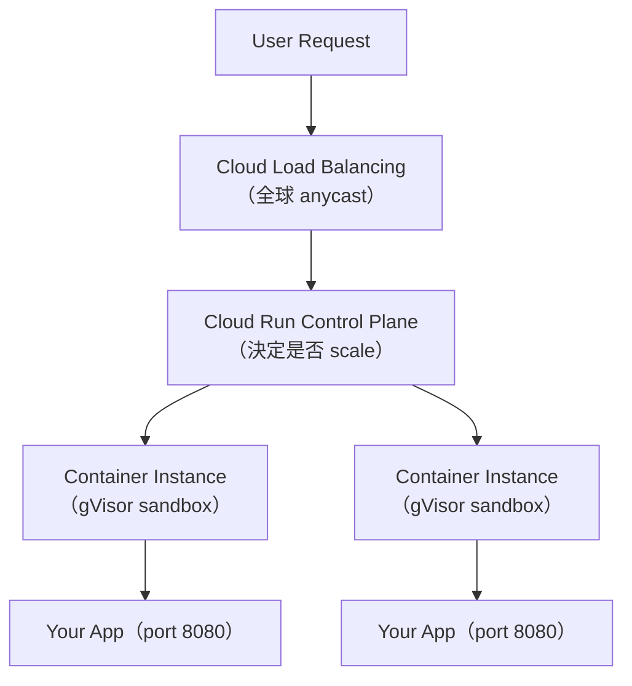
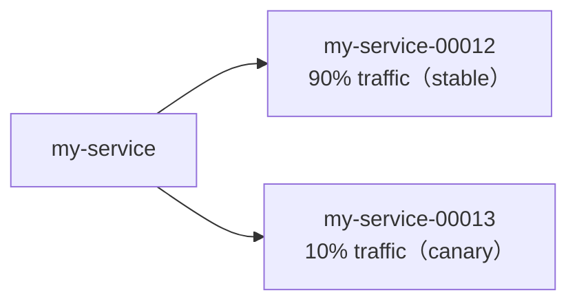
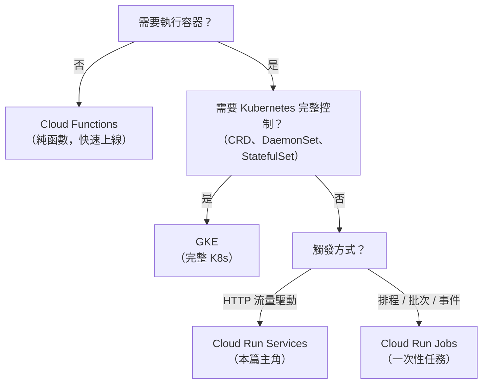
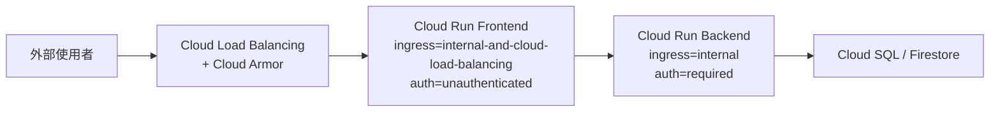

# GCP Cloud Run 的原理與應用

> 全託管無伺服器容器平台：帶著 container image 來，其餘交給 GCP——自動 HTTPS、自動 scale、scale to zero。

## Step 1：Cloud Run 是什麼？

Cloud Run 是 GCP 的**全託管無伺服器容器平台（Serverless Container Runtime）**。你只需要準備好的 container image，Cloud Run 負責：

- 啟動 container、暴露 HTTPS endpoint
- 依請求流量自動 scale out / scale to zero
- 管理 TLS 憑證、load balancing、健康檢查

定位是：**比 GKE 更簡單，比 Cloud Functions 更彈性**。任何語言的 container 都能上，不需要管理 node、cluster 或 ingress。

## Step 2：架構原理



底層核心是 **gVisor**：Google 自研的使用者空間 Linux kernel，提供介於 VM 與傳統 Docker 之間的安全隔離，同時保持接近 container 的啟動速度。

每個 container instance 對外只需監聽 HTTP（port 預設 8080），Cloud Run 自動處理 TLS 終止與路由。

## Step 3：Cold Start（冷啟動）

Cloud Run scale to zero 的代價是 **Cold Start**——當沒有 warm instance 時，請求必須等待：

$$
T_{\text{cold}} = T_{\text{image pull}} + T_{\text{gVisor init}} + T_{\text{app startup}}
$$

| 階段 | 耗時來源 | 優化方向 |
|------|----------|----------|
| Image pull | image 大小 | multi-stage build、distroless base |
| gVisor init | sandbox 初始化 | 固定開銷，通常低於 100 ms |
| App startup | 程式碼初始化 | lazy load、減少全域 I/O |

**緩解方案：**

- **Min instances**：設 `--min-instances=1` 保持一個 warm instance，消除冷啟動（有 idle 計費）
- **CPU always allocated**：instance idle 時仍保留 CPU，適合需要跑背景任務的服務
- **Startup CPU boost**（預覽功能）：在 container 啟動期間暫時分配更多 CPU 加速初始化

## Step 4：Concurrency（並發數）

Cloud Run 最有別於 Cloud Functions 的設計：**單一 instance 可同時處理多個請求**。

| 參數 | 預設值 | 說明 |
|------|--------|------|
| `--concurrency` | 80 | 每個 instance 最多同時處理幾個 request |
| `--max-instances` | 1000 | 最多 scale 到幾個 instance |
| `--min-instances` | 0 | 最少保留幾個（0 = scale to zero） |

**Scale 觸發邏輯（target-based autoscaling）：**

$$
\text{target instances} = \left\lceil \frac{\text{concurrent requests}}{\text{concurrency}} \right\rceil
$$

例如 concurrency = 80、同時有 200 個 in-flight request → 需要 3 個 instance。

**選型建議：**

- **CPU-bound**（影像處理、ML inference）：`concurrency=1`，避免 CPU 競爭，讓 scale-out 決策更精準
- **I/O-bound**（API proxy、資料庫查詢）：`concurrency=80～1000`，充分利用 async 等待時間

## Step 5：Revision 與 Traffic Splitting

每次部署都會產生一個不可變的 **Revision**（版本快照，包含 image、環境變數、concurrency 等所有設定）。流量可以在多個 revision 之間任意切分：



Canary 與 Rollback 只需一條指令：

```bash
# 切 10% 流量到新版（canary）
gcloud run services update-traffic my-service \
  --to-revisions=my-service-00013=10,my-service-00012=90

# 全量 rollback 到舊版
gcloud run services update-traffic my-service \
  --to-revisions=my-service-00012=100
```

Traffic splitting 在 Cloud Run control plane 層完成，不需要額外的 ingress 或 service mesh。

## Step 6：Cloud Run Services vs Cloud Run Jobs

| 面向 | Cloud Run Services | Cloud Run Jobs |
|------|--------------------|----------------|
| 觸發方式 | HTTP request | 手動、Cloud Scheduler、Pub/Sub |
| 執行模式 | 常駐，等待請求 | 一次性任務，執行完即退出 |
| 典型用途 | API、webhook、web app | ETL、報表生成、批次處理 |
| 超時上限 | 60 分鐘 | 24 小時 |
| Scaling | 依流量自動 scale | 可設 task parallelism |

Cloud Run Jobs 支援 **task parallelism**：例如處理 1000 筆資料可以開 10 個 task 並行，每個 task 用環境變數 `CLOUD_RUN_TASK_INDEX` 確定自己的資料範圍。

```bash
gcloud run jobs create my-etl-job \
  --image=gcr.io/my-project/etl \
  --tasks=10 \
  --parallelism=5  # 最多同時跑 5 個 task
```

## Step 7：定價模型

Cloud Run 有兩種 billing 模式，取決於 `--cpu` 的 allocation 設定：

### Request-based（預設）

只在 **處理請求期間** 計費，scale to zero 時完全不收費，適合低流量或突發性服務。

| 資源 | 計費單位 |
|------|----------|
| CPU | vCPU-second |
| Memory | GB-second |
| Requests | 每百萬次 |

### CPU always allocated

instance 存活期間（含 idle）都計費，適合需要執行背景任務（Pub/Sub 消費、定時輪詢）的服務。

**每月免費額度（共享整個專案）：**

| 資源 | 免費額度 |
|------|----------|
| CPU | 180,000 vCPU-seconds |
| Memory | 360,000 GB-seconds |
| Requests | 2,000,000 次 |

小流量服務幾乎可以零成本運行。

## Step 8：選型決策樹



## Step 9：存取控制——Cloud Run 不一定是 Public

Cloud Run 預設會產生一個公開的 HTTPS URL，但存取控制可以透過兩個獨立維度鎖緊。

### 維度一：Ingress（入口流量控制）

控制「哪些網路來源的流量可以進入」：

| Ingress 設定 | 允許的流量來源 |
|---|---|
| `all`（預設） | 任何來源，含公網 |
| `internal` | 同 VPC、Cloud Run、Pub/Sub、Eventarc 等 GCP 內部來源 |
| `internal-and-cloud-load-balancing` | 內部 + 經過 Cloud Load Balancing 的流量（可掛 Cloud Armor WAF） |

```bash
gcloud run services update my-service --ingress=internal
```

### 維度二：IAM Authentication（身份驗證）

控制「呼叫者有無身份權限」：

| 設定 | 效果 |
|---|---|
| Allow unauthenticated | 任何人都能呼叫，無需 token |
| Require authentication | 呼叫者必須帶 Google-signed ID token，且擁有 `roles/run.invoker` |

Private service 的呼叫方式（帶 ID token）：

```bash
TOKEN=$(gcloud auth print-identity-token)
curl -H "Authorization: Bearer $TOKEN" https://my-service-xxx.run.app
```

Service account 之間互打同理——呼叫方的 SA 需被授予目標 service 的 `run.invoker` role。

### 常見架構模式



### 選型速查

| 場景 | Ingress | Auth |
|------|---------|------|
| 對外 public API | `all` | unauthenticated |
| 內部微服務 | `internal` | required |
| 對外但要過 WAF | `internal-and-cloud-load-balancing` | unauthenticated |
| Pub/Sub push / Cloud Scheduler 觸發 | `internal` | required（push subscription 帶 OIDC token） |

## 相關筆記

- [Kubernetes CronJob 與 GCP Cloud Scheduler 的差異與選型](#/sre/05-gcp/k8s-cronjob-vs-cloud-scheduler.mdx)
- [GCP VPC Network 的架構與核心概念](#/sre/05-gcp/gcp-vpc-network.mdx)
- [GKE Pod 記憶體管理：Request 與 Limit 的實際運作](#/sre/05-gcp/gke-pod-memory-without-limit.mdx)
