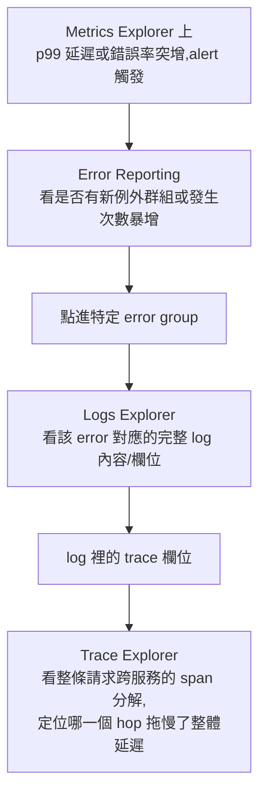
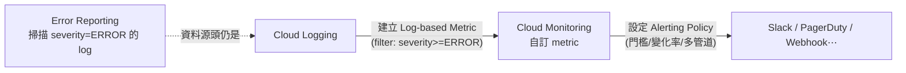

# GCP Logs Explorer、Trace Explorer、Metrics Explorer 與 Error Reporting 的關係

> 一句話版本：這四個介面對應 Google Cloud Operations Suite（原 Stackdriver）裡可觀測性三大支柱——Logging、Metrics、Tracing——再加上一個建立在 Logging 之上的「例外自動聚合」工具（Error Reporting），彼此透過 `trace_id`、log-based metrics 與共用的 Monitored Resource 標籤互相串接，不是四個互相獨立的系統。

## Step 1：先分清楚「服務」與「UI 入口」

這四個名字裡，有的是底層服務，有的只是那個服務的網頁 UI：

| 你聽到的名字 | 底層服務 | 角色 |
|---|---|---|
| Logs Explorer | Cloud Logging | UI 入口 |
| Trace Explorer | Cloud Trace | UI 入口 |
| Metrics Explorer | Cloud Monitoring | UI 入口 |
| Error Reporting | Error Reporting | 服務與 UI 合一，但資料來源是 Cloud Logging |

換句話說，實際上只有三個獨立的資料服務（Logging、Trace、Monitoring），Error Reporting 是架在 Logging 上面的加值產品，不是第四個獨立資料源。

## Step 2：各自負責什麼資料型態

| 工具 | 資料型態 | 典型問題 | 底層儲存/系統 |
|---|---|---|---|
| Cloud Logging | 結構化/非結構化事件紀錄（LogEntry） | 「這次請求印出了什麼？」「哪一行程式碼噴了 exception？」 | 類似 Google 內部的 log 分析基礎設施 |
| Cloud Trace | 一次請求跨服務的 span 樹（延遲分解） | 「這個請求 800ms 花在哪個 hop？」 | 概念源自 Google 內部的 Dapper |
| Cloud Monitoring | 時間序列數值（counter / gauge / distribution） | 「過去一小時 QPS、CPU、p99 延遲的趨勢？」 | Google 內部的 Monarch |
| Error Reporting | 從 Logging 掃出來、依 stack trace 指紋分組的例外群組 | 「這個例外今天發生幾次？有沒有新的例外類型？」 | 建立在 Cloud Logging 之上的索引層 |

## Step 3：彼此的串接方式

四個工具能互相跳轉，靠的是三條具體的資料連結：

**Error Reporting ← Logging**：Error Reporting 持續掃描 `severity=ERROR`（或更高）且帶有 stack trace 的 `LogEntry`，用「例外訊息 + stack frame」做指紋比對（fingerprinting），把同一種例外的多次發生聚合成一個 error group，並統計發生次數、首次/最近發生時間、受影響版本。它本身不接收獨立的寫入路徑，資料源頭永遠是 log。

**Logging ↔ Trace**：`LogEntry` 有一個 `trace` 欄位（格式 `projects/PROJECT_ID/traces/TRACE_ID`），只要應用程式或 OpenTelemetry SDK 在寫 log 時帶上目前的 trace context，Logs Explorer 就能在該筆 log 旁邊直接顯示「查看關聯的追蹤」，一鍵跳到 Trace Explorer 對應的那條 trace；反過來在 Trace Explorer 看一條 trace 時，也能秀出同一個 `trace_id` 底下的所有 log。

**Logging/Trace → Monitoring**：
- Log-based metrics：把一個 log 過濾條件（filter）轉成 counter 或 distribution metric，之後就能在 Metrics Explorer 畫圖、疊加到 dashboard、設 alert——這是 Logging 資料「升級」成 Metrics 的路徑。
- Cloud Trace 也會自動把彙總後的延遲分佈（如 `request_count`、`latencies`）送進 Cloud Monitoring，所以 Metrics Explorer 上看到的延遲趨勢圖，資料源頭常常就是 Trace。

## Step 4：一個典型的除錯流程

實務上排查一次線上異常，四個工具會依序被用到：

也就是：**Monitoring 告訴你「有異常」**，**Error Reporting 告訴你「哪種例外」**，**Logging 告訴你「詳細發生什麼」**，**Trace 告訴你「時間都花在哪個環節」**——四層由粗到細。

## Step 5：統一的資料模型——Monitored Resource

這四個工具能夠互相關聯篩選，是因為底層共用同一套 Monitored Resource 標籤體系（如 `k8s_container`、`gce_instance`、`cloud_run_revision`）。無論在哪個 Explorer 篩選 `namespace_name`、`pod_name` 或 `revision_name`，都是同一組維度，因此可以在四個介面之間用相同條件交叉查找。

## Step 6：Error Reporting 的通知機制——不是靠 Alerting Policy

Error Reporting **有自己內建的通知系統**，跟 Cloud Monitoring 的 Alerting Policy 是兩條平行、彼此獨立的路徑：

| | Error Reporting 內建通知 | Cloud Monitoring Alerting Policy |
|---|---|---|
| **觸發條件** | 固定邏輯：偵測到**新的 error group**（新的例外指紋，過去沒出現過）或**復發的舊 error**（曾經標記 resolved，又再度出現） | 完全自訂：門檻值、變化率、absence、多條件組合 |
| **通知管道** | 只能寄 Email，收件人是專案的 Owner/Editor（IAM 角色決定，不能自訂收件清單） | Email、Slack、PagerDuty、SMS、Pub/Sub、Webhook 等任意 notification channel |
| **設定位置** | Error Reporting 頁面的 Settings，開關而已，沒有條件可調 | 獨立的 Alerting Policy 資源，condition/aggregation/channel 都可調 |
| **可否依「發生次數」設閾值** | 不行，只認「新/復發」這個事件，不看次數或速率 | 可以，任何門檻邏輯都能設 |

也就是說，**預設情況下 Error Reporting 發通知完全不經過 Alerting Policy**，它是一條獨立的、寫死邏輯的 Email 通知。如果只是想知道「有沒有出現新的例外類型」，這條路徑就夠用，不需要另外接 Alerting Policy。

### 想要更細緻的告警（次數門檻、非 Email 管道），要靠 Log-based Metrics 搭橋

Error Reporting 本身無法接到 Alerting Policy，因為它不是一個可被當作 metric 來源的服務。要做到「這個 error group 一分鐘內發生超過 100 次就發 Slack 告警」這類需求，标准做法是：

換句話說，Error Reporting 的畫面體驗（自動分組、指紋比對）是它獨有的加值能力，但**告警的靈活度要繞道 log-based metric，再交給 Alerting Policy 處理**——這也是為什麼 Step 3 提到「Log-based metrics 是 Logging 資料升級成 Metrics 的路徑」在這裡特別重要：Error Reporting 的告警擴充能力，本質上就是走這條路。

## 補充：OpenTelemetry 如何統一寫入路徑

過去這四個工具各自要用不同的 client library 寫入，現在透過 OpenTelemetry 可以用同一套 SDK 產生 logs/metrics/traces，再各自 export 到 Cloud Logging、Cloud Monitoring、Cloud Trace——寫入路徑統一了，但四個工具的角色分工不變。詳細的 export 設定與 GKE 案例見下方相關筆記。

## 相關筆記

- [GCP Cloud Observability 套件總覽](#/sre/05-gcp/gcp-cloud-observability-overview.mdx)
- [OpenTelemetry 在 GKE + GCP 上的實踐案例](#/sre/05-gcp/otel-gcp-gke-case-study.mdx)
