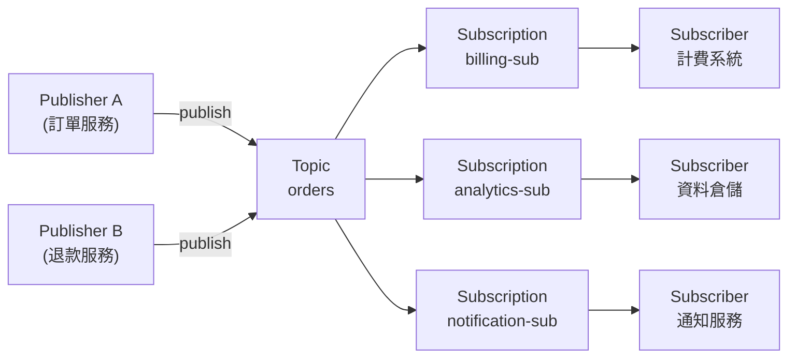
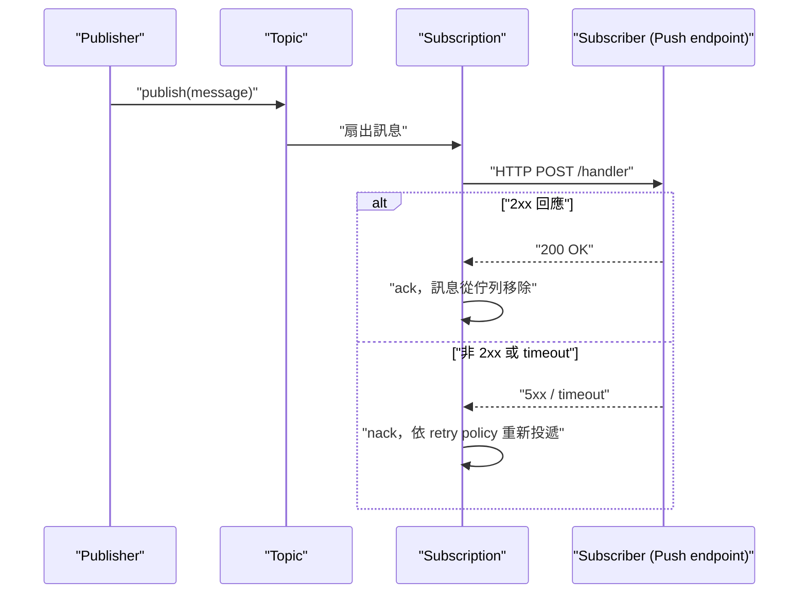

# GCP Pub/Sub 的架構與核心概念

> Pub/Sub 是 GCP 的全託管、非同步訊息傳遞服務：Publisher 把訊息發到 Topic，Pub/Sub 負責可靠地把訊息扇出（fan-out）給所有訂閱該 Topic 的 Subscription，Subscriber 再從 Subscription 拉取或接收訊息，藉此把系統元件解耦（decouple）並吸收流量尖峰。

## Step 1：為什麼需要 Pub/Sub——解耦與削峰填谷

在微服務或事件驅動（event-driven）架構裡，服務之間如果直接用同步 API 呼叫，會有兩個問題：

1. **緊耦合（tight coupling）**：上游服務必須知道下游有哪些消費者、它們的位址與可用性，下游掛掉會直接拖累上游。
2. **流量尖峰無法吸收**：上游產生訊息的速度若瞬間暴增，下游同步處理不過來就會被壓垮。

Pub/Sub 用「訊息佇列 + 發布/訂閱」模式解決這兩個問題：上游只管把訊息發到 Topic，完全不需要知道誰在消費；下游按自己的處理能力從 Subscription 取用訊息，Pub/Sub 在中間扮演緩衝層，把「產生速度」與「處理速度」解耦。



同一則訊息發布到 Topic 後，會**扇出給每一個 Subscription 各自獨立一份**——這是 Pub/Sub 與傳統訊息佇列（如單純的 SQS）最關鍵的差異：它同時具備「佇列」（同一 Subscription 內多個 Subscriber 競爭消費）與「廣播」（多個 Subscription 各自收到完整副本）兩種語意。

## Step 2：核心物件模型

| 物件 | 角色 | 說明 |
|---|---|---|
| Topic | 訊息的邏輯channel | Publisher 只認 Topic，不知道下游有誰在訂閱 |
| Subscription | Topic 與 Subscriber 之間的邏輯連結 | 決定訊息用 Pull 還是 Push 送達、保留多久、重試策略 |
| Message | 傳遞的資料單元 | 由 `data`（bytes）+ `attributes`（key-value metadata）組成 |
| Publisher | 發布端 | 呼叫 `publish` API 把訊息送進 Topic |
| Subscriber | 消費端 | 從 Subscription 拉取（pull）或被動接收（push）訊息 |
| Schema | 訊息格式定義 | 可選，用 Avro 或 Protocol Buffer 定義並在發布時強制驗證 |

**一個 Topic 可以有多個 Subscription，但一個 Subscription 只能綁定一個 Topic**——這是設計扇出拓樸時最基本的限制。

## Step 3：Pull 與 Push 兩種送達模式

| 維度 | Pull | Push |
|---|---|---|
| 誰主動 | Subscriber 主動呼叫 `StreamingPull` API 拉取 | Pub/Sub 主動 HTTP POST 到你指定的 endpoint |
| 適用場景 | 需要精細控制流量、批次處理、高吞吐 | Serverless（Cloud Run / Cloud Functions）、不想維護長連線 worker |
| 擴展方式 | 自己水平擴展 Subscriber 實例數 | Pub/Sub 自動並行送出，依 endpoint 回應速度調整 |
| 認證 | 用 IAM 授權 Subscriber 存取 Subscription | 用 OIDC token（`push_config.oidc_token`）驗證呼叫來源 |
| 失敗處理 | Subscriber 不 ack 就會重新投遞 | endpoint 回傳非 2xx 就視為失敗，會重新投遞 |

Push 模式的典型串接（例如 Cloud Monitoring alerting policy → Pub/Sub → 自訂 Webhook）在
[GCP Alerting Policy → Pub/Sub → 自訂 Webhook 完整串接](#/sre/99-staging/gcp-alerting-pubsub-webhook.mdx)
有完整的 OIDC 認證與 Terraform 設定範例。



## Step 4：Ack、重試與 Dead-letter Topic

Pub/Sub 提供的是 **at-least-once delivery**：只要 Subscriber 沒有在 `ackDeadline`（預設 10 秒，可調到最長 600 秒）內明確 ack，Pub/Sub 就會認定投遞失敗並重新投遞。這代表：

- **Subscriber 必須是冪等的（idempotent）**——同一則訊息可能被處理超過一次，業務邏輯要能安全地重複執行（例如用訊息內的唯一 ID 做去重判斷）。
- 重試策略（retry policy）可設定 **exponential backoff** 的最小/最大間隔，避免下游被重試風暴壓垮。
- 連續失敗超過設定次數（`max_delivery_attempts`）後，可設定投遞到 **dead-letter topic**，避免壞訊息無限重試、阻塞後面的正常訊息（類似 log 的告警去重概念，可參考
  [Log 與 Metric 的職責劃分](#/sre/02-observability/log-vs-metric-signal-design.mdx) 中對雜訊控制的討論）。

## Step 5：Ordering Key 與 Exactly-once Delivery

Pub/Sub 預設**不保證訊息順序**，因為訊息會平行扇出、平行重試。若業務需要順序保證（例如同一個訂單的狀態變更事件必須按順序處理），可以：

1. 在發布時帶上 **ordering key**（例如用 `order_id` 當 key），Pub/Sub 會保證同一個 key 的訊息按發布順序送達同一個 region 內的 Subscriber。
2. 開啟 Subscription 的 **exactly-once delivery** 選項，搭配 ack 的 lease 機制，確保同一則訊息不會被兩個 Subscriber 同時處理成功（但吞吐量與延遲會有代價，需要權衡）。

兩者可以合併使用，但都會犧牲部分平行度換取正確性，屬於典型的 **throughput vs. correctness** trade-off，設計時要先確認業務是否真的需要順序保證，而不是預設打開。

## Step 6：訊息保留與重播（Retention & Seek）

- 訊息預設保留 **7 天**（未被任何 Subscription ack 的訊息也一樣），可調整到最長 31 天。
- **Seek** 功能可以把 Subscription 的讀取游標倒轉到過去某個時間點，重新處理一段時間內的所有訊息——這在下游服務出 bug、需要重跑歷史事件時非常關鍵，等同於「事件溯源（event sourcing）的重播」。
- 若 Subscription 太久沒有任何活動的 Subscriber 消費，且訊息一直堆積超過保留期限，訊息會被丟棄，因此監控 **oldest unacked message age** 是判斷下游是否處理跟不上的核心指標。

## Step 7：Filtering——讓 Subscription 只收想要的訊息

一個 Topic 常常混雜多種事件類型，若每個 Subscriber 都要在應用層過濾，會浪費頻寬與運算。Pub/Sub 支援在 **Subscription 層設定 filter**（基於 message attributes 的表達式），只有符合條件的訊息才會投遞給該 Subscription，不符合的訊息直接視為已處理，不佔用該 Subscription 的配額：

```
attributes.event_type = "order_cancelled" AND attributes.region = "tw"
```

## Step 8：擴展性與延遲特性

Pub/Sub 是**全託管、無需事先佈建容量**的服務：不用像自建 Kafka 一樣規劃 partition 數量與 broker 容量，GCP 會依流量自動水平擴展。典型延遲特性：

- 端到端延遲通常在個位數毫秒到數十毫秒（同 region 內）。
- 吞吐量可以達到每秒數百萬則訊息（單一 Topic），不需要手動 sharding。
- 這也是它與需要手動管理 partition/replica 的 Kafka 最大的維運差異——用可控性換取免維運。

## Step 9：Pub/Sub vs Pub/Sub Lite vs Kafka

| | Pub/Sub | Pub/Sub Lite | Self-managed Kafka |
|---|---|---|---|
| 容量規劃 | 全自動，免規劃 | 需預先佈建 partition/throughput | 需規劃 partition、broker、replica |
| 定價模式 | 依用量（訊息量）計費 | 依預留容量計費，成本更低 | 基礎設施成本 + 維運人力 |
| 順序保證 | 需搭配 ordering key | 原生依 partition 保序 | 原生依 partition 保序 |
| 適用場景 | 一般事件驅動架構、告警串接、任意規模 | 大量、可預測流量且對成本敏感 | 需要完整生態系（Kafka Streams、Connect）或多雲/on-prem |

## Step 10：常見應用場景

1. **監控告警扇出**：Cloud Monitoring alerting policy 觸發後推到 Pub/Sub，再由 Subscription 推播到 Slack、PagerDuty 或自訂 Webhook——參見
   [GCP Alerting Policy → Pub/Sub → 自訂 Webhook 完整串接](#/sre/99-staging/gcp-alerting-pubsub-webhook.mdx)。
2. **排程任務觸發**：Cloud Scheduler 定時發一則訊息到 Pub/Sub，觸發 Cloud Run 或 Cloud Functions 執行批次工作——參見
   [Kubernetes CronJob 與 GCP Cloud Scheduler 的差異與選型](#/sre/05-gcp/k8s-cronjob-vs-cloud-scheduler.mdx)。
3. **微服務事件驅動架構**：服務之間用「發生了什麼事」（event）取代「你去做什麼」（command）溝通，降低耦合。
4. **資料管線（data pipeline）**：作為 streaming ingestion 的入口，後接 Dataflow 做即時 ETL 寫入 BigQuery。

## Step 11：IAM 與安全性

Pub/Sub 的權限是**在 Topic 與 Subscription 兩個層級分別設定**的 IAM policy：

- `roles/pubsub.publisher`：只能發布到指定 Topic，看不到、也動不了任何 Subscription。
- `roles/pubsub.subscriber`：只能從指定 Subscription 拉取/ack 訊息。
- Push 模式下，Pub/Sub 呼叫你的 endpoint 時會附上 OIDC ID token，你的服務（例如 Cloud Run）應驗證這個 token 的 issuer 與 audience，避免任何人偽造請求打你的 webhook。

這種「發布者看不到訂閱者」的權限模型，正是解耦設計在安全性上的延伸：上游服務即使被入侵，攻擊者也拿不到下游任何資訊。

## 相關筆記

- [GCP Alerting Policy → Pub/Sub → 自訂 Webhook 完整串接](#/sre/99-staging/gcp-alerting-pubsub-webhook.mdx)
- [Kubernetes CronJob 與 GCP Cloud Scheduler 的差異與選型](#/sre/05-gcp/k8s-cronjob-vs-cloud-scheduler.mdx)
- [GCP Cloud Monitoring 的 Uptime Checks 與 Alerting 功能](#/sre/05-gcp/gcp-uptime-checks-and-alerting.mdx)
- [Prometheus 與 Grafana 的功能與協作方式](#/sre/02-observability/prometheus-and-grafana-overview.mdx)
