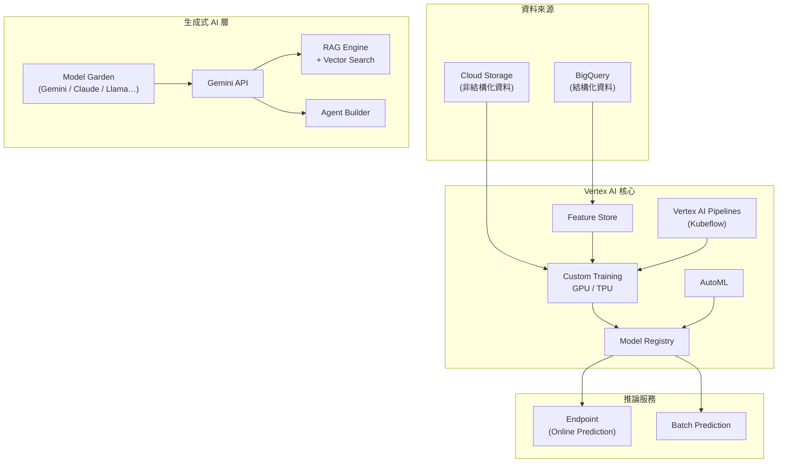

# GCP Vertex AI 平台總覽

> Google Cloud 的統一 AI/ML 平台，把模型訓練、資料管理、推論部署、生成式 AI 呼叫整合在同一個入口，並帶有企業級的安全與合規保證。

## Step 1：Vertex AI 解決什麼問題？

在 Vertex AI 出現之前，GCP 上的 AI 功能分散在多個產品（Cloud ML Engine、AutoML Vision、AutoML NLP…），每個產品有各自的 SDK、Console 入口和 IAM 設定，整合成本很高。

Vertex AI（2021 年 GA）的目標是把整個 ML lifecycle 統一成一個平台：

```
資料準備 → 特徵工程 → 模型訓練 → 評估 → 部署 → 監控
```

加上生成式 AI 浪潮後，又整合了：

```
Gemini API → RAG Engine → Agent Builder
```

## Step 2：核心功能模組

| 模組 | 用途 |
|------|------|
| **Model Garden** | 預建模型市場：Gemini、Imagen、Claude（Anthropic）、Llama（Meta）等 |
| **Vertex AI Studio** | Web UI，快速測試 prompts、做 few-shot tuning，不需寫程式 |
| **Gemini API** | 在 Vertex AI 上呼叫 Gemini，帶企業級安全保證 |
| **Custom Training** | 自訂訓練 job，支援 GPU / TPU，可用 PyTorch / TensorFlow / JAX |
| **AutoML** | 無程式碼訓練（表格分類、影像辨識、文字分類等） |
| **Feature Store** | 特徵管理與線上/離線一致性 |
| **Vertex AI Pipelines** | ML workflow 編排（基於 Kubeflow Pipelines） |
| **Model Registry** | 模型版本管理、Artifact 追蹤 |
| **Endpoint** | Online Prediction：部署模型，提供低延遲 REST/gRPC 呼叫 |
| **Batch Prediction** | 離線批次推論，處理大量資料 |
| **RAG Engine** | 內建 RAG 支援（Grounding + Vector Search 整合） |
| **Agent Builder** | 快速建立 Conversational AI Agent，不需自己串 tool call |

## Step 3：平台架構



## Step 4：Vertex AI Gemini API vs. Google AI Studio

這是最常讓人混淆的地方：

| 面向 | Google AI Studio | Vertex AI Gemini API |
|------|-----------------|----------------------|
| **定位** | 開發者快速驗證、學習 | 企業生產環境 |
| **資料隱私** | 輸入資料可能用於改善 Google 服務 | 不用於訓練，有 DPA 保證 |
| **VPC Service Controls** | 不支援 | 支援（資料不出 VPC） |
| **CMEK** | 不支援 | 支援（用戶自管加密金鑰） |
| **Cloud Audit Logs** | 不支援 | 支援（完整稽核軌跡） |
| **費率** | 有免費額度 | 按量計費，無免費額度 |
| **IAM 整合** | Google Account | 完整 GCP IAM + Service Account |

**結論**：PoC / 個人開發用 Google AI Studio；企業生產系統、有法規遵循要求時一律走 Vertex AI。

## Step 5：典型使用場景

### 場景 A：LLM 應用開發（最常見）

直接呼叫 Gemini API，搭配 LangChain 或 Vertex AI SDK：

```python
import vertexai
from vertexai.generative_models import GenerativeModel

vertexai.init(project="my-project", location="us-central1")
model = GenerativeModel("gemini-1.5-pro")
response = model.generate_content("請幫我整理這份會議紀錄...")
```

### 場景 B：企業知識庫 RAG

RAG Engine 內建 Grounding，不需自己管 Vector DB：

1. 上傳文件到 Cloud Storage
2. 建立 RAG Corpus（自動 chunk + embed）
3. 呼叫 Gemini API 時啟用 `grounding_spec`，平台自動做 retrieval

### 場景 C：自訂模型訓練

用 Vertex AI Pipelines 串起完整 MLOps 流程：

```
資料讀取 → 訓練 → 評估 → 推至 Model Registry → 部署到 Endpoint → 監控漂移
```

### 場景 D：批次文件處理

Batch Prediction 適合離線大量推論（例如每天跑一次文件分類），成本比 Online Prediction 低約 50%。

## Step 6：SRE 觀點——關鍵維運考量

**Region 選擇**

Gemini API 並非所有 region 都有，`us-central1` 是功能最完整的選項；若需要歐洲資料主權，選 `europe-west4`。

**配額（Quota）**

生產環境需提前申請 `online_prediction_requests_per_minute` 及 token TPM（Tokens Per Minute）配額，否則高峰期會遭遇 429 錯誤。

**SLO**

Vertex AI Gemini API 官方 SLA 為 99.9% monthly uptime；自部署 Custom Endpoint 的可用性由底層 GKE / Cloud Run 決定，需另行規劃。

**Cost Control**

- Batch Prediction 比 Online Prediction 便宜約 50%
- 長上下文模型（1M token context window）費用差異極大，建議明確設 `max_output_tokens` 防止意外費用

## 相關筆記

- [GCP Cloud Run 的原理與應用](#/sre/05-gcp/gcp-cloud-run-overview.mdx)
- [GCP VPC Network 的架構與核心概念](#/sre/05-gcp/gcp-vpc-network.mdx)
- [GCP Cloud Observability 套件總覽](#/sre/05-gcp/gcp-cloud-observability-overview.mdx)
