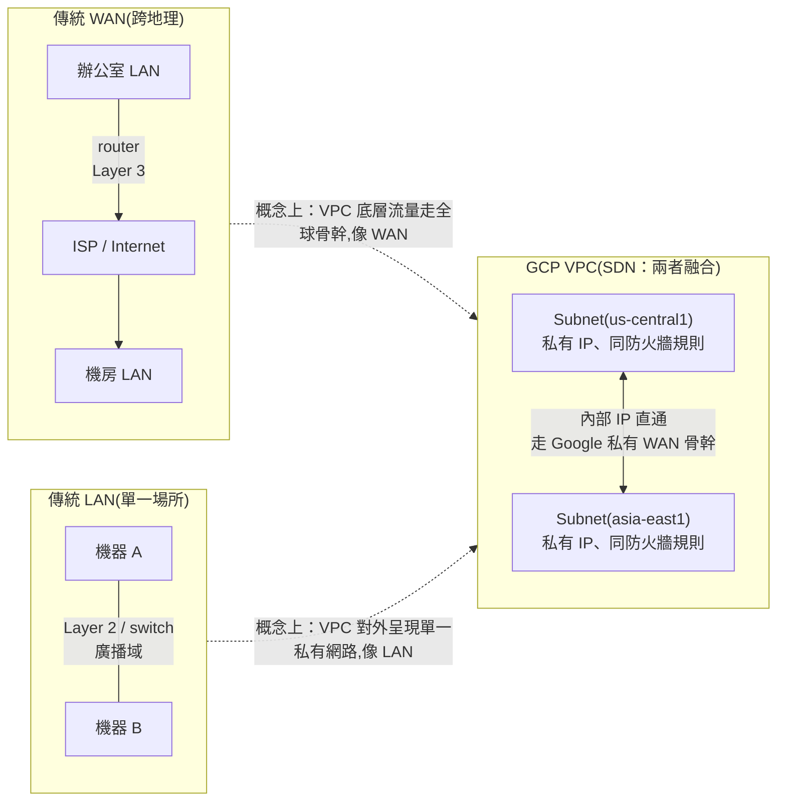
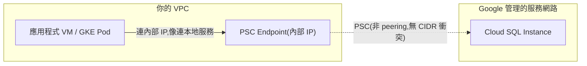
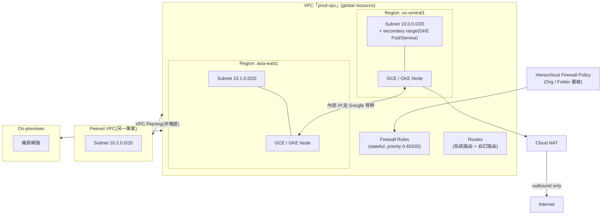

# GCP VPC Network 的架構與核心概念

> GCP 的 VPC 是一個 global、跨區域的邏輯網路，把子網路（subnet）、路由、防火牆規則收斂成單一資源，讓你決定服務彼此如何連通、對外如何曝露。

## 背景知識：LAN、WAN 是什麼，VPC 又是哪一種？

在講 GCP VPC 的細節之前，先把傳統網路的兩個基本分類釐清，因為 VPC 本質上是把這兩者的特性融合在一起的軟體定義網路（SDN）。

### LAN（Local Area Network，區域網路）

- **範圍**：侷限在單一地理位置——一間辦公室、一個機房、一棟大樓
- **技術層次**：以 Layer 2（資料連結層）為主，裝置間靠 switch 轉送，用 MAC address 定址，同一個 LAN 內的機器是同一個**廣播域（broadcast domain）**——ARP broadcast、DHCP 都靠廣播找到彼此
- **特性**：高頻寬、低延遲（通常 < 1ms），你自己擁有實體線路的控制權
- **典型裝置**：switch（同一 LAN 內轉送封包）、家用/辦公室的 Wi-Fi AP

### WAN（Wide Area Network，廣域網路）

- **範圍**：跨越城市、國家、洲際，把多個地理上分散的 LAN 連接起來——**Internet 本身就是全世界最大的 WAN**
- **技術層次**：以 Layer 3（網路層）為主，靠 router 做封包轉送，用 IP address + routing table 定址，不同 LAN 之間**不共享廣播域**，broadcast 不會跨 WAN 傳遞
- **特性**：頻寬相對受限、延遲較高（幾十到幾百 ms，取決於地理距離），通常需要租用線路（leased line）、走公網 VPN，或用 BGP 動態交換路由
- **典型裝置**：router、Interconnect / MPLS 線路、VPN gateway

### 兩者對照

| 維度 | LAN | WAN |
|---|---|---|
| 地理範圍 | 單一場所 | 跨地區、跨洲 |
| OSI 層次 | Layer 2（switch） | Layer 3（router） |
| 定址方式 | MAC address | IP address + routing |
| 廣播域 | 是（同一域內互相看得到廣播封包） | 否（router 會阻擋廣播） |
| 延遲 | 通常 < 1ms | 數十至數百 ms |
| 擁有權 | 通常自己架設、完全控制 | 常需仰賴電信商 / ISP 的線路 |

### VPC：把 LAN 的私密性搬到 WAN 的地理尺度上

GCP 的 VPC 正是解決「我想要 LAN 那種私有、受控、統一防火牆規則的網路，但我的伺服器分散在全世界好幾個 region」這個矛盾的產物。它的做法是：底層實際流量走的是 Google 自建的全球骨幹網路（本質上是一個私有 WAN），但在邏輯上把整個網路包裝成一個**單一、扁平、私有**的定址空間——你會拿到跟 LAN 很像的體感（私有 IP、集中的防火牆規則、內部主機互通不用過公網），但涵蓋的地理範圍跟傳統 WAN 一樣大。

對應到實務元件：

| 傳統網路角色 | GCP VPC 對應 |
|---|---|
| LAN 內的 switch / 廣播域 | Subnet（同 region 內的邏輯分段；VPC 內沒有真正的廣播，靠 unicast 路由取代） |
| 連接多個 LAN 的 router + 專線/VPN | Cloud Router（BGP）+ Cloud Interconnect / Cloud VPN，把 on-prem 機房（傳統 LAN）接進 VPC |
| 企業內網對外的 NAT gateway | Cloud NAT |
| 一整個私有網路的定址規劃 | VPC 本身（global 邏輯容器）+ 各 subnet 的 CIDR 規劃 |

對 SRE 來說最重要的推論：因為 VPC 底層本質是 WAN（跨 region 流量還是要走實體骨幹、還是有光速延遲），**broadcast-based 的服務發現（像傳統 LAN 常用的 mDNS/ARP 廣播）在 VPC 裡完全不適用**，跨 region 呼叫也不能假設是 LAN 等級的低延遲——這也是為什麼容量規劃、SLO 設計時，跨 region 的 P99 延遲要單獨估算（可參考 [P50 / P95 / P99 百分位延遲的意義與監控應用](#/sre/02-observability/latency-percentiles.mdx)）。

## Step 1：VPC 是 global resource，subnet 才是 regional

這是最容易搞錯的一點：GCP 的 VPC 本身**不綁定任何區域**，它是一個橫跨全球的邏輯容器，只定義「哪些子網路屬於同一個路由與防火牆管轄範圍」。真正落地到實體位置的是 **subnet（子網路）**，每個 subnet 綁定一個 region，內部再橫跨該 region 下所有的 zone。

這個設計的直接好處：同一個 VPC 內、不同 region 的 VM 預設就能用內部 IP 互通（走 Google 骨幹網路），不需要額外的跨區連通元件，也不必公開到網際網路。

## Step 2：Auto mode vs Custom mode

建立 VPC 時要選：

| 模式 | 行為 | 適用場景 |
|---|---|---|
| **Auto mode** | 每個 GCP region 自動建一個 `/20` subnet，之後新增 region 也自動加 | 測試、demo，不建議正式環境 |
| **Custom mode** | 完全自己決定每個 subnet 的 region、CIDR、是否建立 | 正式環境標準做法，可控 IP 規劃、避免浪費位址空間 |

正式環境幾乎都用 custom mode，理由是 IP 位址規劃必須跟未來的 VPC Peering、Shared VPC、跨雲 / 跨機房連線一起考慮 —— 一旦不同 VPC 的 CIDR 重疊，之後想 peering 或串接就會卡死（peering 不支援 overlapping CIDR，且事後改 subnet 範圍是有限制的擴縮，不能整段搬移）。

## Step 3：Subnet 的 IP 位址規劃

每個 subnet 有：

- **Primary IP range**：VM 的主要內部 IP 來源
- **Secondary IP ranges**（可選、可多個）：最常見用途是 GKE 的 alias IP —— Pod IP 和 Service IP 各佔一個 secondary range，讓 Pod 直接用 VPC 原生路由（VPC-native cluster），不需要額外的 overlay network

subnet 的 primary range 可以**在不重啟工作負載的情況下擴大**（例如 `/24` 擴成 `/20`），但不能縮小或跟其他 subnet 重疊，所以規劃時通常會預留足夠大的區塊。

## Step 4：Routes—— 封包怎麼被送到目的地

每個 VPC 都有一份路由表，決定封包的 next hop：

- **系統自動產生的路由**：每個 subnet 建立時自動產生一條本地路由，加上一條預設路由 `0.0.0.0/0` 指向 Internet Gateway
- **自訂靜態路由**：可以指到 instance、內部 IP、Cloud VPN tunnel、Interconnect attachment、或內部負載平衡器
- **優先權（priority）**：0–65535，數字越小優先權越高，多條路由匹配同一目的地時用優先權決勝負，優先權相同才看前綴長度（more specific 優先）

VPC Peering、Shared VPC 建立後，會透過動態交換路由的方式讓對方看到你的 subnet 路由，但這裡有個關鍵限制：**Peering 不具傳遞性（non-transitive）**——A peer B、B peer C，A 並不會自動看到 C，這是實務上最常踩到的坑。

## Step 5：Firewall Rules—— 狀態化防火牆

GCP 的防火牆規則是**狀態化（stateful）**的（允許進來的連線，回應封包自動放行，不用另開規則），核心概念：

| 屬性 | 說明 |
|---|---|
| **Implied rules** | 每個 VPC 隱含兩條規則：allow all egress（優先權 65535，最低）、deny all ingress（優先權 65535） |
| **Direction** | INGRESS / EGRESS，各自獨立評估 |
| **Priority** | 0–65535，數字越小越先套用，第一條匹配到的規則生效 |
| **Target** | 用 network tag 或 service account 指定規則套用到哪些 VM，比早期純用 IP 更容易維護 |
| **Source/Destination** | CIDR、tag、service account，甚至可以指定 Google-managed range |

比 per-VPC 防火牆規則更上層的是 **Hierarchical Firewall Policies**：可以掛在 Organization 或 Folder 上，強制套用到底下所有專案，用來實作「全公司禁止對外 SSH」這類跨團隊的硬性規範，且它的優先權會跟 VPC 層的防火牆規則一起排序，不是各自為政。

## Step 6：VPC 之間怎麼互連

這是最容易選錯的部分，幾種常見手段各解決不同問題：

| 方式 | 適用情境 | 是否 transitive | 關鍵限制 |
|---|---|---|---|
| **VPC Peering** | 兩個獨立 VPC（不同專案 / 組織）需要用內部 IP 互通 | 否 | 不支援 overlapping CIDR，不能傳遞 |
| **Shared VPC** | 同一組織下多個專案共用同一套網路（集中管理防火牆 / 路由，各專案跑各自的資源） | N/A（本質是同一個 VPC） | Host project 集中管控，Service project 只能用不能改網路設定 |
| **Private Service Connect (PSC)** | 消費 Google 或第三方的 managed service（如 Cloud SQL、SaaS）而不想處理 peering 的 CIDR 衝突問題 | 否，但天生避開 overlap 問題 | 只曝露單一 endpoint，不是整個網路互通 |
| **Cloud VPN / Interconnect** | 連接 on-premises 機房或其他雲 | 需搭配 Cloud Router 的 BGP 才能動態學路由 | Interconnect 需要實體線路布建，VPN 走公網加密隧道 |
| **Network Connectivity Center** | 把多個 VPC、VPN、Interconnect 統一成 hub-and-spoke 拓樸 | 是（透過 hub） | 較新的服務，用來解掉 peering 不能傳遞的根本問題 |

### 案例：Cloud SQL 的 PSC 模式

Cloud SQL 是最典型會用到 PSC 的 managed service。舊做法「Private Services Access」本質是 Google 把 Cloud SQL 放進它自己管理的 VPC，再跟你的 VPC 做 **peering**——所以會直接繼承 peering 的老問題：CIDR 不能重疊、不能傳遞，多個 VPC 要接同一個 Cloud SQL instance 時，每個 VPC 都要單獨處理位址規劃。

PSC 模式則完全不做 peering：你在自己的 subnet 裡建一個 **PSC endpoint**（本質是一條 forwarding rule），拿到一個內部 IP，這個 endpoint 背後透過 Google 的 PSC 基礎設施指向 Cloud SQL instance。應用程式連這個內部 IP 就像連一般內部服務，流量不出你的 VPC、不過公網，而且**完全不需要跟 Cloud SQL 的網路做 CIDR 協調**——這正是上面表格說 PSC「天生避開 overlap 問題」的具體案例。

多個 VPC 要共用同一個 Cloud SQL instance 時，PSC 模式下每個 VPC 只需各自建一個 endpoint 指向同一個 instance，不像 Private Services Access 要對每個 VPC 重新走一次 peering 流程。唯一要注意的是：跨 region 存取 PSC endpoint 一樣要計入跨 region 延遲，因為底層流量還是要走 Google 骨幹網路——這跟本篇開頭「VPC 底層本質是 WAN」的推論是一致的。

## Step 7：對外連線

- **Cloud NAT**：讓沒有外部 IP 的 VM 能對外發起連線（outbound-only），不像早期用單一 VM 當 NAT gateway 那樣有單點瓶頸，且不需要在防火牆開對內規則
- **Private Google Access**：讓沒有外部 IP 的 VM 仍能存取 Google API / 服務（如 Cloud Storage、BigQuery），不必經過公網
- **Private Service Connect for Google APIs**：比 Private Google Access 更進一步，把 Google API 映射成 VPC 內部的一個 IP，方便走內部防火牆規則統一管控

## 架構總覽

## 小結給 SRE 視角

VPC 本身的設定失誤（IP 規劃太小、peering CIDR 衝突、忘記 hierarchical policy 會覆蓋 VPC 層規則）通常在容量爬升或跨團隊合併網路時才會爆炸性地變成大問題，所以規劃階段就要把「未來會不會需要 peering / Shared VPC / 跨雲連線」納入 CIDR 設計，而不是等到要接的時候才發現位址空間重疊。

## 相關筆記

- [GKE Pod 記憶體管理：Request 與 Limit 的實際運作](#/sre/05-gcp/gke-pod-memory-without-limit.mdx)
- [GCP Cloud Observability 套件總覽](#/sre/05-gcp/gcp-cloud-observability-overview.mdx)
