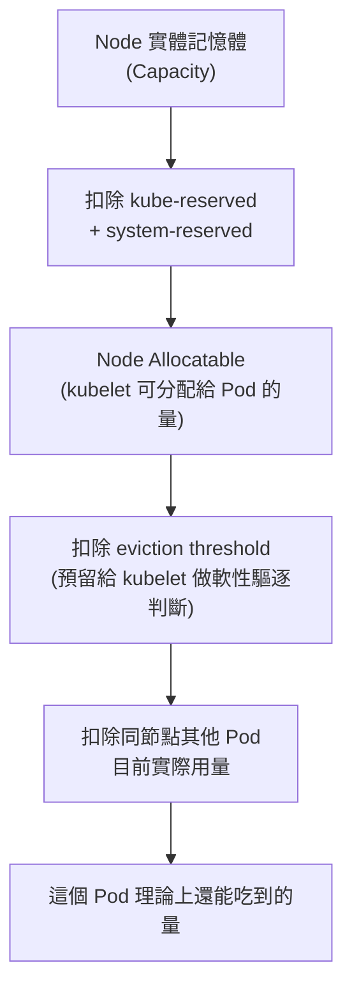

# GKE Pod 記憶體管理：Request 與 Limit 的實際運作

> 一句話版本：Kubernetes 只用 `requests.memory` 來排程與計算 OOM 優先序，並不會拿它去限制 container 實際能用的記憶體。沒設 `limits.memory` 時，cgroup 完全沒有上限，這個 Pod 理論上可以一路吃到整個 Node 的可分配記憶體用盡，才會被 kubelet 或 kernel 的 OOM 機制介入。

## Step 1：先分清楚 request 和 limit 各自映射到什麼機制

這是最容易搞混的一點：CPU 和 memory 的 request/limit 在底層（cgroup）映射方式不一樣。

| | Request | Limit |
|---|---|---|
| CPU | 映射到 `cpu.shares`(cgroup v1)/ `cpu.weight`（v2）—— 是「相對權重」，決定資源競爭時分到多少，**不是硬上限** | 映射到 `cpu.cfs_quota_us` / `cpu.max`—— 是硬上限，會被 throttle |
| Memory | **只用來排程與計算 OOM 分數，底層完全沒有對應的 cgroup 設定** | 映射到 `memory.max`(cgroup v2)/ `memory.limit_in_bytes`（v1）—— 是硬上限，超過就被 OOM kill |

也就是說：

```
requests:
  memory: 10Gi   # 純粹是「排程用的承諾值」+「OOM 時的計分依據」
                 # 底層 cgroup 沒有任何機制強制這個 container 只能用 10Gi
# 沒設 limits.memory → 這個 container 的 cgroup 沒有 memory.max
                 # 代表 kernel 不會因為超過某個數字而砍它
```

所以問題「這個 Pod 實際上可以用到多少 memory」的答案是：**沒有 Kubernetes 層級的上限**，能用多少完全取決於 Node 當下還剩多少可分配記憶體。

## Step 2：那「可以用多少」的真實邊界在哪裡

雖然 K8s 不設限，但實體 Node 是有限的，邊界依序是：



- **Node Allocatable**:GKE 節點的可分配記憶體本來就小於實體記憶體，因為要扣掉 `kube-reserved`（kubelet、container runtime 用）和 `system-reserved`（OS、systemd 用）。
- **同節點其他 Pod**：如果同節點還有其他 Pod 在跑，它們目前的實際用量（不是 request）會先佔走一部分，這個沒設 limit 的 Pod 可以把剩下的全部吃光。
- **沒有「這個 Pod 只能到 10Gi」這種東西**——10Gi 只是它跟排程器承諾的「基本需求」，不是天花板。

## Step 3：吃到邊界之後會發生什麼事

有兩種 OOM 機制會介入，層級不同：

1. **kubelet node-pressure eviction（軟性，節點層級預防）**
當 Node 可用記憶體低於 eviction threshold 時，kubelet 會主動驅逐（evict）Pod，而不是等 kernel 出手。驅逐順序的邏輯是：
- QoS class 低的先評（`BestEffort` > `Burstable` > `Guaranteed`）
- 同 QoS class 內，**實際用量超過 request 的比例越高，越先被驅逐**

2. **kernel OOM killer（硬性，系統層級最後手段）**
如果記憶體壓力來得太快，kubelet 來不及反應，kernel 會直接依 `oom_score_adj` 選一個 process 砍掉。K8s 給 Burstable Pod 的計分公式大致是：

$$
\text{oom\_score\_adj} = \max\left(2,\ \min\left(999,\ 1000 - \frac{1000 \times \text{memoryRequestBytes}}{\text{nodeMemoryCapacityBytes}}\right)\right)
$$

直覺理解：**request 設得越小，oom_score_adj 越高，越容易被優先砍**。這裡的重點是 —— 這個 Pod 因為 request 只設 10Gi（相對節點記憶體可能是個小比例），一旦它把記憶體撐到很大，在系統 OOM 時反而是「優先被犧牲」的對象，而不是被保護的對象。

## Step 4：這個設定對應的 QoS Class 是什麼

Kubernetes 依 request/limit 的設定組合分三種 QoS class:

| QoS Class | 條件 | 行為 |
|---|---|---|
| `Guaranteed` | 每個 container 的 CPU、memory 都同時設了 request 和 limit，且兩者相等 | 最後被驅逐，cgroup memory.min 也會設保護值 |
| `Burstable` | 至少一個 container 設了 request 或 limit，但不滿足 `Guaranteed` 條件 | 排程有基本保障，但可以往上超用，超用越多越先被砍 |
| `BestEffort` | 完全沒設 request/limit | 最先被驅逐 |

題目中的設定（只有 `requests.memory: 10Gi`，沒有 `limits.memory`）屬於 **`Burstable`**—— 排程器保證至少有 10Gi 可用，但實際用量不受 10Gi 約束，可以無上限往上「burst」，直到撞到 Node 邊界。

## Step 5：為什麼這在生產環境是個風險（SRE 視角）

1. **Noisy neighbor**：這個 Pod 吃光 Node 剩餘記憶體，會直接影響同節點其他 Pod 的可用資源，即使它們各自的 request 都有被滿足。
2. **OOM 的隨機性**：kernel OOM killer 一旦介入，砍誰是看整台機器的 `oom_score_adj` 排序，不一定砍「造成問題的那個 Pod」自己，可能連坐砍到別的服務。
3. **記憶體洩漏無防護**：如果 code 有 memory leak，沒有 limit 等於沒有「安全閥」，異常會被放大成整個 Node 的事故，而不是單一 Pod crash 後被重啟這麼單純。
4. **容量規劃失真**：如果多個 Pod 都這樣設定（有 request 沒 limit），Node 的實際使用率會長期偏離「request 加總」這個規劃基準，容量規劃會低估風險。

**建議做法**：除非你刻意需要 Burstable 讓 Pod 能彈性使用閒置資源（例如 batch job、可容忍被驅逐的 workload），否則正式服務通常建議 `requests.memory == limits.memory`（拿到 `Guaranteed` QoS），用可預期的方式失敗（container OOMKilled → Kubernetes 重啟），而不是讓它變成整個 Node 的記憶體風險。如果團隊想全域防呆，可以在 namespace 上設 `LimitRange` 強制要求所有 Pod 都要設 `limits.memory`。
