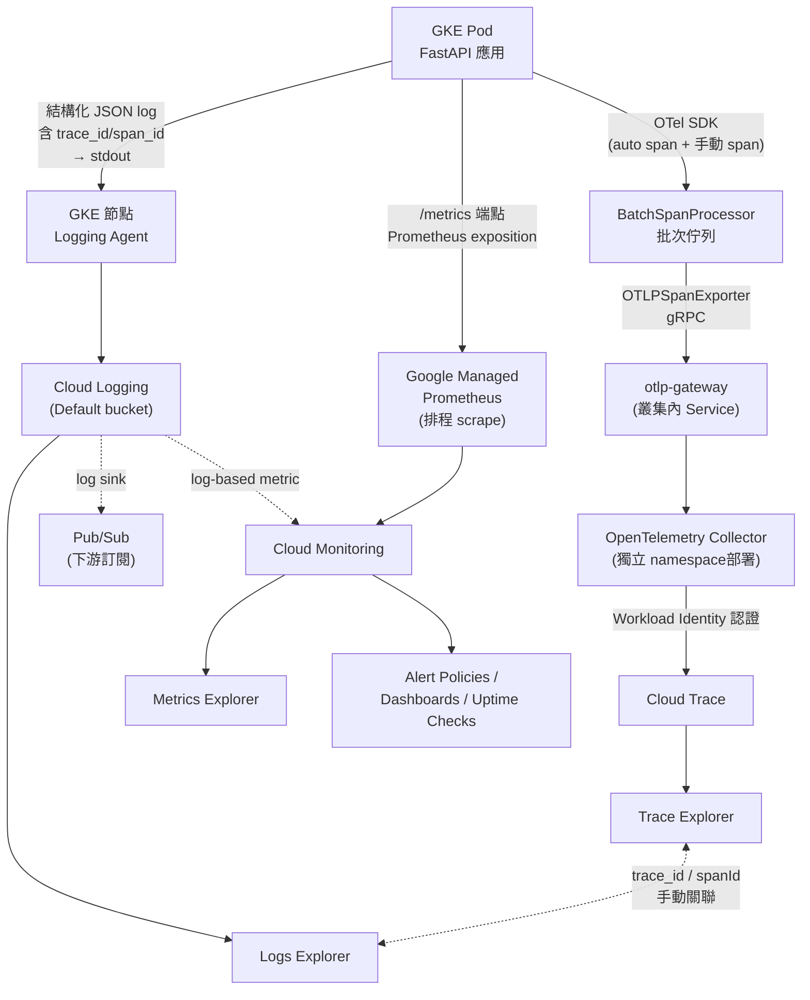
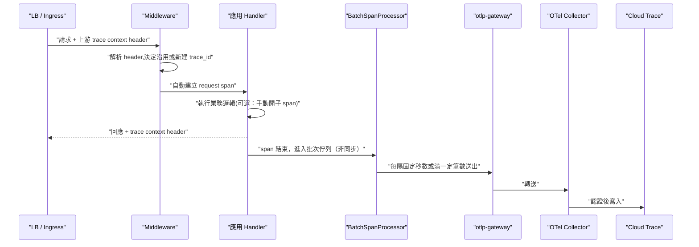

# OpenTelemetry 在 GKE + GCP 上的實踐案例

> 一句話版本：很多「導入了 OpenTelemetry」的生產系統，其實只把 **Traces** 這一個信號真正換成 OTel SDK;Logs 繼續走 GKE 節點內建的 Logging Agent,Metrics 繼續靠 Google Managed Prometheus 主動 scrape。三者不是同一條 pipeline，而是靠應用層手動塞進 log 的 `trace_id` 在 Trace Explorer / Logs Explorer / Metrics Explorer 之間做有限的互聯。

這篇是 [OpenTelemetry 的功能是什麼？](#/sre/06-opentelemetry/what-is-opentelemetry.mdx) 的實務案例延伸 —— 概念篇講的是教材上「三支柱統一 pipeline」的理想模型，這篇記錄一個真實 GKE + GCP 生產系統裡，理想模型與實際落地之間的落差。

## Step 1：為什麼三個信號常常不是同一條 pipeline?

教材上的 OTel 會把 Traces、Metrics、Logs 講成共用同一套 API/SDK、同一個 Collector 的框架。但實際落地到一個已經在用 GCP 原生可觀測性工具的系統時，常見的漸進式導入路徑是：

- **Traces**：團隊主動導入 OTel SDK，因為原生 vendor SDK 換掉的成本最低、對既有系統影響最小。
- **Logs**：繼續沿用 Kubernetes 平台既有的節點級日誌收集機制（如 GKE 內建的 Logging Agent），沒有強烈動機重工成 OTel 的 `LoggerProvider`。
- **Metrics**：繼續沿用雲端原生的 Prometheus 相容方案（如 Google Managed Prometheus 主動 scrape 應用曝露的 `/metrics` 端點），沒有經過 OTel 的 `MeterProvider`。

這不是設計缺陷，而是「先把最痛的那塊換掉，其他等生態成熟再補」的正常演進過程。

## Step 2：整體架構圖

一個應用 Pod 同時產生三種信號，但離開 Pod 之後就分道揚鑣，各自走到對應的 GCP 服務，最後在 Console 的三個 Explorer 分別呈現：

幾個關鍵節點的角色：

- **OTel Collector**：通常獨立部署在自己的 namespace，用 Kubernetes Workload Identity 換到一個具備 `roles/cloudtrace.agent`（以及有時附帶 `monitoring.metricWriter`、`logging.logWriter`）的 GCP Service Account，再用這個身份把收到的 span 寫進 Cloud Trace。應用 Pod 本身不需要任何 GCP 憑證，只需要能連到叢集內的 Collector/gateway。
- **GKE 節點 Logging Agent**：這是 GKE 叢集開啟 Cloud Logging 整合後就內建的元件，自動收集所有容器的 stdout/stderr，不需要應用程式做任何額外設定 —— 這也是為什麼 Logs 這條路徑完全繞過了 OTel。
- **Google Managed Prometheus(GMP)**:GKE 叢集在 `monitoring_config` 裡開啟 `managed_prometheus` 後，會依 PodMonitoring/ClusterPodMonitoring 這類 CRD 設定的排程，主動去 scrape 應用曝露的 Prometheus exposition 端點，再把時間序列寫進 Cloud Monitoring。

> GMP 的 collector 元件底層其實也是改造自 OpenTelemetry Collector，但那是 Google 代管的獨立元件，跟上圖裡「應用團隊自己部署的 OTel Collector」是完全不同的兩套部署，不要混為一談。

## Step 3：一次請求的生命週期

Traces 這條路徑裡，「產生 span」和「把 span 送到 Cloud Trace」是兩個時間點分開的動作 —— 前者發生在 request 處理過程中，後者是背景非同步進行，不會拖慢 response:

Logs 這條路徑則簡單得多：一行結構化 JSON 印到 stdout 的那一刻，应用程式的工作就結束了，後面全部是平台層（節點 Logging Agent）的事。Metrics 更被動，應用程式只負責「被動地」曝露一個端點，什�麼時候被讀取完全由 scrape 排程決定。

## Step 4：三個 Explorer 之間怎麼互聯

| 關聯 | 機制 | 說明 |
|------|------|------|
| Trace Explorer ⇄ Logs Explorer | 手動塞入的 trace/span 欄位 | 每筆結構化 log 都帶 `trace` 與 `spanId` 欄位，可以在 Trace 詳情頁「查看這個 span 對應的 log」，反過來在 Logs Explorer 選一筆記錄也能跳回對應的 trace。這條關聯是應用層 log formatter 手動塞進去的，**不是** OTel `LoggerProvider` 自動處理的結果 |
| Logs Explorer → Metrics Explorer | log-based metric | 把符合特定過濾條件的 log 筆數轉成一條時間序列，出現在 Metrics Explorer，可以再對它掛 Alert Policy |
| Metrics Explorer ⇄ Trace Explorer | 目前普遍沒有 | 要做到「從一條延遲飆高的 metric 點進對應的 trace」，需要 OTel Metrics SDK 搭配 exemplar（在 metric 資料點上附帶 trace_id）。如果系統裡沒有 `MeterProvider`，這條關聯就是空的 |

這張表也說明了一件事：**「有 trace_id」不等於「有 OTel」**。Trace ⇄ Logs 的關聯靠的是應用層自己維護的 trace_id 欄位約定，即使完全不用 OTel 的 Logs SDK 也做得到 —— 這正是很多系統選擇「只上 OTel Traces、Logs/Metrics 維持原狀」的原因：關聯性的大部分價值，用最小的改動就能拿到。

## Step 5：實務上常見的落差

半套導入的架構容易留下這些技術債，排查問題時值得先確認清楚：

- **環境變數與實際行為不一致**：K8s manifest 裡可能還留著一個標準的 `OTEL_EXPORTER_OTLP_ENDPOINT` 環境變數（例如指向 GCP 的 telemetry 端點），但程式碼裡把 endpoint 寫死成叢集內的 gateway 位址 —— 這個環境變數其實從未被讀取，是遺留設定。
- **未使用的相依套件**：依賴清單裡可能還留著某個雲端廠商的專屬 exporter 套件（例如某個 `-exporter-gcp-trace` 套件），但程式碼實際用的是通用的 OTLP exporter，前者從未被 import。
- **Collector 的部署位置不在應用的 repo 裡**：應用團隊的 repo 通常只會看到 Collector 需要的 IAM 身份 / Workload Identity 綁定，實際的 Collector Deployment/Helm release 定義多半在平台團隊另一個 infra repo 管理，兩邊要對照才能看到全貌。
- **非生產環境是 no-op**：許多團隊會讓 OTel pipeline 只在 PROD/UAT 生效，DEV/TEST 用 no-op 的 TracerProvider 完全不產生也不送出 span，避免本地開發時的雜訊與额外開銷。排查「為什麼本地測試看不到 trace」時，先確認是不是環境判斷擋住了整條 pipeline。

## 相關筆記

- [GCP Cloud Observability 套件總覽](#/sre/05-gcp/gcp-cloud-observability-overview.mdx)
- [GKE Pod 記憶體管理：Request 與 Limit 的實際運作](#/sre/05-gcp/gke-pod-memory-without-limit.mdx)
- [OpenTelemetry 的功能與應用](#/sre/06-opentelemetry/what-is-opentelemetry.mdx)
