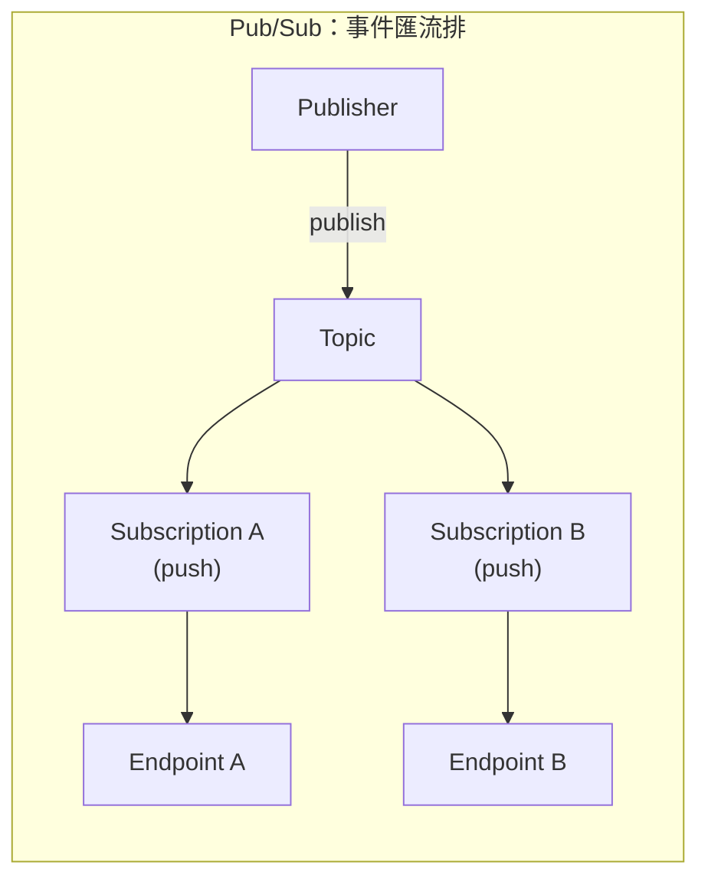
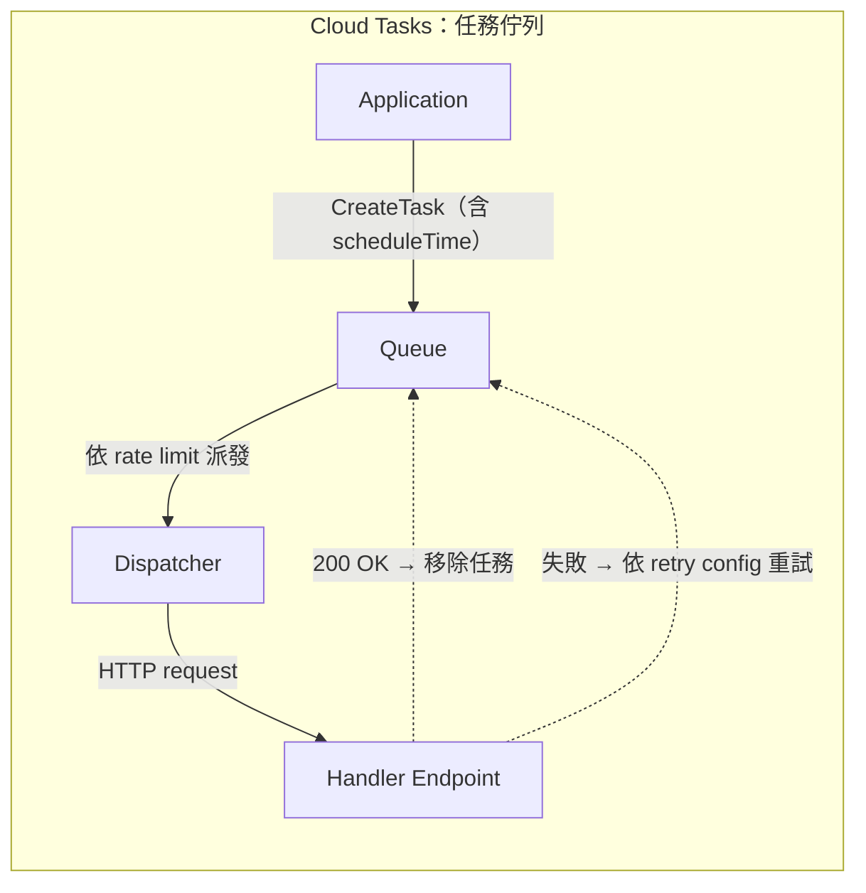

# GCP Pub/Sub Push 訂閱與 Cloud Tasks 的核心差異

> 兩者都是「把工作透過 HTTP callback 丟給下游處理」的非同步機制，但心智模型完全不同：Pub/Sub 是**事件匯流排（event bus）**，設計給「一個事件、多個消費者」的廣播場景；Cloud Tasks 是**受管理的任務佇列（task queue）**，設計給「這件工作要精準控制何時做、多快做」的單一消費者場景。

## Step 1：先分清楚兩者的定位

選型錯誤最常見的原因是把兩者都當成「非同步執行工具」來比較，但它們解決的問題本質不同：

- **Pub/Sub**：核心價值是**解耦（decouple）與扇出（fan-out）**。Publisher 不需要知道、也不該知道下游有誰在消費；同一則訊息可以廣播給多個完全獨立的 Subscription。
- **Cloud Tasks**：核心價值是**對「執行」本身的精準控制**。你明確知道這個任務要交給哪一個 handler 處理，但你要控制它「什麼時候做」「多快做」「失敗了怎麼重試」。

同一則事件在 Pub/Sub 裡會**複製給每個 Subscription 各一份**；而 Cloud Tasks 的一個 task 從建立到成功處理只會被**消耗一次**，沒有廣播語意。

## Step 2：逐項比較

| 面向 | Pub/Sub Push | Cloud Tasks |
|---|---|---|
| 定位 | 事件匯流排（一對多廣播） | 受管理的任務佇列（一對一執行） |
| 訊息分發 | 一個 Topic 可掛多個 Subscription，各自收到完整副本（fan-out） | 一個 Queue 對應固定的 handler，task 只被處理一次（point-to-point） |
| 延遲排程 | 沒有原生「N 分鐘後才送達」機制，要延遲需另外搭配 Cloud Scheduler 或應用層邏輯 | 原生支援 `scheduleTime`，可指定任務在未來最多 30 天內的任意時間點執行 |
| 流量 / 並發控制 | 靠訂閱端 ack 速度與 flow control（`max outstanding messages`）間接調節，難以精確限制對下游的呼叫速率 | Queue 層可直接設定 `max_dispatches_per_second`、`max_concurrent_dispatches`，精確控制打向下游的 QPS 與並發數 |
| 重試設定 | Subscription 層的 `RetryPolicy`（min/max backoff），對所有訊息一視同仁 | Queue 層 + Task 層皆可設定 `max_attempts`、`max_retry_duration`、per-task backoff，粒度更細 |
| 去重 / Exactly-once | 預設 at-least-once；可開啟 exactly-once delivery，但仍是「訊息語意」的去重 | 可用具名 task 做去重（有效期內），但 Google 官方建議避免大量具名 task——hash-based sharding 會造成 hotspot，吞吐量可能被壓到約 500 QPS |
| 訊息 / 任務定序 | 需要 ordering key，且同一 key 只能綁定同一區域，會犧牲部分吞吐量 | Task 大致依建立順序派發，但重試會打亂順序，不是嚴格 FIFO |
| 典型情境 | 事件通知、多服務需要收到同一事件（訂單建立後同時觸發計費、分析、通知） | 明確的背景工作、需要控制執行時機與呼叫速率（延遲寄信、避免打爆第三方 API、把同步請求非同步化） |

## Step 3：常見誤用與 workaround

實務上最容易踩的坑，是想用 Pub/Sub 做「延遲執行」：因為 Pub/Sub 沒有原生的 per-message delay，常見的 workaround 是用 Cloud Scheduler 定期發布訊息到 Topic。但這是**輪詢（polling）語意**——精度受限於排程週期，不是每則訊息各自獨立的延遲時間，這正是 Cloud Tasks 的 `scheduleTime` 想解決的問題。

反過來，如果需求是「一個事件要同時通知好幾個獨立系統」，用 Cloud Tasks 就必須在應用層手動建立多個 task 分別打給每個下游，等於自己實作一套簡化版的 fan-out——這種情境交給 Pub/Sub 的多 Subscription 機制會自然得多。

## Step 4：選型指引

- 需要「一個事件、多個消費者各自獨立處理」→ **Pub/Sub**
- 需要「延遲執行」或「精準限制對下游的呼叫速率 / 並發」→ **Cloud Tasks**
- 只是想把一段同步邏輯丟到背景執行、沒有廣播需求 → **Cloud Tasks** 通常更直覺，佇列語意（單一 handler、可控重試）更貼近需求
- 兩者都常見搭配 Cloud Run／Cloud Functions 當 HTTP handler，並用 OIDC token 驗證呼叫者身份（`run-invoker` 角色）

## 相關筆記

- [GCP Pub/Sub 的架構與核心概念](#/sre/05-gcp/gcp-pubsub-overview.mdx)
- [Kubernetes CronJob 與 GCP Cloud Scheduler 的差異與選型](#/sre/05-gcp/k8s-cronjob-vs-cloud-scheduler.mdx)
- [GCP Cloud Scheduler 的 Timeout 限制與配置](#/sre/05-gcp/cloud-scheduler-timeout.mdx)
