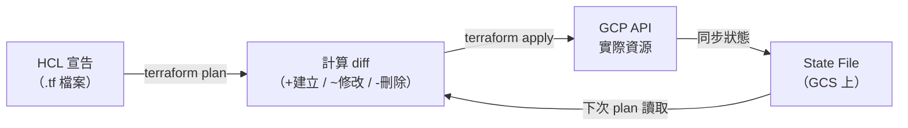
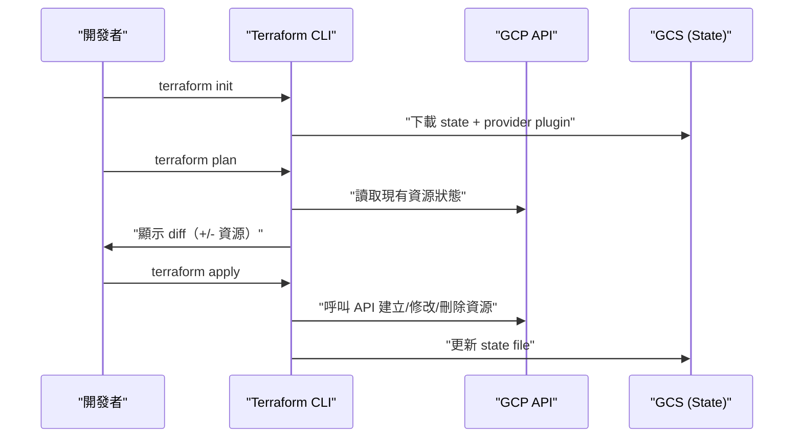

# Terraform 與 GCP 的整合：Infrastructure as Code 實踐

> Terraform 透過 Google Cloud Provider 以宣告式 HCL 管理 GCP 資源，讓基礎設施像程式碼一樣可被版控、審查與重現。

## 核心定位：為什麼要用 Terraform 管 GCP？

直接在 GCP Console 點選或用 `gcloud` CLI 操作雲端資源，短期方便，但有三個痛點：

1. **難以重現**：另一個環境（staging、DR）要手動對照步驟，容易漏設定。
2. **無法 code review**：基礎設施變更繞過了 PR 流程，出事了也查不到是誰改的。
3. **容易 drift**：有人偷偷去 Console 改了一個 firewall rule，沒人知道。

Terraform 的解法是「宣告目標狀態，讓工具負責收斂差異」：



---

## Step 1：Provider 設定

Terraform 透過 **Google Cloud Provider**（`hashicorp/google`）呼叫 GCP API。

```hcl
terraform {
  required_providers {
    google = {
      source  = "hashicorp/google"
      version = "~> 5.0"
    }
  }

  # 將 state 存在 GCS（推薦 production 做法）
  backend "gcs" {
    bucket = "my-tfstate-bucket"
    prefix = "env/prod"
  }
}

provider "google" {
  project = "my-gcp-project-id"
  region  = "asia-east1"
}
```

**認證方式**優先順序：

1. `GOOGLE_APPLICATION_CREDENTIALS` 環境變數（指向 Service Account JSON）
2. Application Default Credentials（`gcloud auth application-default login`）
3. GCE/GKE Metadata Server（在 GCP 機器上跑 Terraform 時自動生效）

---

## Step 2：State 管理

Terraform 用一個 **state file**（`terraform.tfstate`）記錄「目前 GCP 上實際存在的資源 ID」，讓 Plan 能算出 diff。

| 儲存後端 | 適用場景 |
|----------|---------|
| 本機檔案 | 個人實驗 |
| GCS Bucket | 團隊協作（推薦），天然加鎖（object versioning） |
| Terraform Cloud | SaaS 管理，含 UI、RBAC、遠端執行 |

**重要**：state 是真相的來源，不要手動改 GCP Console，否則下次 Plan 會試圖把資源「改回」state 描述的狀態。偵測與修復 drift 的指令是 `terraform plan`（看 diff）與 `terraform refresh`（重新同步 state）。

---

## Step 3：常用 GCP Resources

### Compute Engine（VM）

```hcl
resource "google_compute_instance" "web" {
  name         = "web-server"
  machine_type = "e2-medium"
  zone         = "asia-east1-b"

  boot_disk {
    initialize_params {
      image = "debian-cloud/debian-12"
    }
  }

  network_interface {
    network    = google_compute_network.vpc.id
    subnetwork = google_compute_subnetwork.subnet.id
    access_config {}  # 移除此 block 則無 public IP
  }

  service_account {
    email  = google_service_account.app_sa.email
    scopes = ["cloud-platform"]
  }
}
```

### VPC 與 Subnet

```hcl
resource "google_compute_network" "vpc" {
  name                    = "prod-vpc"
  auto_create_subnetworks = false
}

resource "google_compute_subnetwork" "subnet" {
  name          = "prod-subnet"
  ip_cidr_range = "10.10.0.0/24"
  region        = "asia-east1"
  network       = google_compute_network.vpc.id

  private_ip_google_access = true  # VM 不透過 public IP 存取 GCP API
}

resource "google_compute_firewall" "allow_ssh" {
  name    = "allow-ssh"
  network = google_compute_network.vpc.name

  allow {
    protocol = "tcp"
    ports    = ["22"]
  }

  source_ranges = ["35.235.240.0/20"]  # IAP 的 IP range
  target_tags   = ["ssh-allowed"]
}
```

### IAM（Service Account + Binding）

```hcl
resource "google_service_account" "app_sa" {
  account_id   = "app-service-account"
  display_name = "Application Service Account"
}

resource "google_project_iam_member" "app_sa_roles" {
  project = var.project_id
  role    = "roles/bigquery.dataViewer"
  member  = "serviceAccount:${google_service_account.app_sa.email}"
}

# 允許 GKE Workload Identity（KSA impersonate GSA）
resource "google_service_account_iam_member" "workload_identity" {
  service_account_id = google_service_account.app_sa.name
  role               = "roles/iam.workloadIdentityUser"
  member             = "serviceAccount:${var.project_id}.svc.id.goog[${var.namespace}/${var.ksa_name}]"
}
```

### GCS（Cloud Storage）

```hcl
resource "google_storage_bucket" "data" {
  name          = "my-data-bucket-${var.project_id}"
  location      = "ASIA-EAST1"
  force_destroy = false

  versioning {
    enabled = true
  }

  lifecycle_rule {
    condition { age = 90 }
    action    { type = "SetStorageClass"; storage_class = "NEARLINE" }
  }

  uniform_bucket_level_access = true
}

resource "google_storage_bucket_iam_member" "reader" {
  bucket = google_storage_bucket.data.name
  role   = "roles/storage.objectViewer"
  member = "serviceAccount:${google_service_account.app_sa.email}"
}
```

### Cloud SQL（PostgreSQL）

```hcl
resource "google_sql_database_instance" "postgres" {
  name             = "prod-postgres"
  database_version = "POSTGRES_15"
  region           = "asia-east1"

  settings {
    tier              = "db-g1-small"
    availability_type = "REGIONAL"  # HA：自動切換到備用副本

    ip_configuration {
      ipv4_enabled    = false
      private_network = google_compute_network.vpc.id
    }

    backup_configuration {
      enabled                        = true
      start_time                     = "03:00"
      point_in_time_recovery_enabled = true
    }
  }

  deletion_protection = true  # 防止 terraform destroy 誤刪
}

resource "google_sql_database" "app_db" {
  name     = "app"
  instance = google_sql_database_instance.postgres.name
}
```

### GKE（Kubernetes Engine）

```hcl
resource "google_container_cluster" "primary" {
  name     = "prod-cluster"
  location = "asia-east1"  # Regional cluster（3 個 zone，HA）

  remove_default_node_pool = true
  initial_node_count       = 1

  networking_mode = "VPC_NATIVE"
  network         = google_compute_network.vpc.name
  subnetwork      = google_compute_subnetwork.subnet.name

  workload_identity_config {
    workload_pool = "${var.project_id}.svc.id.goog"
  }
}

resource "google_container_node_pool" "app_nodes" {
  name       = "app-pool"
  location   = "asia-east1"
  cluster    = google_container_cluster.primary.name
  node_count = 2

  node_config {
    machine_type    = "e2-standard-4"
    service_account = google_service_account.app_sa.email
    oauth_scopes    = ["https://www.googleapis.com/auth/cloud-platform"]

    workload_metadata_config {
      mode = "GKE_METADATA"  # 啟用 Workload Identity
    }
  }

  autoscaling {
    min_node_count = 1
    max_node_count = 5
  }
}
```

### Cloud Run

```hcl
resource "google_cloud_run_v2_service" "api" {
  name     = "api-service"
  location = "asia-east1"

  template {
    service_account = google_service_account.app_sa.email

    containers {
      image = "asia-east1-docker.pkg.dev/${var.project_id}/app/api:latest"

      resources {
        limits = { cpu = "1", memory = "512Mi" }
      }

      env {
        name  = "DB_HOST"
        value = google_sql_database_instance.postgres.private_ip_address
      }
    }

    scaling {
      min_instance_count = 1
      max_instance_count = 10
    }
  }
}

# 開放公開存取（移除此 block 則需 IAM Token）
resource "google_cloud_run_v2_service_iam_member" "public" {
  name   = google_cloud_run_v2_service.api.name
  role   = "roles/run.invoker"
  member = "allUsers"
}
```

---

## Step 4：變數與模組化

```hcl
# variables.tf
variable "project_id" {
  type        = string
  description = "GCP project ID"
}

variable "environment" {
  type    = string
  default = "prod"
}

# outputs.tf
output "cluster_endpoint" {
  value     = google_container_cluster.primary.endpoint
  sensitive = true
}
```

實務上用 **module** 封裝常見 pattern（例如「帶 IAM 的 GCS bucket」），讓不同環境共用同一份程式碼，只傳不同 variable：

```hcl
module "data_bucket" {
  source      = "./modules/gcs-bucket"
  name        = "prod-data"
  readers     = [google_service_account.app_sa.email]
  environment = "prod"
}
```

---

## Step 5：典型工作流程



---

## 實踐要點

| 情境 | 建議做法 |
|------|---------|
| 多環境（staging/prod） | 用 workspace 或各環境獨立目錄 + 共用 module |
| CI/CD | `plan` 在 PR review 時跑，`apply` 在 merge 後自動跑 |
| 敏感值（密碼、key） | 用 Secret Manager，不要寫入 `.tf` 或 state |
| 防止意外刪除 | `deletion_protection = true`、`lifecycle { prevent_destroy = true }` |
| Drift 偵測 | 定期跑 `terraform plan`，確認沒有人繞過 TF 直接改 Console |

---

## 相關筆記

- [GCP VPC Network 的架構與核心概念](#/sre/05-gcp/gcp-vpc-network.mdx)
- [GCP Cloud Run 的原理與應用](#/sre/05-gcp/gcp-cloud-run-overview.mdx)
- [GKE 跨叢集遷移時 Ingress 外部 IP 切換的風險與正確做法](#/sre/03-operations/gke-cluster-migration-ingress-cutover.mdx)
- [GCP Pub/Sub 的架構與核心概念](#/sre/05-gcp/gcp-pubsub-overview.mdx)
