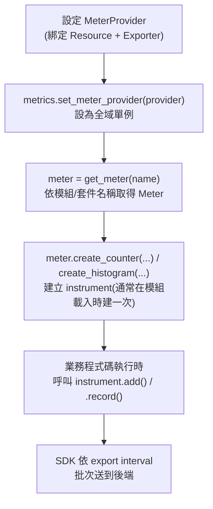

# OpenTelemetry 的 Metrics API 與其他 API 總覽（以 FastAPI 為例）

> 一句話版本：OpenTelemetry 定義了四類語言中立的 API——Tracer（Traces）、Meter（Metrics）、Logger（Logs）、Propagator（Context Propagation）——其中 Metrics API 底下又分 Counter、UpDownCounter、Histogram、Gauge 等幾種 instrument，讓應用程式碼產生量化指標而不綁定任何特定後端。

## Step 1：OTel 有哪些 API？

OTel 的 API 對應到它定義的三大信號，再加一個負責跨服務傳遞 context 的 API：

| API | 對應信號 | 拿來做什麼 |
|---|---|---|
| **Tracer API** | Traces | 建立/管理 span，標記一次請求在系統裡走的路徑 |
| **Meter API** | Metrics | 建立/記錄量化指標（counter、histogram…） |
| **Logger API** | Logs | 產生結構化 log 事件（標準化較晚，各語言支援度不一） |
| **Propagator API** | Context Propagation | 把 trace context 序列化進 HTTP header，跨進程傳遞（inject/extract） |

每種語言都有對應的 `opentelemetry-api`（純介面，業務程式碼依賴這層）與 `opentelemetry-sdk`（實際實作，含取樣、批次、匯出邏輯）套件，這是[前一篇筆記](#/sre/06-opentelemetry/what-is-opentelemetry.mdx)提過的 API/SDK 分層設計——你可以只換 SDK 的 exporter 設定，不動一行業務程式碼。

## Step 2：Metrics API 的核心——Instrument 種類

Meter API 建立出來的量測工具叫 **instrument**，OTel 定義了幾種，依「同步/非同步」與「是否只會累加」分類：

| Instrument | 同步/非同步 | 特性 | 典型用途 |
|---|---|---|---|
| Counter | 同步 | 只能累加，不能減 | 累計請求數、累計錯誤數 |
| UpDownCounter | 同步 | 可增可減 | 目前 in-flight 請求數、連線池使用中連線數 |
| Histogram | 同步 | 記錄數值分布（可算 p50/p99） | 請求延遲、payload 大小 |
| ObservableGauge | 非同步（callback） | 回報「當前值快照」 | CPU 溫度、佇列長度、記憶體用量 |
| ObservableCounter / ObservableUpDownCounter | 非同步（callback） | Counter/UpDownCounter 的非同步版本 | 從外部系統定期讀取累計值（如系統層級的網路封包數） |

同步 instrument 是在業務程式碼裡「事件發生的當下」直接呼叫記錄（如每次請求進來時 `+1`）；非同步（Observable）instrument 是註冊一個 callback，由 SDK 依匯出週期主動呼叫去讀值，適合「查一下當前狀態」而不是「事件觸發」的指標。

## Step 3：使用 Metrics API 的基本流程



關鍵是 instrument 通常只在模組載入時建立**一次**（像宣告全域變數），之後在每次請求處理時重複呼叫 `.add()` / `.record()`，不要在請求處理路徑裡重新 `create_counter()`。

## Step 4：FastAPI 範例——手寫 Metrics API

以下示範在 FastAPI 服務裡建立三種 instrument：累計請求數（Counter）、請求延遲分布（Histogram）、目前處理中的請求數（UpDownCounter）。

```python
import time
from fastapi import FastAPI, Request

from opentelemetry import metrics
from opentelemetry.sdk.metrics import MeterProvider
from opentelemetry.sdk.metrics.export import PeriodicExportingMetricReader
from opentelemetry.exporter.otlp.proto.grpc.metric_exporter import OTLPMetricExporter
from opentelemetry.sdk.resources import Resource

resource = Resource.create({"service.name": "order-service"})
exporter = OTLPMetricExporter(endpoint="localhost:4317", insecure=True)
reader = PeriodicExportingMetricReader(exporter, export_interval_millis=10_000)
provider = MeterProvider(resource=resource, metric_readers=[reader])
metrics.set_meter_provider(provider)

meter = metrics.get_meter("order-service.http")

request_counter = meter.create_counter(
    name="http.server.request.count",
    unit="1",
    description="累計 HTTP 請求數",
)
request_duration = meter.create_histogram(
    name="http.server.request.duration",
    unit="ms",
    description="HTTP 請求處理時間分布",
)
active_requests = meter.create_up_down_counter(
    name="http.server.active_requests",
    unit="1",
    description="目前正在處理的請求數",
)

app = FastAPI()


@app.middleware("http")
async def otel_metrics_middleware(request: Request, call_next):
    active_requests.add(1)
    start = time.perf_counter()
    try:
        return await call_next(request)
    finally:
        elapsed_ms = (time.perf_counter() - start) * 1000
        attributes = {"http.route": request.url.path, "http.method": request.method}
        request_counter.add(1, attributes)
        request_duration.record(elapsed_ms, attributes)
        active_requests.add(-1)


@app.get("/orders/{order_id}")
async def get_order(order_id: str):
    return {"order_id": order_id}
```

`add()` 用在 Counter/UpDownCounter，`record()` 用在 Histogram；第二個參數是 attributes（標籤），會變成後端查詢時可以 group by 的維度（例如依 `http.route` 分開看延遲）。

**ObservableGauge** 則是另一種寫法，適合「定期讀取外部狀態」而非事件驅動：

```python
def queue_length_callback(options):
    yield metrics.Observation(get_current_queue_length(), {})

meter.create_observable_gauge(
    name="worker.queue.length",
    callbacks=[queue_length_callback],
    description="目前待處理任務佇列長度",
)
```

## Step 5：手寫 vs Auto-Instrumentation 的分工

FastAPI 有現成的 `opentelemetry-instrumentation-fastapi` 套件，只要一行就能自動幫每個 HTTP 請求產生標準化的 span 與 metric（遵循 Semantic Conventions，如 `http.server.duration`）：

```python
from opentelemetry.instrumentation.fastapi import FastAPIInstrumentor

FastAPIInstrumentor.instrument_app(app)
```

實務上兩者會混用：

| 場景 | 用哪個 |
|---|---|
| 通用 HTTP 層（進站延遲、狀態碼分布） | Auto-instrumentation（`FastAPIInstrumentor`） |
| 業務自訂指標（訂單金額分布、庫存低於閾值次數、佇列長度） | 手寫 Meter API |

Auto-instrumentation 負責打底，手寫 Metrics API 補業務邏輯層級才知道的指標——這跟[前一篇筆記](#/sre/06-opentelemetry/what-is-opentelemetry.mdx)提到的 Trace 埋點策略是同一個原則。

## 相關筆記

- [OpenTelemetry 的功能與應用](#/sre/06-opentelemetry/what-is-opentelemetry.mdx)
- [OpenTelemetry 在 GKE + GCP 上的實踐案例](#/sre/05-gcp/otel-gcp-gke-case-study.mdx)
