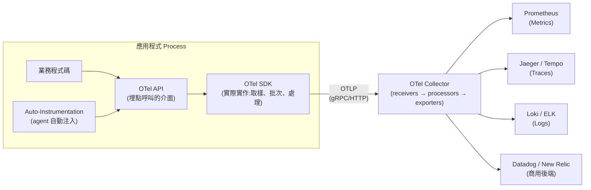
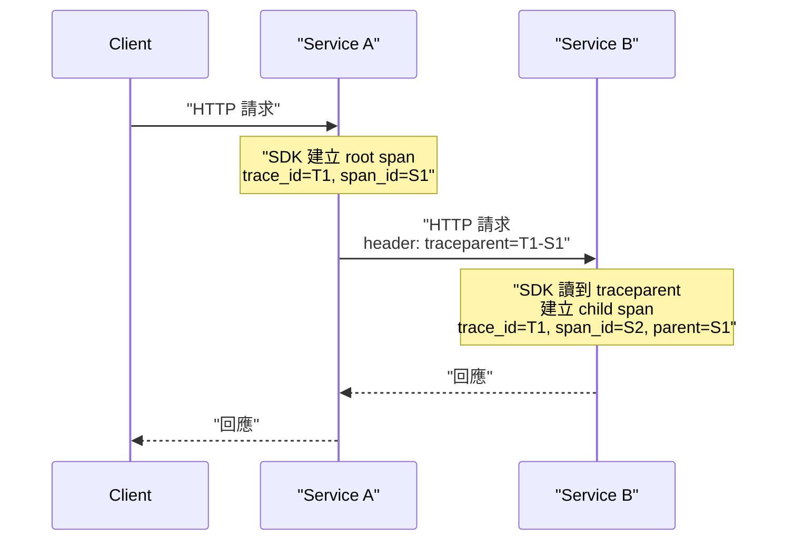

# OpenTelemetry 的功能與應用

> 一句話版本：OpenTelemetry（簡稱 OTel）是 CNCF 底下的**廠商中立可觀測性標準**，定義了一套統一的 API/SDK 與資料格式，讓應用程式產生的 Traces、Metrics、Logs 三種信號可以用同一套方式收集、處理、匯出到任何後端（Prometheus、Jaeger、Datadog、Grafana…），避免被單一廠商的 SDK 綁死。

## Step 1：為什麼會有 OpenTelemetry?

在 OTel 出現之前，可觀測性生態是碎片化的：

- **Distributed tracing** 有 OpenTracing（廠商中立 API）和 OpenCensus（Google 主導，API + SDK 都有）兩套互相競爭的標準。
- **Metrics** 各家廠商（Datadog、New Relic、Prometheus）都有自己的 client library，格式互不相容。
- 一旦你在程式碼裡埋了某廠商的 SDK，換後端就要重寫所有埋點（instrumentation），形成 **vendor lock-in**。

2019 年 OpenTracing 與 OpenCensus 合併成 **OpenTelemetry**，由 CNCF 主導，目標是「埋一次，到處送」（instrument once, export anywhere）。

## Step 2：三大信號（Signals）

OpenTelemetry 統一定義了可觀測性的三種資料型態，這也是它最核心的功能範疇：

| 信號 | 回答的問題 | 資料型態特點 |
|------|-----------|-------------|
| **Traces** | 一個請求在分散式系統中走了哪些服務、每一跳花多少時間？| 由多個 Span 組成一棵樹，含 parent-child 關係 |
| **Metrics** | 系統整體的量化指標（QPS、延遲分布、error rate）？| 數值型時間序列，可聚合（counter、histogram、gauge） |
| **Logs** | 某個時間點、某個 span 上發生了什麼細節事件？| 結構化事件，可透過 trace id 關聯回對應的 span |

三者共用同一份 **Resource**（標記這筆資料來自哪個 service、哪個 host、哪個 k8s pod）與同一套 **Context**（trace id、span id），所以可以互相關聯 —— 這是 OTel 相對於「各自為政」的舊工具最大的價值：同一個請求的 log、trace、metric 可以用 trace id 串起來一起查。

## Step 3：架構長什麼樣子？

三個關鍵層次：

1. **API**：定義「怎麼呼叫」的介面（例如 `tracer.startSpan(...)`），應用程式碼只依賴這層，不依賴任何具體後端。
2. **SDK**:API 的實際實作，負責取樣（sampling）、批次處理（batching）、將資料轉成 **OTLP**（OpenTelemetry Protocol）格式送出。SDK 是可替換的 —— 理論上你可以換一套 SDK 而不改業務程式碼。
3. **Collector**：獨立部署的資料處理管線（可以是 sidecar 或獨立服務），接收 OTLP 資料後做 receivers → processors（如過濾、加 attribute、取樣、批次）→ exporters（轉送到任意數量的後端）。有了 Collector，應用程式不需要知道最終資料會送去哪個後端，後端要換也不用重新部署應用程式。

## Step 4：埋點（Instrumentation）怎麼做？

OTel 提供兩種埋點方式：

- **Auto-instrumentation**：透過 agent（如 Java 的 `-javaagent`、Python 的 `opentelemetry-instrument`）在啟動時自動 hook 常見框架（HTTP client/server、資料庫 driver、訊息佇列 client），不用改一行程式碼就能拿到基本的 trace 與 metric。
- **Manual instrumentation**：在程式碼中手動呼叫 API 建立自訂 span、記錄自訂 metric，用於業務邏輯層級的可觀測性（auto-instrumentation 看不到的部分，例如「這個 span 代表一次折扣計算」）。

實務上通常是兩者混用：auto-instrumentation 打底（HTTP/DB 呼叫都自動有 span），manual instrumentation 補業務關鍵路徑。

## Step 5:Context Propagation—— 分散式追蹤的關鍵

一個請求跨越多個服務時，OTel 靠 **Context Propagation** 把 trace context（trace id + span id）透過 HTTP header 或訊息佇列 metadata 傳遞下去，讓下游服務產生的 span 能正確掛在同一棵 trace 樹下。

標準的傳遞格式是 **W3C Trace Context**(`traceparent` header),OTel 預設遵循這個標準，所以能跨語言、跨廠商互通。除了 trace context，還有 **Baggage** 機制可以在整條呼叫鏈傳遞任意 key-value（例如 tenant id），但要注意 baggage 會隨每一跳傳遞，濫用會增加網路開銷。

## Step 6:Semantic Conventions—— 標準化的命名規則

如果每個團隊對「這是一次 HTTP 呼叫」的 attribute 命名都不一樣（有人叫 `http_method`，有人叫 `method`），資料就無法跨系統比較查詢。OTel 定義了一套 **Semantic Conventions**，規定常見場景的標準屬性名稱，例如：

- HTTP:`http.request.method`、`http.response.status_code`
- 資料庫：`db.system`、`db.statement`
- 訊息佇列：`messaging.system`、`messaging.destination.name`

這讓不同語言、不同團隊產出的資料在後端可以用同一套 query/dashboard 邏輯處理。

## Step 7:Sampling—— 控制資料量與成本

Trace 資料量在高流量系統會非常大，OTel 支援兩種取樣策略：

- **Head-based sampling**：在 span 建立的當下就決定要不要保留（例如固定機率 10%）。成本低，但可能漏掉真正重要的請求（如剛好沒被抽到的錯誤請求）。
- **Tail-based sampling**：先收集完整個 trace，依「是否有錯誤」「延遲是否過高」等條件事後決定要不要保留，通常在 Collector 層做。準確度高但需要暫存資料、成本較高。

## 小結：OpenTelemetry 解決的核心問題

| 問題 | OTel 的解法 |
|------|------------|
| 廠商鎖死，換後端要重寫埋點 | API/SDK 與後端解耦，只換 exporter 設定 |
| Trace/Metric/Log 各自為政，查問題要切換多個工具 | 共用 Resource + trace id，可互相關聯 |
| 各語言 / 團隊 attribute 命名不一致 | Semantic Conventions 標準化 |
| 高流量下 trace 資料爆量 | Head-based / Tail-based sampling |
| 應用程式要知道資料送去哪裡 | Collector 集中處理 routing / 轉送 |

## 相關筆記

- [OTel 在 GKE + GCP 上，Traces / Logs / Metrics 是怎麼串起來的？](#/sre/05-gcp/otel-gcp-gke-case-study.mdx)
- [OpenTelemetry 的 Metrics API 與其他 API 總覽（以 FastAPI 為例）](#/sre/06-opentelemetry/otel-metrics-api-fastapi.mdx)
