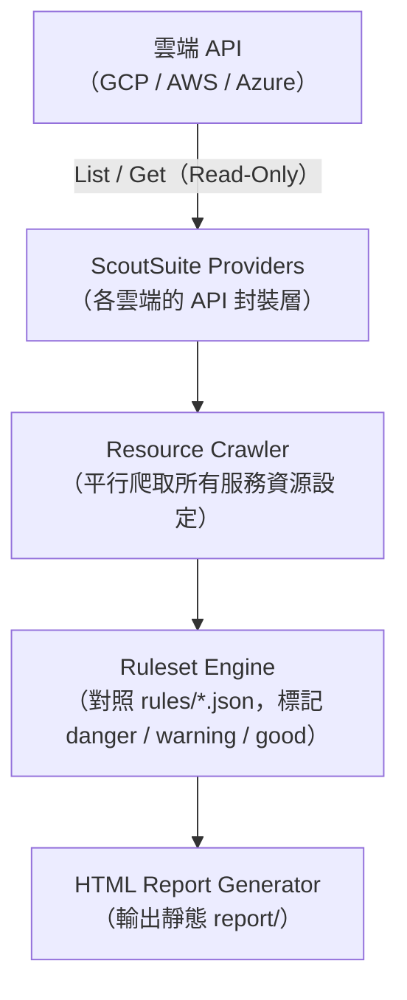

# ScoutSuite：多雲安全態勢稽核工具

> ScoutSuite 是開源的多雲安全稽核工具，透過讀取雲端 API 盤點資源設定，並對照規則集產出 HTML 安全評估報告，讓工程師快速掌握整個雲端環境的 Security Posture。

## 核心設計：Read-Only API Scan

ScoutSuite **不會修改任何資源**——它只呼叫雲端 API 的 `List`、`Get`、`Describe` 類端點，把資源快照下載到本地端，再跑規則引擎，最後輸出靜態 HTML 報告。

這個設計的優點：

- 不需要進入 VM 或 Container，對生產環境零副作用
- 只需最小唯讀權限的 service account
- 報告可以離線保存或分享給合規審查人員

支援雲端平台：**AWS、GCP、Azure、Alibaba Cloud、Oracle Cloud、Kubernetes**。

## 架構流程



## 稽核範圍（以 GCP 為例）

| 服務 | 典型發現 |
|------|---------|
| IAM | 具有 `roles/owner` 或 `roles/editor` 的 service account；外部成員被加入組織 |
| GCS | Bucket 設為 `allUsers` / `allAuthenticatedUsers` 公開存取 |
| GKE | Legacy ABAC 啟用；Master Authorized Networks 未設定；Workload Identity 未啟用 |
| Compute / Firewall | 開放 `0.0.0.0/0` 的 SSH (22)、RDP (3389) 入站規則 |
| Cloud SQL | 允許任意 IP 連線；SSL 未強制 |
| KMS | Key rotation policy 未設定 |
| Cloud Logging | Data Access 稽核日誌未啟用 |
| VPC | VPC Flow Logs 未啟用 |

## 安裝與執行

```bash
# 安裝
pip install scoutsuite

# GCP：使用 ADC（Application Default Credentials）掃描指定 project
scout gcp --project-id my-project-id

# 指定 service account key
scout gcp --project-id my-project-id --service-account path/to/key.json

# 自訂報告輸出目錄（預設 scoutsuite-report/）
scout gcp --project-id my-project-id --report-dir ./my-report
```

執行完成後，用瀏覽器開啟 `scoutsuite-report/scoutsuite-results/scoutsuite_report.html` 即可查看互動式報告。

## 報告結構與嚴重度

HTML 報告依**服務**分類，每個發現有四種狀態：

| 狀態 | 顏色 | 意義 |
|------|-----|------|
| Danger | 紅 | 高風險，應立即處理（例如：bucket 公開讀寫） |
| Warning | 橙 | 中風險，需評估（例如：root account 缺少 MFA） |
| Good | 綠 | 符合最佳實踐 |
| Unknown | 灰 | 無法評估，通常是 API 權限不足 |

## GCP 最小權限設定

建議給 ScoutSuite 的 service account 授予以下最小角色：

```bash
# 大部分資源的唯讀存取
roles/viewer

# 讀取 IAM policy 細節
roles/iam.securityReviewer

# Cloud Asset API（加速資源盤點）
roles/cloudasset.viewer
```

透過 Cloud Asset API 可以顯著縮短掃描時間，因為 ScoutSuite 可以批次查詢資源，而非逐一呼叫各服務 API。

## 與 CSPM 工具的定位關係

ScoutSuite 屬於 **CSPM（Cloud Security Posture Management）** 工具類別：

| 工具類別 | 代表工具 | 特點 |
|---------|---------|------|
| CSPM 開源 | ScoutSuite、Prowler | 本地執行，免費，規則可自訂 |
| CSPM 商業 | Wiz、Prisma Cloud、Orca | SaaS，持續監控，整合更深 |
| 雲端原生 | GCP Security Command Center、AWS Security Hub | 平台原生，整合度最高，但鎖定單一雲端 |

ScoutSuite 最適合的場景：

- **定期點狀稽核**：例如每季跑一次，追蹤 posture 趨勢
- **新環境上線前的 security baseline 驗收**
- **顧問或外部審計評估**

不適合作為**持續監控**工具，因為它沒有事件驅動的告警機制；持續監控建議搭配 GCP Security Command Center 或商業 CSPM。

## 相關筆記

- [GCP VPC Network 的架構與核心概念](#/sre/05-gcp/gcp-vpc-network.mdx)
- [GCP Cloud Run 的原理與應用](#/sre/05-gcp/gcp-cloud-run-overview.mdx)
