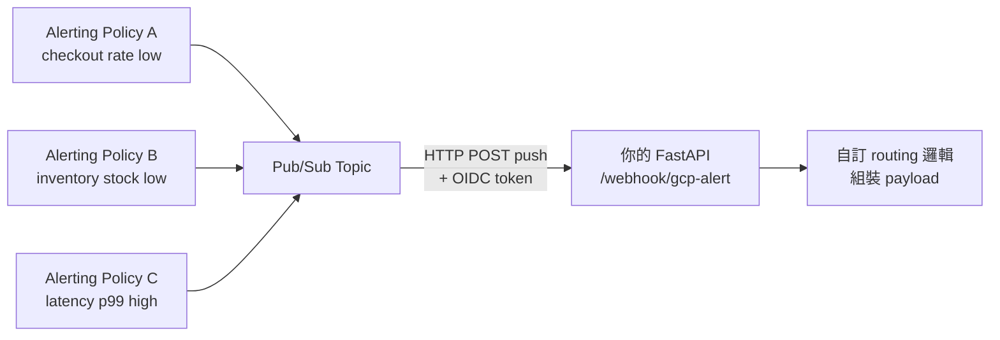
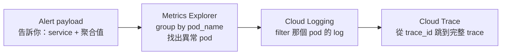

# GCP Alerting Policy → Pub/Sub → 自訂 Webhook 完整串接

> GCP Alerting 的 webhook payload 格式固定，透過 Pub/Sub 當中介層才能自訂格式、集中 routing。

## 架構總覽



所有 Alerting Policy 共用同一個 Pub/Sub topic，由你的 API 統一接收並處理。

---

## Step 1：建立 Pub/Sub Topic + Push Subscription

```bash
gcloud pubsub topics create gcp-alerts

gcloud pubsub subscriptions create gcp-alerts-push \
  --topic=gcp-alerts \
  --push-endpoint=https://your-api.com/webhook/gcp-alert \
  --push-auth-service-account=your-sa@project.iam.gserviceaccount.com \
  --push-auth-token-audience=https://your-api.com/webhook/gcp-alert
```

`--push-auth-service-account` 讓 Pub/Sub push 時自動帶 OIDC token，你的 API 驗證這個 token 確認請求來自 GCP。

---

## Step 2：Alerting Policy 的 Notification Channel 選 Pub/Sub

GCP Console → Monitoring → Notification Channels → **Pub/Sub** → 選剛建的 topic。

所有 Alerting Policy 的 notification channel 都指向同一個 topic。

---

## Step 3：Alert Payload 結構

GCP Alerting 打到 Pub/Sub 的 payload 格式**固定**，無法自訂 template。

你的 API 收到的是 Pub/Sub envelope，alert 資料在 `message.data` 裡 base64 encoded：

```python
import base64, json

envelope = await request.json()
raw = base64.b64decode(envelope["message"]["data"])
alert = json.loads(raw)
incident = alert["incident"]
```

解開後的 `incident` 結構：

```json
{
  "incident_id": "0.opqiw61fsv7p",
  "policy_name": "Checkout success rate low",
  "condition_name": "rate below threshold",
  "resource": {
    "type": "k8s_container",
    "labels": {
      "project_id": "my-project",
      "cluster_name": "prod-cluster",
      "namespace_name": "payments",
      "pod_name": "checkout-api-7d4b9c-xkp2m",
      "container_name": "checkout-api"
    }
  },
  "metric": {
    "type": "workload.googleapis.com/checkout.success.total",
    "labels": {
      "payment_method": "credit_card",
      "region": "TW"
    }
  },
  "threshold_value": "0.1",
  "observed_value": "0.02",
  "state": "OPEN",
  "started_at": 1720000000,
  "ended_at": null,
  "url": "https://console.cloud.google.com/monitoring/alerting/incidents/..."
}
```

### 關鍵欄位說明

| 欄位 | 說明 |
|------|------|
| `state` | `OPEN`（觸發）或 `CLOSED`（恢復），同一個 webhook 兩種都會收到 |
| `policy_name` | Alerting Policy 名稱，用來 routing 到不同處理邏輯 |
| `metric.labels` | 你在 OTel `.add()` 帶的 attributes 會出現在這裡 |
| `resource.labels` | 執行環境資訊（namespace、container name、pod name） |
| `observed_value` | 觸發當下的實際數值 |
| `threshold_value` | 你設定的閾值 |

### resource.labels 依執行環境不同

| 環境 | `resource.type` | 識別用欄位 |
|------|----------------|-----------|
| GKE | `k8s_container` | `namespace_name`, `container_name`, `pod_name` |
| Cloud Run | `cloud_run_revision` | `service_name`, `revision_name` |
| GCE | `gce_instance` | `instance_id`, `zone` |

---

## Step 4：Alert 觸發對象是聚合值，不是單一 Pod

**重要**：Alerting Policy 評估的是所有 pod 聚合後的數值：

```
checkout-api pod A → rate: 0.05/s  ┐
checkout-api pod B → rate: 0.03/s  ├ sum → 0.08/s → 低於 0.1/s → 觸發
checkout-api pod C → rate: 0.00/s  ┘
```

`resource.labels.pod_name` 在聚合 alert 裡**沒有意義**。要找出是哪個 pod 造成問題，需要：



routing 邏輯用 `container_name` 或 `namespace_name` 識別服務，`pod_name` 留給 debug 用。

---

## Step 5：FastAPI 接收端完整實作

```python
# main.py
import base64, json
import httpx
from fastapi import FastAPI, Request, HTTPException
from google.oauth2 import id_token
from google.auth.transport import requests as google_requests

app = FastAPI()

EXPECTED_AUDIENCE = "https://your-api.com/webhook/gcp-alert"

async def verify_oidc_token(request: Request):
    auth = request.headers.get("Authorization", "")
    if not auth.startswith("Bearer "):
        raise HTTPException(status_code=401)
    token = auth.removeprefix("Bearer ")
    try:
        id_token.verify_oauth2_token(
            token,
            google_requests.Request(),
            audience=EXPECTED_AUDIENCE,
        )
    except Exception:
        raise HTTPException(status_code=401)

@app.post("/webhook/gcp-alert")
async def receive_alert(request: Request):
    await verify_oidc_token(request)

    envelope = await request.json()
    raw = base64.b64decode(envelope["message"]["data"])
    incident = json.loads(raw)["incident"]

    service = (
        incident.get("resource", {}).get("labels", {}).get("container_name")
        or incident.get("resource", {}).get("labels", {}).get("service_name")
        or "unknown"
    )

    match incident["policy_name"]:
        case "Checkout success rate low":
            await handle_checkout_alert(incident, service=service)
        case "Inventory stock low":
            sku = incident["metric"]["labels"].get("sku", "unknown")
            await handle_inventory_alert(incident, sku=sku)
        case _:
            await handle_generic_alert(incident, service=service)

    # 一定要回 2xx，否則 Pub/Sub 會重試
    return {"status": "ok"}
```

---

## Alerting Policy 設定要點

Counter 是累積值，Alert condition 要用 `rate()` 轉換：

```
Metric: workload.googleapis.com/checkout.success.total
Rolling window: 5 min
Rolling window function: rate
Condition: < 0.1 (per second)
Duration: 5 min   ← 持續 5 分鐘才觸發，防止瞬間抖動
```

偵測「完全沒有流量」用 **Metric Absence**，比設閾值更準：

```
Condition type: Metric absence
Duration: 5 min
```

---

## 用 Terraform 管理（建議）

```hcl
resource "google_monitoring_alert_policy" "checkout_low" {
  display_name = "Checkout success rate low"
  combiner     = "OR"

  conditions {
    display_name = "rate below threshold"
    condition_threshold {
      filter          = "metric.type=\"workload.googleapis.com/checkout.success.total\""
      comparison      = "COMPARISON_LT"
      threshold_value = 0.1
      duration        = "300s"

      aggregations {
        alignment_period   = "300s"
        per_series_aligner = "ALIGN_RATE"
      }
    }
  }

  notification_channels = [google_monitoring_notification_channel.pubsub.name]
}

resource "google_monitoring_notification_channel" "pubsub" {
  display_name = "GCP Alerts Pub/Sub"
  type         = "pubsub"
  labels = {
    topic = "projects/my-project/topics/gcp-alerts"
  }
}
```

---

## OIDC Token 驗證注意事項

`id_token.verify_oauth2_token()` 每次呼叫都打 Google JWKS endpoint 拿公鑰。高流量時應加 cache（token 有效期通常 1 小時），避免每個 request 都發網路請求。

## 相關筆記

- [GCP Log-based Metrics 與 OTel Metrics API 的差異](#/sre/99-staging/gcp-log-based-metrics-vs-otel-metrics.mdx)
- [OTel Metrics Instrument 選型指南](#/sre/99-staging/otel-metrics-instrument-selection.mdx)
- [GCP Uptime Checks 與 Alerting 功能](#/sre/05-gcp/gcp-uptime-checks-and-alerting.mdx)
