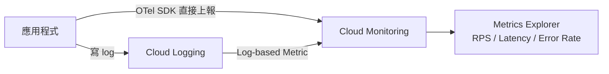

# GCP Log-based Metrics 與 OTel Metrics API 的差異

> 兩者都能在 Metrics Explorer 畫出 RPS，但資料來源與精度差距決定了適用場景。

## 問題起點：structured log 能直接變成 metric 嗎？

GCP 上的應用程式通常會產生類似這樣的結構化日誌：

```json
{
  "latency": "0.000811s",
  "requestMethod": "GET",
  "requestUrl": "http://10.1.16.133/task-api/healthz",
  "status": 200
}
```

這些 log 進入 Cloud Logging 後，可以透過兩條路轉成 metric：



---

## 做法一：Log-based Metrics（零改 code）

在 Cloud Logging 建立 Counter 或 Distribution metric，filter 條件抓到對應的 log 就自動累積。

**建 Counter metric（算 RPS）：**

1. Cloud Logging → Log-based Metrics → Create Metric → Counter
2. Filter: `jsonPayload.requestUrl =~ "task-api"`
3. 加 Label：`status` 從 `jsonPayload.status` 萃取

在 Metrics Explorer 選這個 metric，aggregation 用 `rate()` 就得到 RPS。

**建 Distribution metric（算 latency 分佈）：**

- Field name: `jsonPayload.latency`
- Type: Distribution

建完後可直接看 p50 / p95 / p99。

---

## 做法二：OTel Metrics API（主動埋點）

在應用程式裡用 OTel SDK 直接上報數值：

```python
from opentelemetry import metrics
from opentelemetry.sdk.metrics import MeterProvider
from opentelemetry.sdk.metrics.export import PeriodicExportingMetricReader
from opentelemetry.exporter.cloud_monitoring import CloudMonitoringMetricsExporter

exporter = CloudMonitoringMetricsExporter()
reader = PeriodicExportingMetricReader(exporter, export_interval_millis=30_000)
provider = MeterProvider(metric_readers=[reader])
metrics.set_meter_provider(provider)
meter = metrics.get_meter("my-service", version="1.0.0")
```

FastAPI auto-instrumentation 三行搞定 HTTP metrics：

```bash
pip install opentelemetry-instrumentation-fastapi
```

```python
from opentelemetry.instrumentation.fastapi import FastAPIInstrumentor
FastAPIInstrumentor.instrument_app(app)
```

自動產出：

| Metric | 說明 |
|--------|------|
| `http.server.request.duration` | latency histogram |
| `http.server.active_requests` | 當前 in-flight 數 |

RPS = `rate(http.server.request.duration_count)`。

---

## 核心差異對比

| 面向 | Log-based Metrics | OTel Metrics API |
|------|-------------------|------------------|
| 資料來源 | Log 事件計數（間接推導） | 應用程式直接上報 |
| 精度 | 受 log sampling 影響 | 不受 log sampling 影響 |
| Cardinality 控制 | 難以預先控制 | 在 code 裡決定 attributes |
| Pipeline 延遲 | 30–90 秒 | 10–15 秒 |
| Business metrics | 無法（不在 access log 裡） | 完全自訂 |
| 改 code 需求 | 零 | 需要埋 SDK |

**Log sampling 的隱患**：高流量服務常對 log 做 sampling（只記 1% 的 200 請求），這樣算出來的 RPS 是估算值。OTel Counter 在 SDK 裡直接累加，不走 log pipeline，不受影響。

---

## 選擇原則

```
服務不能改 code（third-party / legacy）     → Log-based Metrics
流量不高、不在意 30–60 秒延遲              → Log-based Metrics
需要精確 latency histogram（p99.9 SLO）    → OTel Metrics
log 有 sampling，RPS 要準確               → OTel Metrics
需要 business metrics（checkout 成功數）   → OTel Metrics（唯一選擇）
需要 trace + metric 關聯（exemplar）       → OTel Metrics
```

---

## Pod 效能與基礎設施 metrics

OTel SDK 在 app process 裡，不管 pod CPU / memory。那些由 GKE 基礎設施自動提供：

| 指標 | 來源 |
|------|------|
| Pod CPU / memory usage | GKE 內建（`kubernetes.io/` namespace） |
| Pod restart count | GKE 內建 |
| Network I/O | GKE 內建 |

這些在 Metrics Explorer 搜尋 `kubernetes` 就直接看得到，不需要任何設定。

## 相關筆記

- [GCP Cloud Observability 套件總覽](#/sre/05-gcp/gcp-cloud-observability-overview.mdx)
- [OpenTelemetry 的 Metrics API 與其他 API 總覽（以 FastAPI 為例）](#/sre/06-opentelemetry/otel-metrics-api-fastapi.mdx)
- [GCP Alerting Policy → Pub/Sub → 自訂 Webhook 完整串接](#/sre/99-staging/gcp-alerting-pubsub-webhook.mdx)
