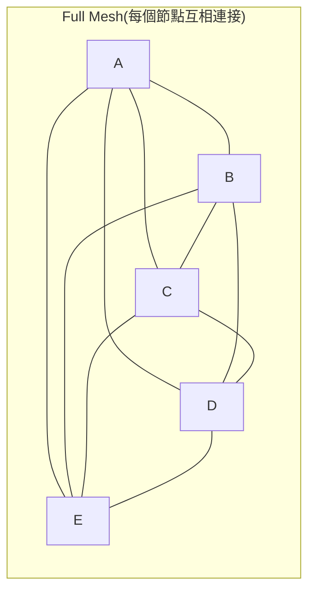
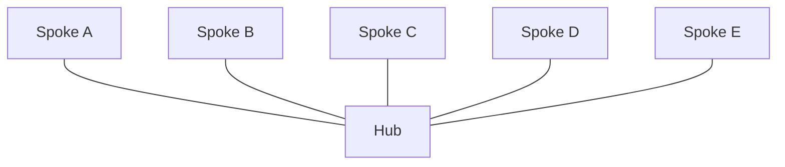

# Hub-and-Spoke 架構模式：集中協調的星狀拓撲

> 所有節點（spoke）只與一個中心節點（hub）連接，節點彼此不直接互聯；連線複雜度從 full mesh 的 O(n²) 降到 O(n)，代價是 hub 變成單點故障與效能瓶頸。

## Step 1：對照 full mesh，理解問題本質

假設有 5 個系統（或 5 個網路節點）需要互通，兩種拓樸長這樣：

Full mesh 的連線數是 $\binom{n}{2} = \dfrac{n(n-1)}{2}$，n 每增加 1，新增的連線數就跟著線性成長；到了 20 個節點就是 190 條連線，維運與安全策略同步的成本急遽膨脹。Hub-and-spoke 把所有連線收斂到一個中心，連線數退化成 $n - 1$，新增一個節點只需要接一條線到 hub，成本是常數。

## Step 2：hub 承擔的角色

Hub 不只是「轉接站」，通常也承擔：

- **路由 / 轉發**：spoke 之間的流量（或訊息）都先經過 hub 再送到目的地。
- **統一治理**：安全策略、存取控制、監控埋點集中在 hub 一處設定，不用在每個 spoke 重複維護。
- **協定轉換 / 中介邏輯**：企業整合場景中，hub 常負責格式轉換、認證、限流等跨切面邏輯。

## Step 3：常見應用場景

| 場景 | Hub | Spoke |
|---|---|---|
| 雲端網路拓樸 | Transit VPC / GCP Network Connectivity Center | 各業務 VPC |
| 企業整合（EAI / ESB） | Enterprise Service Bus | 各業務系統 |
| 多代理（multi-agent）系統 | Orchestrator | Worker agents |
| 航空業路網規劃 | 樞紐機場 | 各地點對點航班 |
| 資料管線 | 中央資料湖 / event bus | 各資料來源系統 |

以 GCP 網路為例，Shared VPC 或 Network Connectivity Center 就是 hub-and-spoke 的具體實作：各專案（spoke）不互相建立 peering，而是統一連到中心網路（hub），由 hub 統一管理路由與防火牆規則，可參考「[GCP VPC Network 的架構與核心概念](#/sre/05-gcp/gcp-vpc-network.mdx)」。

在 LLM 應用中，orchestrator-worker 這種多代理協作模式，本質上也是 hub-and-spoke：orchestrator 是 hub，負責任務拆解與結果彙整；各 subagent 是 spoke，彼此不直接溝通，細節見「[AI Agent 三種分工模式](#/llm/04-applications/ai-agent-collaboration-modes.mdx)」。

## Step 4：Trade-offs

**優點**

- 連線數與治理成本是 $O(n)$，新增節點成本是常數，擴展性好。
- 安全策略、監控、日誌集中在 hub，一致性容易維持。
- Spoke 之間互不耦合，個別 spoke 的變更不會直接波及其他 spoke。

**缺點**

- **單點故障（SPOF）**：hub 掛掉，所有 spoke 之間的溝通全部中斷。
- **效能瓶頸**：所有流量集中經過 hub，hub 的頻寬 / 運算資源必須隨 spoke 數量與流量規模一起擴容。
- **額外延遲**：即使兩個 spoke 地理位置很近，流量仍須先繞到 hub 再轉出去，跳數（hop count）比 spoke 直接互連多一段。

## Step 5：常見變形，緩解上述缺點

- **Multi-hub（區域樞紐）**：依地理區域或可用性需求佈建多個 hub，避免單一 hub 成為全域 SPOF，同時縮短區域內的繞路距離。
- **Hub-and-spoke with spoke-to-spoke shortcut**：對延遲敏感的少數 spoke 對，允許例外建立直連捷徑，其餘仍走 hub；這是在「集中治理」與「效能」之間做的局部妥協，本質已經是 hybrid 拓樸而非純粹的 hub-and-spoke。

## 相關筆記

- [AI Agent 三種分工模式](#/llm/04-applications/ai-agent-collaboration-modes.mdx)
- [GCP VPC Network 的架構與核心概念](#/sre/05-gcp/gcp-vpc-network.mdx)
- [gRPC 的原理與設計](#/swe/01-system-design/what-is-grpc.mdx)
