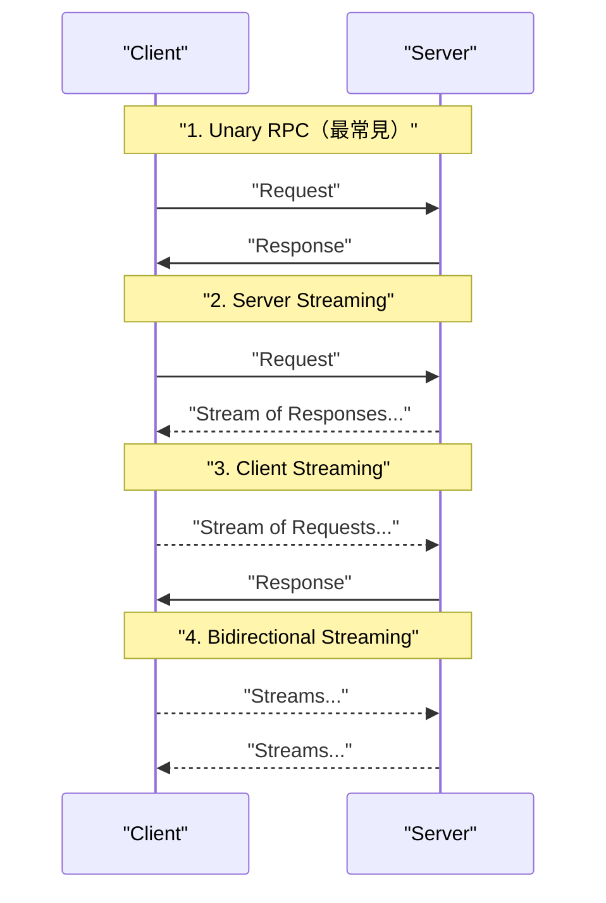
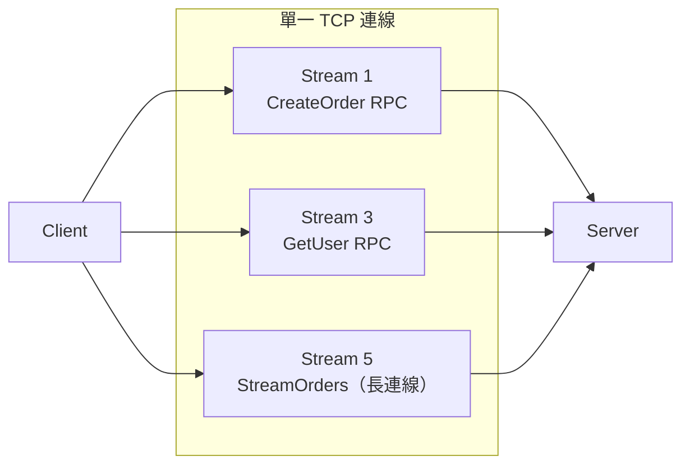

# gRPC 的原理與設計

> gRPC 是以 Protocol Buffers 為序列化格式、HTTP/2 為傳輸層的高效能 RPC 框架，讓跨語言的服務呼叫像呼叫本地函式一樣自然，並透過 `.proto` 強型別 IDL 確保介面契約。

## Step 1：為什麼需要 gRPC？

微服務架構下，服務之間需要大量內部通訊。傳統 REST/JSON 有幾個痛點：

- **序列化開銷大**：JSON 是文字格式，欄位名稱重複出現，payload 冗餘。
- **HTTP/1.1 並行限制**：每個請求佔一條 TCP 連線（或受 pipeline 限制）。
- **無原生 streaming**：需要額外引入 WebSocket 或 SSE。
- **介面契約靠慣例**：OpenAPI 是補充文件，不是程式語言層級的保障。

gRPC 解決了以上問題：

| 維度 | REST/JSON | gRPC/Protobuf |
|------|-----------|---------------|
| 序列化 | 文字，冗餘大 | 二進位，約小 3–10x |
| 傳輸協定 | HTTP/1.1（預設） | HTTP/2（多路複用、Header 壓縮） |
| 介面契約 | 慣例（OpenAPI 補充） | `.proto` 強型別 IDL |
| Streaming | 需 WebSocket/SSE | 四種原生 streaming 模式 |
| 程式碼生成 | 需額外工具 | `protoc` 一鍵多語言 |

**適用場景**：微服務間的內部通訊（低延遲、高吞吐）、需要 streaming 的場景（音訊串流、即時推送）。
**不適用場景**：對外公開 API（瀏覽器不能直接用 gRPC）、簡單的 CRUD REST API。

## Step 2：定義契約 ——`.proto` 檔

`.proto` 是 gRPC 的 IDL（Interface Definition Language），語言中立：

```protobuf
syntax = "proto3";

package order;

service OrderService {
  rpc CreateOrder (CreateOrderRequest) returns (CreateOrderResponse);
  rpc StreamOrders (StreamRequest) returns (stream OrderEvent);
}

message CreateOrderRequest {
  string user_id = 1;
  repeated string item_ids = 2;
}

message CreateOrderResponse {
  string order_id = 1;
  string status   = 2;
}
```

欄位後面的數字（`= 1`、`= 2`）是 **field number**，Protobuf 用它（而非欄位名稱）做序列化，因此可以安全地新增欄位而不破壞舊版相容性。

## Step 3：Protobuf 序列化原理

Protobuf 使用 **TLV（Tag-Length-Value）** 二進位編碼 —— 每個欄位編碼成 `(field_number << 3 | wire_type)` 的 varint + 資料本體。

```
JSON:    {"user_id":"u123","item_ids":["i1","i2"]}  → 約 46 bytes
Protobuf: 同樣資料                                   → 約 14 bytes
```

優點：緊湊、解析快。缺點：不可人讀，需要 schema 才能解碼（生產環境除錯需要 `protoc --decode` 或 gRPC reflection）。

## Step 4：程式碼生成

```bash
protoc --go_out=. --go-grpc_out=. order.proto
```

`protoc` 會根據 `.proto` 生成兩類程式碼：

- **Client Stub**：封裝序列化 + 網路呼叫，呼叫方看起來就像呼叫本地函式。
- **Server Interface**：你只需實作業務邏輯，框架負責反序列化與 dispatch。

這讓介面契約從「文件慣例」升級為「編譯期保障」：`.proto` 改了，所有語言的 stub 重新生成，型別不符就編譯失敗。

## Step 5：四種通訊模式



| 模式 | 用途範例 |
|------|---------|
| Unary | 查詢訂單、建立資源 |
| Server Streaming | 即時推送通知、日誌串流 |
| Client Streaming | 上傳大型資料、批次寫入 |
| Bidirectional | 即時聊天、協作編輯 |

## Step 6：HTTP/2 傳輸層

gRPC 的每個 RPC 對應一個 HTTP/2 **stream**，同一條 TCP 連線可以並行執行多個 RPC（**多路複用**），解決了 HTTP/1.1 的 Head-of-Line Blocking 問題。



HTTP/2 還帶來 **Header 壓縮（HPACK）**：同一連線上重複的 header（如 `content-type: application/grpc`）只傳一次，後續請求引用索引即可。

## Step 7：Interceptor 中介層

gRPC 的 interceptor 類似 HTTP middleware，可在不改業務邏輯的情況下插入橫切關注點：

```go
// Go server-side unary interceptor 範例
func loggingInterceptor(
    ctx context.Context,
    req interface{},
    info *grpc.UnaryServerInfo,
    handler grpc.UnaryHandler,
) (interface{}, error) {
    log.Printf("RPC: %s", info.FullMethod)
    resp, err := handler(ctx, req)
    log.Printf("done, err=%v", err)
    return resp, err
}

// 掛載
grpc.NewServer(grpc.UnaryInterceptor(loggingInterceptor))
```

常見用途：認證（JWT /mTLS）、distributed tracing（OpenTelemetry）、rate limiting、retry with backoff。

## 生產環境注意事項

**Load Balancing**：HTTP/2 長連線讓 L4 LB 把流量釘死在單一 Pod，Kubernetes 環境需用 L7 LB（Envoy / Istio）或 client-side load balancing。

**gRPC 錯誤碼**：gRPC 有自己的 status code（`NOT_FOUND`、`UNAVAILABLE`、`DEADLINE_EXCEEDED`…），不要和 HTTP 4xx/5xx 混用，否則 interceptor 與監控會誤判。

**瀏覽器限制**：瀏覽器無法直接使用 gRPC（HTTP/2 trailer 不支援），需透過 **gRPC-Web**（Envoy 代理轉換協定）對外暴露。

**Schema 演進規則**：

- 安全：新增欄位（舊 client 忽略未知欄位）
- 危險：刪除欄位、改 field number、改欄位型別 —— 會破壞相容性

## 相關筆記

- [OpenTelemetry 的功能與應用](#/sre/06-opentelemetry/what-is-opentelemetry.mdx)——gRPC interceptor 整合 OTel 做 distributed tracing
- [GCP VPC Network 的架構與核心概念](#/sre/05-gcp/gcp-vpc-network.mdx)——gRPC 服務在 VPC 內的網路設計
