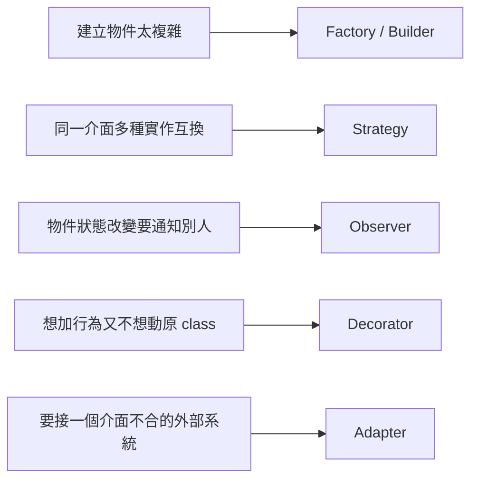

# OOP 與 Clean Code 的系統性學習路徑

> 給 Backend Engineer 的循序學習法：先建立 OOP 心智模型，再學會辨識 code smell，用 SOLID 收斂設計判斷，最後把紀律落到每天寫的函式與命名上。

## Step 1：建立 OOP 的心智模型（而不是背語法）

多數人學 OOP 卡在把「class、inheritance」當語法學，而不是當「管理複雜度的工具」學。先把四大支柱換成工程語言：

| 概念 | 語言層面 | 工程目的 |
|---|---|---|
| Encapsulation（封裝） | private 欄位 + public method | 把「怎麼做」藏起來，只暴露「做什麼」，讓內部實作可以自由改 |
| Abstraction（抽象） | interface /abstract class | 讓呼叫者依賴「行為契約」，不依賴「具體實作」 |
| Inheritance（繼承） | extends | 表達 is-a 關係、共享行為 —— 但最容易被濫用 |
| Polymorphism（多型） | 同一介面、不同實作互換 | 消除大量 if/switch，讓新增行為不用改舊程式碼 |

**練習**：挑一個服務裡最多 `if type == "A" ... elif type == "B"` 的地方標記起來 —— 這通常是「該用多型取代條件判斷」的訊號，Step 4 會回來處理。

## Step 2：學會辨識 Code Smell

在學任何 design pattern 之前，先練「聞出壞味道」的能力，這是 Clean Code 的入門：

- **God Class**：一個 class 做太多事（違反 SRP）。
- **Long Method**：函式超過一個螢幕、參數超過 3–4 個。
- **Feature Envy**：方法一直在存取別的物件的資料，而不是自己的。
- **Primitive Obsession**：到處傳 `String`/`int`，而不是用有意義的型別包裝（如 `Money`、`UserId`）。
- **Shotgun Surgery**：改一個需求要動十幾個檔案。

## Step 3：掌握 SOLID 原則

SOLID 是把 OOP 用好的五條紀律，建議按這個順序內化：

| 原則 | 全名 | 一句話 |
|---|---|---|
| **S**RP | Single Responsibility | 一個 class 只該有一個改變的理由 |
| **O**CP | Open/Closed | 新增行為靠擴充，不靠修改既有程式碼 |
| **L**SP | Liskov Substitution | 子類別必須能無縫替換父類別，不破壞契約 |
| **I**SP | Interface Segregation | 介面要小而專一，不強迫實作用不到的方法 |
| **D**IP | Dependency Inversion | 高層模組依賴抽象，不依賴具體實作（這是 DI 框架存在的理論基礎） |

**練習**：回到 Step 1 標記的 `if/elif`，用 Strategy pattern（本質是 OCP + 多型）改寫 —— 把每個分支變成一個實作同一介面的 class，新增類型時只加新 class，不改舊程式碼。

## Step 4：學設計模式，但只學「解決真實問題」的那幾個

不用背 23 種 GoF pattern,backend 工程日常最常用的是：

學習方法：每學一個 pattern，不要抽象記口訣，回去找專案裡「應該用但沒用」或「用錯地方」的實例。

## Step 5：把 Clean Code 落到寫程式的具體習慣

這是最容易立刻應用的部分，來自 Robert C. Martin《Clean Code》的核心規範：

- **命名**：函式名要能回答「做什麼」而不用看內文（`calculateMonthlyInterest` 優於 `calc`）；布林變數用 `is`/`has`/`can` 開頭。
- **函式**：只做一件事、一層抽象層級；超過一屏就該拆。
- **參數**：超過 3 個就考慮包成物件（Parameter Object）。
- **錯誤處理**：用例外表達異常路徑，不要用回傳 `null` 或 `-1` 讓呼叫端猜。
- **註解**：好的命名讓註解變得不必要；必要的註解只解釋「為什麼」，不解釋「做什麼」。
- **格式**：一致的縮排、空行分段 —— 大多能靠 formatter/linter 強制，不用靠自律。

## Step 6：用三種方式練習，而不是只讀書

1. **Refactoring Kata**：找一段已知很亂但能跑的程式碼（如 Gilded Rose kata），在不改變行為的前提下逐步重構，每步跑測試驗證。
2. **Code Review 當教材**：review 別人 PR 時，練習用 Step 2 的 code smell 詞彙具體描述問題，而不是只說「這裡怪怪的」。
3. **先寫測試再重構**：沒有測試保護的重構是危險的，先補測試（哪怕只是 characterization test），再放心動刀。

## Step 7：進階 —— 把 Clean Code 延伸到架構層級

當能穩定寫出乾淨的 class/method 後，下一步是把同樣的紀律用到模組邊界：

- **Clean Architecture / Hexagonal Architecture**：核心業務邏輯不依賴框架、資料庫、UI，依賴方向永遠指向內層（DIP 的系統級應用）。
- **DDD 的戰術模式**（Entity、Value Object、Aggregate）：本質上是把 OOP 的封裝用在業務規則上，值得之後單獨深入。

## 推薦資源（依順序）

1. 《Clean Code》— Robert C. Martin，入門必讀，重點對應 Step 5。
2. 《Head First Design Patterns》— 比 GoF 原書好懂的設計模式入門。
3. 《Refactoring》（2nd ed.）— Martin Fowler，系統化的重構手法目錄。
4. 《A Philosophy of Software Design》— John Ousterhout，補足「複雜度管理」的現代視角。
