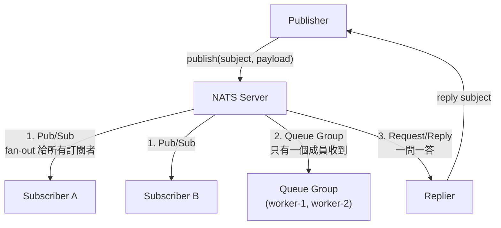
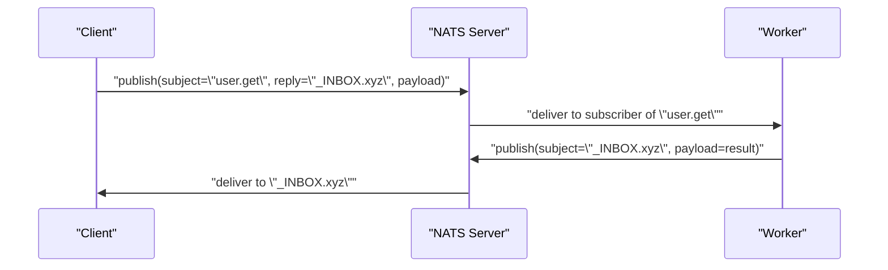
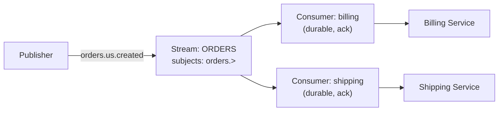
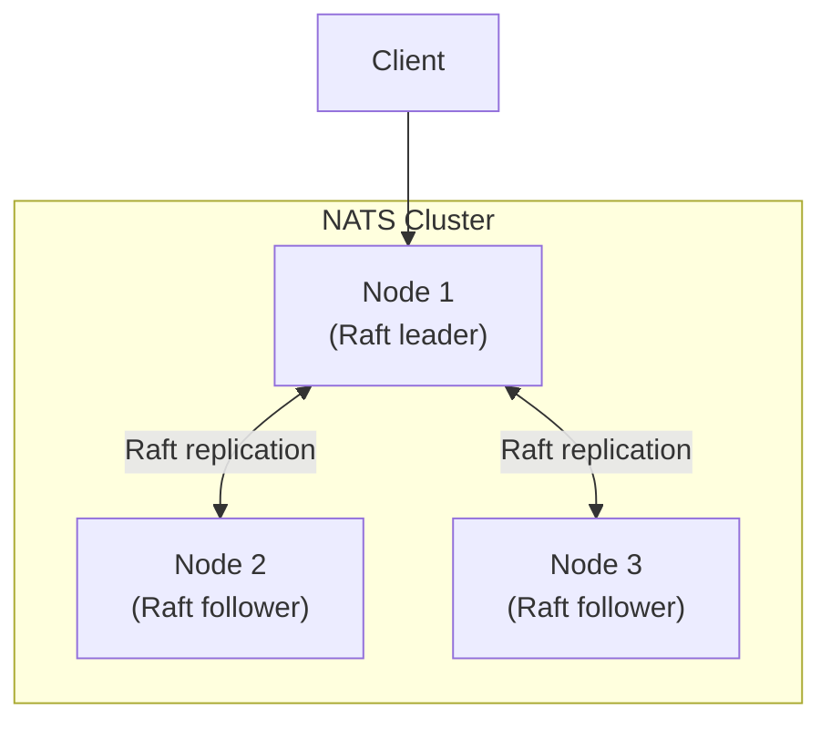
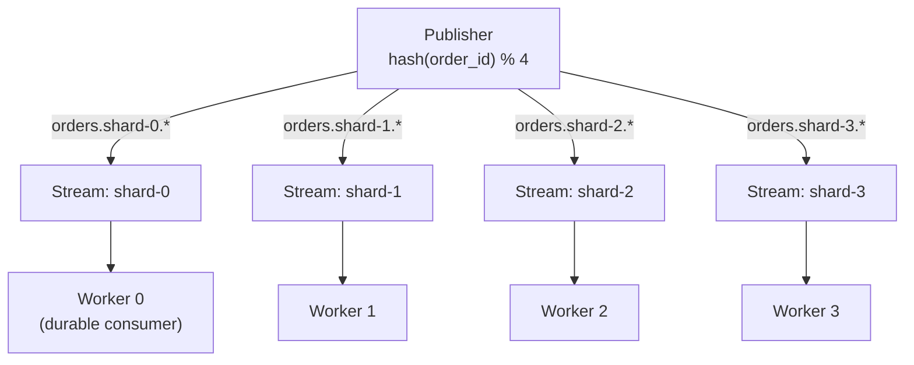

# NATS 訊息系統的核心概念與架構

> NATS 是一套以 subject-based addressing 為核心的輕量訊息系統，Core NATS 提供極低延遲的 fire-and-forget publish/subscribe，JetStream 則在其上疊加持久化、at-least-once／exactly-once 語意與 stream/consumer 模型，讓同一套系統橫跨快取失效通知到事件溯源都能用。

## Step 1：為什麼需要 NATS？

服務之間的通訊有兩種基本形態：**同步呼叫**（gRPC、REST——A 直接打給 B，等回應）與**非同步訊息**（A 發出事件，不管誰在聽、何時處理）。當你要做到下面這些事，同步呼叫會讓系統變脆弱：

- **解耦生產者與消費者**：新增一個消費者不需要改動生產者程式碼。
- **削峰填谷**：上游流量尖峰時，訊息先堆在系統裡，下游依自己的速度消化。
- **廣播與扇出（fan-out）**：一則事件同時通知多個不相關的服務。

這正是訊息系統（message broker）的角色，NATS 是這個領域的一個實作，定位介於「極簡、極快」（Core NATS）與「有持久化保證的訊息佇列／事件串流」（JetStream）之間：

| 系統 | 定位 | 持久化 | 典型延遲 |
|------|------|--------|----------|
| NATS Core | 記憶體內 pub/sub，fire-and-forget | 無 | 微秒等級 |
| NATS JetStream | NATS 之上疊加的持久化層 | 有（磁碟／記憶體） | 毫秒等級 |
| RabbitMQ | AMQP 訊息佇列，路由規則豐富 | 有 | 毫秒等級 |
| Kafka | 分散式 log，高吞吐事件串流 | 有（長期保留） | 毫秒等級 |
| GCP Pub/Sub | 全代管的雲端訊息系統 | 有 | 毫秒等級 |

NATS 的差異化賣點是**單一二進位檔、單一協定，同時涵蓋 pub/sub、request/reply、佇列與串流**，且 Core NATS 本身極輕量（Server 是幾十 MB 的單一執行檔，無外部相依）。

## Step 2：核心模型——Subject-based Addressing

NATS 沒有 Kafka 的 topic 或 RabbitMQ 的 exchange/queue 概念，取而代之的是 **subject**：一個以 `.` 分隔的字串，兼具路由與定址功能。

```
orders.us.created
orders.tw.created
orders.*.cancelled
```

- **Publisher** 發布訊息到一個具體 subject（如 `orders.us.created`）。
- **Subscriber** 訂閱一個 subject 或帶 wildcard 的 pattern。
- Server 依 subject 比對，把訊息投遞給所有匹配的 subscriber——比對在記憶體中完成，這是低延遲的來源之一。

Wildcard 有兩種：

| Wildcard | 意義 | 範例 |
|----------|------|------|
| `*` | 匹配單一 token | `orders.*.created` 匹配 `orders.us.created`、`orders.tw.created` |
| `>` | 匹配該位置之後所有 token（只能放最後） | `orders.>` 匹配 `orders.us.created`、`orders.us.line.item.added` |

## Step 3：三種訊息模式



1. **Publish/Subscribe**：一則訊息廣播給所有匹配 subject 的訂閱者，各自收到獨立副本。
2. **Queue Group（佇列群組）**：多個 subscriber 加入同一個 queue group，Server 保證每則訊息只投遞給群組內**一個**成員——這就是水平擴展 worker 的機制，等同 Kafka 的 consumer group 概念但更輕量。
3. **Request/Reply**：Publisher 在訊息上附一個臨時 reply subject，對方處理完把結果發回該 subject，模擬同步呼叫但底層仍是非同步訊息。

## Step 4：Request/Reply 時序



Client 端函式庫會自動產生唯一的 `_INBOX.*` subject 並訂閱，呼叫端寫程式的體感就是「呼叫一個函式並拿到回傳值」，但實際上完全是訊息傳遞，沒有長連線佔用。

## Step 5：Core NATS 的限制——為什麼需要 JetStream

Core NATS 是 **at-most-once**：Server 不落地儲存，訊息投遞後就從記憶體釋放。

- Subscriber 斷線期間發布的訊息會**永久遺失**，重連後拿不回來。
- 沒有訊息確認（ack）機制，Server 不知道訊息有沒有被成功處理。
- 適合「錯過就算了」的場景：即時心跳、快取失效通知、metrics 廣播。

一旦需求變成「訊息不能丟」「消費者可以重播歷史」「需要 exactly-once」，就要用 **JetStream**。

## Step 6：JetStream——Stream 與 Consumer

JetStream 在 Core NATS 之上加了一層持久化，核心是兩個物件：

- **Stream**：訂閱一組 subject（如 `orders.>`），把匹配的訊息持久化寫入磁碟或記憶體，形成一個有序的 log（概念上很接近 Kafka 的 partition）。
- **Consumer**：綁定在 Stream 上的讀取游標，記錄「讀到哪裡了」，支援 ack、重試、限速。Consumer 可以是 **push**（Server 主動推送）或 **pull**（Client 主動拉取，適合批次處理）。



同一個 Stream 可以有多個 Consumer，各自獨立記錄消費進度——這代表 billing 服務掛掉重啟後，能從自己上次 ack 的位置繼續，不影響 shipping 服務的進度。

## Step 7：投遞保證與去重

| 保證 | 做法 |
|------|------|
| At-least-once | Consumer 處理完才 ack，未 ack 訊息逾時後重新投遞 |
| Exactly-once（有條件） | Publisher 帶 `Nats-Msg-Id` header，Stream 在去重視窗內丟棄重複 ID 的訊息 |
| 順序保證 | 同一 Stream 內訊息依寫入順序編號（sequence number），單一 Consumer 依序讀取 |

exactly-once 的前提是去重視窗（duplicate window）內重送才有效，超過視窗時間的重送仍可能重複，這點與 Kafka 的 idempotent producer 概念類似，都是「有限視窗內的精確一次」而非無條件保證。

## Step 8：Clustering 與高可用

NATS Server 可以組成 cluster，JetStream 用 **Raft** 協定在多個節點間複製 Stream 資料：



- Core NATS 的 pub/sub 路由本身就是全網狀（full mesh gossip），任一節點斷線，訊息可經其他節點轉發。
- JetStream 的 Stream 可設定 replica 數（通常 3），跟一般分散式共識系統一樣，多數節點（quorum）存活即可繼續服務。
- 多個 cluster 之間可再組成 **super-cluster**，做跨地域（region）的訊息路由。

## Step 9：Shard 與 Pub/Sub 的關係——NATS 沒有內建 Partition

「Shard」在訊息系統的脈絡裡通常指的是 Kafka 的 **partition**：一個 topic 底層切成多個 partition，producer 依 key 雜湊決定訊息落在哪個 partition，同一個 partition 內訊息保證順序，consumer group 內每個 consumer 固定認養一組 partition，藉此把「順序保證」與「水平擴展」同時做到。

NATS（不論 Core NATS 還是 JetStream）**沒有這種內建的 partition 機制**：

- Core NATS 的 pub/sub 是純粹的 fan-out：訊息比對 subject 後投遞給所有匹配的訂閱者，沒有「這個 subject 屬於哪個 shard」的概念。
- JetStream 的一個 Stream 只有一個 Raft leader 負責排序寫入，所有匹配該 Stream subject 的訊息共享同一條有序 log——這與 Kafka「一個 topic 多個 partition、各自獨立排序」不同，NATS 是「一個 Stream 一條全序 log」。
- Cluster 裡的 replica（Step 8 提到的 Raft 複製）是**同一份資料的多個副本**，用來做高可用容錯，不是把資料切開分散負載——這常被誤解成「shard」，但語意完全不同：replica 是同步的相同資料，shard 是切開的不同資料。

### 那 NATS 怎麼做到類似 sharding 的效果？

兩種機制分別對應「不保證 per-key 順序的水平擴展」與「保證 per-key 順序的水平擴展」：

1. **Queue Group——只做負載分攤，不保證 key 一致性**：多個 worker 加入同一個 queue group，Server 用近似 round-robin 的方式把每則訊息派給群組內一個成員。這確實達到「多個 worker 平行消化同一個 subject」的效果，但**同一個 key（例如同一個 user_id）的連續訊息可能被分派到不同 worker**，順序不被保證——這是它與 Kafka partition 最本質的差異：Kafka 用 key hash 決定 partition，保證同 key 訊息永遠落在同一個 partition、同一個 consumer；NATS queue group 沒有 key 的概念，純粹是「誰先喊到就給誰」。

2. **應用層手動 sharding——把 shard key 編碼進 subject**：如果需要「同一個 key 的訊息保持順序，又要水平擴展」，做法是自己把 shard key 放進 subject hierarchy，讓每個 shard 各自是獨立的 Stream + Consumer：

   ```
   orders.shard-0.created
   orders.shard-1.created
   ...
   orders.shard-15.created
   ```

   Publisher 端用 `hash(order_id) % 16` 算出 shard 編號組出 subject；每個 shard 各自綁一個 durable Consumer，固定由一個 worker 消費，worker 數等於 shard 數即可達到水平擴展，且**同一個 shard 內的訊息仍在同一條 Stream log 裡，順序被保留**。這跟 Kafka producer 用 key hash 選 partition 是同一個設計思路，只是 NATS 要求開發者在 subject 設計時就手動做這件事，而不是像 Kafka 由框架內建。



### 與 GCP Pub/Sub、Kafka 的對照

| 系統 | Shard/Partition 機制 | 保序範圍 |
|------|----------------------|----------|
| Kafka | Topic 內建多個 partition，producer 依 key hash 選 partition | 單一 partition 內保序 |
| GCP Pub/Sub | 無內建 partition，用 **ordering key** 讓同 key 訊息依序投遞給同一個訂閱者（見 [GCP Pub/Sub 的架構與核心概念](#/sre/05-gcp/gcp-pubsub-overview.mdx)） | 同一 ordering key 內保序 |
| NATS Core | 無 shard 概念，queue group 純負載分攤 | 不保證 |
| NATS JetStream | 無內建 partition，須應用層把 shard key 編碼進 subject、拆成多個 Stream | 單一 Stream（＝手動切出的 shard）內保序 |

**結論**：NATS 的 pub/sub 模型本身跟「shard」是兩件事——pub/sub 決定「訊息怎麼被匹配與投遞」，shard 是「資料／負載怎麼被切開分散」。NATS 把 sharding 的責任留給應用層的 subject 設計，這是它保持協定簡單、單一二進位檔的代價；Kafka 把 partition 內建進 topic 模型，換來的是更重的叢集架構（ZooKeeper／KRaft、partition rebalance）。

## 生產環境注意事項

**選型判斷**：

- 只需要「通知」、可以接受偶爾漏訊息、追求最低延遲 → Core NATS。
- 需要訊息不遺失、consumer 可重播、需要 worker pool 水平擴展 → JetStream。
- 需要長期（數天／數月）保留海量事件、跨多消費者群組做不同保留策略、生態系已在用 Kafka Connect/ksqlDB → 選 Kafka 而非 JetStream。
- 已經全上雲、不想自建維運 broker → GCP Pub/Sub 或雲端代管的 Kafka（見 [GCP Pub/Sub 的架構與核心概念](#/sre/05-gcp/gcp-pubsub-overview.mdx)）。

**維運要點**：

- JetStream 的持久化資料在磁碟，容量規劃要看訊息保留策略（依時間、依大小、或依訊息數量三選一或組合）。
- Queue Group 的成員數決定並行度，但 subject 設計不當（例如所有訊息擠在同一個 subject 沒有再細分）會讓某些場景無法用 wildcard 做精細路由。
- Client 函式庫預設會自動重連並補訂閱，但 Core NATS 重連期間遺失的訊息不會補回來，設計時要清楚哪些流程「可以丟」、哪些必須走 JetStream。

## 相關筆記

- [GCP Pub/Sub 的架構與核心概念](#/sre/05-gcp/gcp-pubsub-overview.mdx)——雲端代管訊息系統的對照組
- [gRPC 的原理與設計](#/swe/01-system-design/what-is-grpc.mdx)——同步 RPC 與非同步訊息的取捨對照
- [Hub-and-Spoke 架構模式：集中協調的星狀拓撲](#/swe/01-system-design/hub-and-spoke-architecture.mdx)——訊息系統作為中心節點的拓撲設計
