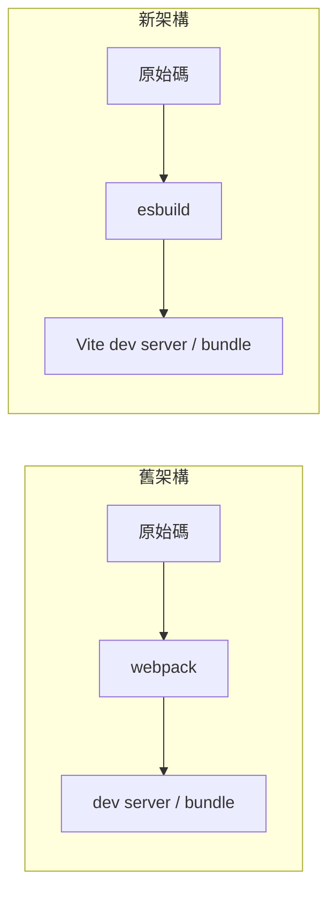

# Angular CLI：Angular 專案的建置與開發命令列工具

> 一句話版本：Angular CLI 是 Angular 官方標準化的 tooling，把專案建立、程式碼生成、建置、測試與版本升級整合成單一命令列介面，讓團隊不必自行組裝 webpack／TypeScript／測試 runner 等設定。

## Step 1：Angular CLI 是什麼

Angular CLI（套件名稱 `@angular/cli`）是 Angular 官方維護的命令列工具。它解決的是前端專案常見的痛點：每個專案自己拼裝 build tooling，久了設定漂移、團隊間不一致、升級困難。CLI 把這些決策收斂成官方標準流程，開發者面對的是一組穩定的命令（`ng new`、`ng generate`、`ng build`……），而不是一堆手寫的 webpack config。

這個定位跟本站另一篇筆記提到的 [glab：GitLab 官方 CLI 工具](#/swe/04-delivery/glab-gitlab-cli-overview.mdx) 類似——都是「官方把常見操作封裝成命令列介面」的思路，差別在於 glab 面對的是 GitLab 平台操作，Angular CLI 面對的是前端專案的 scaffolding 與 build pipeline。

## Step 2：安裝與建立專案

```bash
npm install -g @angular/cli
ng new my-app
cd my-app
ng serve
```

`ng new` 會互動詢問路由、樣式方案（CSS／SCSS）等選項，產生一個具備標準目錄結構與設定檔的專案骨架。`ng serve` 啟動開發伺服器並支援熱更新，預設監聽 `http://localhost:4200`。

## Step 3：常用指令（generate schematics）

CLI 內建一套稱為 schematics 的程式碼生成機制，用來產生具備樣板結構的檔案，同時自動處理相依註冊（例如把元件掛進對應模組）：

```bash
ng generate component my-component   # 簡寫：ng g c my-component
ng generate service my-service       # 簡寫：ng g s
ng generate module my-module         # 簡寫：ng g m
ng generate directive my-directive
ng generate pipe my-pipe
ng generate guard my-guard
```

schematics 不只是貼樣板，它會依專案目前的設定（standalone 或 NgModule 架構）調整輸出內容，這也是 CLI 相較於「複製貼上範本」更可靠的地方。

## Step 4：Build、Test、Lint

```bash
ng build                                # production build，輸出到 dist/
ng build --configuration=development
ng test                                 # 單元測試，預設 Karma + Jasmine
ng e2e                                   # 端對端測試，需另外設定 runner（如 Cypress、Playwright）
ng lint                                  # 需另外安裝 ESLint schematic
```

`ng build` 背後的建置引擎近年有重大變化，詳見 Step 6。

## Step 5：版本升級（ng update）

Angular 的版本節奏是每半年一個 major release，CLI 提供 `ng update` 讓升級路徑標準化，而不是手動改 `package.json` 後自行排除相依衝突：

```bash
ng update                                     # 檢查可更新的套件
ng update @angular/core @angular/cli          # 升級核心套件，會套用對應的程式碼遷移（migration）
```

`ng update` 執行時會依套件提供的 schematics 自動改寫程式碼中的破壞性變更（例如 API 改名、預設值調整），這是它與單純 `npm update` 的關鍵差異。跨大版本升級建議搭配官方的 update guide 逐版確認遷移細節，不要跳版直接升級。

## Step 6：近期演進重點

**Standalone components。** 新版 Angular 預設不再強制透過 NgModule 組織元件，`ng generate component` 產生的元件預設就是 standalone，相依直接在元件層級宣告，降低了新手需要理解的概念數量，也讓 tree-shaking 更精準。

**esbuild-based builder。** 新專案的預設 builder 已從 webpack 換成 esbuild 搭配 Vite 做開發伺服器，建置速度大幅提升。可以用下面的流程圖理解這個轉變：



esbuild 用 Go 實作，編譯速度比 JavaScript 實作的 webpack loader 鏈快上一個量級，這也是近年前端 tooling（Vite、esbuild、swc）共同的趨勢：把效能瓶頸從 JS 生態系移到原生語言實作。

**`ng add` 生態系。** 第三方套件（Angular Material、NgRx、Tailwind 等）多半提供 `ng add <package>` 的 schematics，執行時不只是安裝套件，還會自動修改設定檔、注入必要的 import，把「安裝＋設定」這兩步合併成一個命令。這跟 Step 3 的 `ng generate` 是同一套 schematics 機制的不同應用場景。

## 相關筆記

- [glab：GitLab 官方 CLI 工具的核心概念與使用方式](#/swe/04-delivery/glab-gitlab-cli-overview.mdx)
