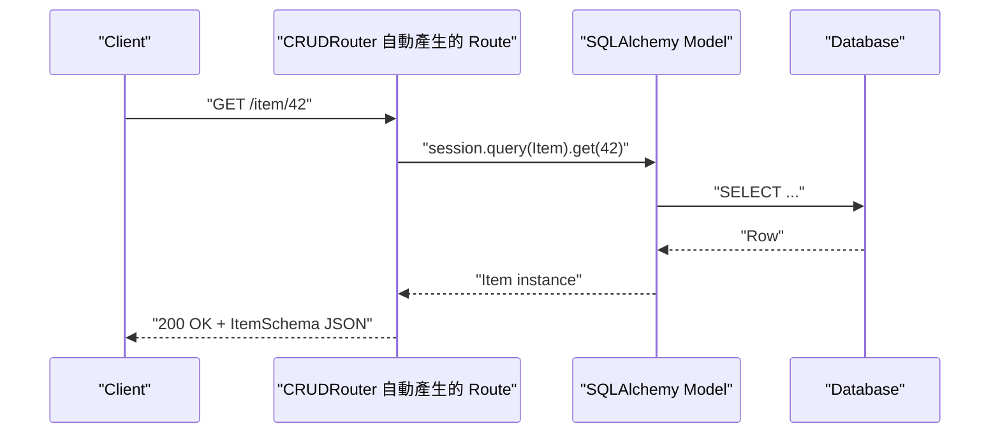

# FastAPI 官方 CLI 與 CRUD 自動生成工具總覽

> 一句話版本：FastAPI 官方 CLI 只負責啟動開發／正式伺服器，並沒有像 Angular CLI `ng generate` 那樣的程式碼生成器；一鍵生出 CRUD 端點要靠第三方 router 套件，生出整個專案骨架則要靠官方的 copier 範本。

## Step 1：FastAPI 官方 CLI 做什麼

FastAPI 從 0.111 版起內建了 `fastapi` 命令列工具（安裝 `fastapi[standard]` 即附帶），角色類似「把 uvicorn 常用參數包成好記的命令」：

```bash
pip install "fastapi[standard]"

fastapi dev main.py     # 開發模式：自動重載、顯示 debug 資訊
fastapi run main.py     # 正式模式：關閉 reload，適合搭配多 worker 部署
```

這個 CLI 解決的是「開發者不用背 uvicorn 一堆參數」的問題，跟 [Angular CLI](#/swe/04-delivery/angular-cli-overview.mdx) 的 `ng serve` 屬於同一類（啟動開發伺服器），但**不包含**程式碼生成能力——沒有對應 `ng generate component` 的「一個指令生出一組 CRUD 檔案」功能。這是 FastAPI 作為 micro-framework 的刻意設計：框架本身只管路由、驗證、文件產生，其餘留給生態系決定。

## Step 2：CRUD 自動生成靠第三方 router 套件

FastAPI 生態系裡最接近「自動產生 CRUD」的做法，不是 CLI 生成程式碼檔案，而是**執行期自動掛路由**：把 ORM model 丟給一個 router 類別，它會反射出對應欄位並自動註冊 GET／POST／PUT／DELETE 端點。

常見套件：

| 套件 | 支援 ORM | 特色 |
|------|----------|------|
| `fastapi-crudrouter` | SQLAlchemy、Tortoise ORM、Databases、GINO、ormar、piccolo | 最早、最廣泛使用，同步為主 |
| `fastcrud` | SQLAlchemy（async） | 較新、原生 async、支援 bulk operation 與過濾條件 |

以 `fastapi-crudrouter` 為例：

```python
from fastapi import FastAPI
from fastapi_crudrouter import SQLAlchemyCRUDRouter

app = FastAPI()

app.include_router(
    SQLAlchemyCRUDRouter(
        schema=ItemSchema,   # Pydantic schema
        db_model=Item,       # SQLAlchemy model
        db=get_db,           # session dependency
    )
)
```

這幾行就會自動產生 `GET /item`、`GET /item/{item_id}`、`POST /item`、`PUT /item/{item_id}`、`DELETE /item/{item_id}` 五個端點，行為類似 Django REST Framework 的 `ModelViewSet`。請求進來後的實際流程：



要注意的是這類套件只適合簡單、貼近資料表結構的 CRUD；一旦業務邏輯變複雜（權限判斷、跨表交易、欄位轉換），還是得跳出自動生成、手寫 route handler。

## Step 3：整個專案骨架的生成——官方 full-stack 範本

如果目標是「像 `ng new` 一樣一次生出完整專案」，FastAPI 官方維護的是 [full-stack-fastapi-template](https://github.com/fastapi/full-stack-fastapi-template)，用 `copier`（Cookiecutter 的後繼工具）驅動：

```bash
pip install copier
copier copy gh:fastapi/full-stack-fastapi-template my-project
```

互動式詢問專案名稱、資料庫設定等問題後，產生的骨架包含 FastAPI 後端、React 前端、PostgreSQL、Docker Compose、CI 設定，並內建一組可運作的 CRUD 範例（Item 資源的 model／schema／router／test 全套）。這比較接近「專案模板」而非「單一資源的 CRUD 生成器」——生成後你會照著範例裡的 Item 資源模式手動複製出下一個資源，而不是每次都下指令生成。

## Step 4：跟 Angular CLI／Django 的定位比較

| | Angular CLI | Django | FastAPI |
|---|---|---|---|
| 專案骨架生成 | `ng new`（官方內建） | `django-admin startproject`（官方內建） | `copier` 範本（官方維護，但非框架內建指令） |
| 單一資源 CRUD 生成 | `ng generate component/service`（官方 schematics） | 需搭配 Django REST Framework 的 `ModelViewSet` + router | 需搭配 `fastapi-crudrouter` / `fastcrud`（第三方，執行期反射，非產檔） |
| 開發伺服器 | `ng serve` | `manage.py runserver` | `fastapi dev` |

這個對照反映的是框架哲學差異：Angular／Django 屬於「batteries-included」框架，官方就把 scaffolding 當一等公民；FastAPI 定位是 ASGI micro-framework，刻意只做路由與驗證的核心，把「要不要自動生成 CRUD」這種決策權留給使用者選擇的套件。技術選型時如果團隊重視開發速度與一致性，`fastapi-crudrouter` / `fastcrud` 搭配 SQLModel 是常見組合；如果 CRUD 端點需要大量客製邏輯，直接手寫反而更可控。

## 相關筆記

- [Angular CLI：Angular 專案的建置與開發命令列工具](#/swe/04-delivery/angular-cli-overview.mdx)
- [glab：GitLab 官方 CLI 工具的核心概念與使用方式](#/swe/04-delivery/glab-gitlab-cli-overview.mdx)
