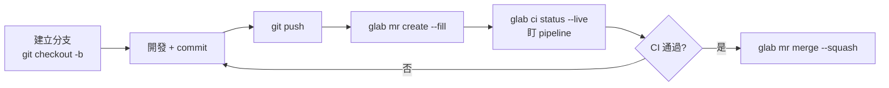

# glab：GitLab 官方 CLI 工具的核心概念與使用方式

> `glab` 讓你不離開終端機就能操作 GitLab 的 merge request、issue、CI/CD pipeline 與 repository，是 GitLab 版的 `gh`。

## Step 1：它解決什麼問題

日常開發常常要在「寫程式」與「操作 GitLab 網頁」之間切換：開 merge request（MR）、看 pipeline 有沒有跑過、approve 同事的 MR、查 issue。每一次切換都要離開終端機、等網頁載入、用滑鼠點選。

`glab` 把這些操作包成命令列指令，資料來源是 GitLab 的 REST/GraphQL API，認證一次之後，後續操作都在終端機內完成，也方便寫進 shell script 或 CI 流程。

## Step 2：安裝與認證

```bash
# macOS
brew install glab
```

第一次使用要先登入：

```bash
glab auth login
```

會依序詢問：
1. 要連線的 GitLab 實例——`gitlab.com` 或公司自架的 self-managed 網域
2. 認證方式——瀏覽器 OAuth 或 personal access token
3. 預設的 git protocol（HTTPS 或 SSH）

CI 環境或腳本裡不方便互動登入，可以直接用環境變數提供 token：

```bash
export GITLAB_TOKEN=glpat-xxxxxxxx
```

用 `glab auth status` 隨時檢查目前登入到哪個帳號、哪個實例。

## Step 3：核心指令群

`glab` 的指令設計是「資源 + 動作」的模式，例如 `glab mr create`、`glab issue list`，跟 REST 資源的操作方式一一對應。

### Merge Request（`glab mr`）

```bash
glab mr create --fill              # 用 commit 訊息自動帶入標題/描述,快速建立
glab mr list                        # 列出開啟中的 MR
glab mr view 123                    # 看某個 MR 的詳情與討論串
glab mr diff 123                    # 看 diff
glab mr checkout 123                # 把該 MR 的分支 checkout 到本機
glab mr approve 123
glab mr merge 123 --squash
```

`glab mr checkout` 特別實用：review 別人的 MR 時不用手動找分支名稱、加 remote，一行指令就切過去。

### Issue（`glab issue`）

```bash
glab issue create
glab issue list --label bug
glab issue view 45
glab issue close 45
```

### CI/CD Pipeline（`glab ci`）

這是 `glab` 相對於 GitHub CLI（`gh`）比較獨特的部分——GitLab CI 是平台原生功能，`glab` 對它的整合也更深：

```bash
glab ci status              # 目前分支最新一次 pipeline 的狀態
glab ci view                 # 互動式檢視 pipeline,可逐一看每個 job 的 log
glab ci trace <job-id>       # 即時串流某個 job 的 log(類似 tail -f)
glab ci retry <job-id>
glab ci lint                 # 本地驗證 .gitlab-ci.yml 語法,不用 push 才發現寫錯
```

`glab ci lint` 在改 CI 設定時很值得養成習慣：先本地驗證語法，避免 push 之後才在 pipeline 頁面看到 YAML 錯誤。

### Repository（`glab repo`）

```bash
glab repo clone <path>
glab repo view
glab repo create
glab repo fork
```

### API 逃生口（`glab api`）

沒有專屬子指令包裝的功能，可以直接打 GitLab 的 REST 或 GraphQL API，`glab` 會自動附上認證與正確的 base URL：

```bash
glab api projects/:id/merge_requests/123/approvals
glab api graphql -f query='query { currentUser { name } }'
```

## Step 4：典型工作流程



整個流程完全不需要開瀏覽器，對於習慣終端機的工程師能省下不少 context switch。

## Step 5：與 GitHub CLI（`gh`）的比較

| 面向 | glab | gh |
|---|---|---|
| 對應平台 | GitLab | GitHub |
| Pull/Merge Request | `mr` | `pr` |
| CI 整合 | 內建深度整合(GitLab CI 原生) | 需搭配 `gh run` 看 Actions |
| Self-managed 支援 | 原生支援自架實例，`glab auth login` 直接選 | 對 GitHub Enterprise Server 支援較弱 |
| API 逃生口 | `glab api` | `gh api` |

兩者的指令哲學幾乎一致（`create` / `list` / `view` / `checkout` / `merge`），用過其中一個，另一個幾乎零學習成本。

## Step 6：進階設定

```bash
glab config set editor vim
glab config set gitlab_uri https://gitlab.yourcompany.com   # 切換到 self-managed 實例

glab alias set mrv 'mr view'    # 自訂別名
glab variable set MY_VAR value  # 設定 CI/CD variable
```

多個 GitLab host（例如同時要操作 `gitlab.com` 和公司內部自架實例）可以透過不同 profile 或 `--hostname` 參數切換，不需要重複登出登入。
