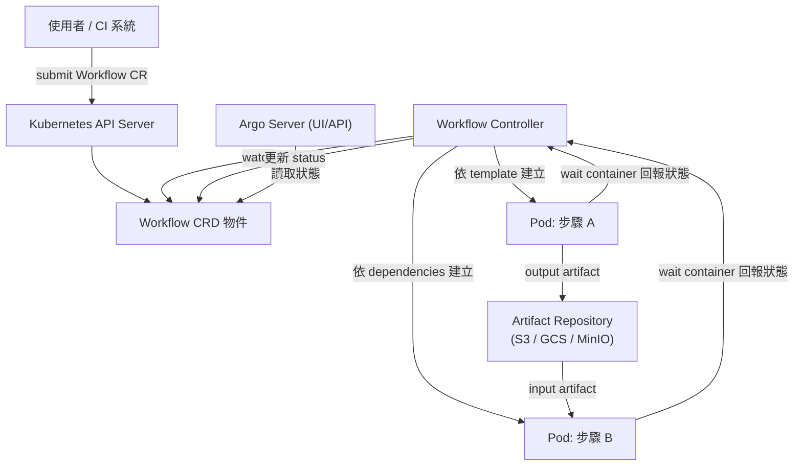

# Argo Workflow 的核心概念與架構

> Argo Workflow 是 Kubernetes-native 的工作流程引擎，用 CRD（`Workflow`）把一組有依賴關係的多步驟任務（每個步驟就是一個 container）編排成 DAG 或 Steps，交給 Kubernetes 排程與執行。

## Step 1：為什麼需要它

傳統 CI/CD（Jenkins、GitLab CI runner）通常在固定的 agent/executor 上跑 pipeline，隔離性與擴展性受限於 agent 池的容量。Argo Workflow 把「一個步驟」對應成「一個 Kubernetes Pod」，這帶來幾個直接好處：

- **原生彈性伸縮**：步驟數量暴增時，直接吃 Kubernetes cluster 的排程與 autoscaling 能力，不需要自己維護 agent pool。
- **強隔離**：每個步驟是獨立 Pod，資源限制（CPU/memory request/limit）、network policy、RBAC 都能用 Kubernetes 原生機制套用到單一步驟。
- **宣告式 + GitOps 友善**：workflow 定義是一份 YAML（CRD instance），可以像其他 Kubernetes 資源一樣被版本控制、被 Argo CD 這類工具同步部署。

它跟 Argo CD 是同個 Argo 專案底下的兩個獨立工具：Argo CD 負責「把 Git 上的宣告狀態同步到叢集」（GitOps 持續部署），Argo Workflow 負責「執行一組有依賴關係的任務」（工作流程編排）。兩者常一起用但職責完全不同。

## Step 2：核心概念

- **`Workflow` CRD**：`apiVersion: argoproj.io/v1alpha1`、`kind: Workflow`，`spec.templates` 是一組可重用的任務定義，`spec.entrypoint` 指定從哪個 template 開始執行。
- **Template 種類**：
  - `container`：執行一個 container，最常見的最小執行單位。
  - `script`：inline 程式碼（Python、Bash…），Argo 幫你包成 container 執行。
  - `steps`：循序群組，群組內用巢狀陣列表示可平行的步驟。
  - `dag`：用 `dependencies` 明確宣告依賴關係，比 `steps` 更適合表達複雜的分支/匯合。
  - `suspend`：暫停執行，等待人工核准或外部訊號才繼續（human-in-the-loop）。

## Step 3：架構



四個核心元件：

1. **Workflow Controller**：整個系統的大腦，watch `Workflow` CRD，依 template 定義建立對應的 Pod，並維護一個狀態機（Pending → Running → Succeeded/Failed/Error）。
2. **Argo Server**：提供 Web UI 與 gRPC/REST API，可視化 DAG 執行進度、log。
3. **Executor（wait container）**：每個 Pod 除了你的 main container，還會被注入一個 wait container，負責監控 main container 的生命週期、蒐集 output artifacts、把 log 轉送出去。
4. **Artifact Repository**：步驟之間傳遞檔案（不只是簡單參數）要透過外部物件儲存（S3、GCS、MinIO 等），這也是 Argo Workflow 和「只傳環境變數/字串參數」的 pipeline 系統的關鍵差異。

## Step 4：DAG 範例

```yaml
apiVersion: argoproj.io/v1alpha1
kind: Workflow
metadata:
  generateName: build-test-deploy-
spec:
  entrypoint: pipeline
  templates:
    - name: pipeline
      dag:
        tasks:
          - name: build
            template: build-step
          - name: unit-test
            template: test-step
            dependencies: ["build"]
          - name: lint
            template: lint-step
            dependencies: ["build"]
          - name: deploy
            template: deploy-step
            dependencies: ["unit-test", "lint"]
    - name: build-step
      container:
        image: my-app:ci
        command: ["make", "build"]
    - name: test-step
      container:
        image: my-app:ci
        command: ["make", "test"]
    - name: lint-step
      container:
        image: my-app:ci
        command: ["make", "lint"]
    - name: deploy-step
      container:
        image: my-app:ci
        command: ["make", "deploy"]
```

`unit-test` 與 `lint` 都依賴 `build`，兩者彼此獨立可平行跑；`deploy` 要等兩者都完成才會被排程，這就是 DAG 相對 `steps` 的優勢：能自然表達「扇出再匯合」的依賴形狀，而不必手動排出巢狀的序列/平行區塊。

## Step 5：進階功能

| 功能 | 用途 |
|---|---|
| `parameters` / `artifacts` | 步驟間傳遞字串參數或檔案，`outputs` 產出可被下游 `inputs` 引用 |
| `retryStrategy` | 失敗自動重試，可設重試上限與 backoff 策略 |
| `parallelism` | 限制同時執行的 Pod 數量，避免瞬間把叢集資源打滿 |
| `onExit` template | 不論成功或失敗都會執行，等同 try/finally，常用來發送通知或清理資源 |
| `CronWorkflow` | 排程重複執行 workflow，比 Kubernetes 原生 `CronJob` 更適合「多步驟」的排程任務 |
| `WorkflowTemplate` / `ClusterWorkflowTemplate` | 把常用的 template 抽出來跨 workflow 重用，類似函式庫 |
| `when` 條件 | 依前一步驟的輸出結果決定是否執行某個 task（條件分支） |

`CronWorkflow` 值得對照 [k8s CronJob 與 Cloud Scheduler 的差異與選型](#/sre/05-gcp/k8s-cronjob-vs-cloud-scheduler.mdx) 裡討論的排程選型：如果排程出來的任務本身是單一 container 的簡單工作，原生 `CronJob` 就夠；一旦任務要拆成多步驟、有依賴關係、需要重試與 artifact 傳遞，`CronWorkflow` 是更貼切的選擇。

## Step 6：與其他工具的比較

| | Argo Workflow | Tekton | Apache Airflow | GitHub Actions |
|---|---|---|---|---|
| 執行單位 | Kubernetes Pod | Kubernetes Pod | Python 進程/Operator | Runner VM/container |
| 定義方式 | Kubernetes CRD（YAML） | Kubernetes CRD（YAML） | Python DAG code | YAML |
| 依賴表達 | 原生 DAG/Steps | 原生 DAG（Pipeline） | 原生 DAG（程式碼定義） | 較弱，需自行組合 job needs |
| 適用場景 | CI/CD、ML/資料 pipeline、批次任務 | CI/CD（更偏 K8s 原生 CI 標準） | 資料工程排程（非容器原生） | GitHub repo 內建 CI/CD |
| 平台依賴 | 需要 Kubernetes cluster | 需要 Kubernetes cluster | 獨立部署，不綁定 K8s | 綁定 GitHub |

Argo Workflow 和 Tekton 定位很接近（都是 Kubernetes CRD 驅動、Pod 為單位），差異更多在生態系整合與 CNCF 標準化程度；跟 Airflow 的差異則在於 Airflow 的任務是 Python 進程/Operator，不是天生的 container 隔離，排程哲學也更偏資料工程（依賴時間排程、backfill）而非事件觸發的 CI/CD。

## Step 7：常見應用場景

- **CI/CD pipeline**：build、test、security scan、deploy，各步驟天然對應獨立 Pod。
- **機器學習/資料 pipeline**：Kubeflow Pipelines 底層就是用 Argo Workflow 編排訓練/預處理步驟。
- **批次資料處理（ETL）**：多步驟的資料抽取、轉換、載入，中間結果透過 artifact repository 傳遞。
- **需要人工核准的流程**：用 `suspend` template 讓 pipeline 停在「等待核准」節點，符合變更管理（change management）需求。

Argo Workflow 本質上是「orchestrator」模式在 CI/CD 領域的具體實作：有一個中心化的 controller 依賴圖排程一組 worker（Pod），這個模式跟 [AI Agent 三種分工模式](#/llm/04-applications/ai-agent-collaboration-modes.mdx) 裡討論的 orchestrator-worker agent 分工，以及 [Hub-and-Spoke 架構模式：集中協調的星狀拓撲](#/swe/01-system-design/hub-and-spoke-architecture.mdx) 的星狀拓撲，在「集中協調、周邊執行」的設計思路上是一致的。

## 相關筆記

- [Kubernetes CronJob 與 GCP Cloud Scheduler 的差異與選型](#/sre/05-gcp/k8s-cronjob-vs-cloud-scheduler.mdx)
- [AI Agent 三種分工模式](#/llm/04-applications/ai-agent-collaboration-modes.mdx)
- [Hub-and-Spoke 架構模式：集中協調的星狀拓撲](#/swe/01-system-design/hub-and-spoke-architecture.mdx)
